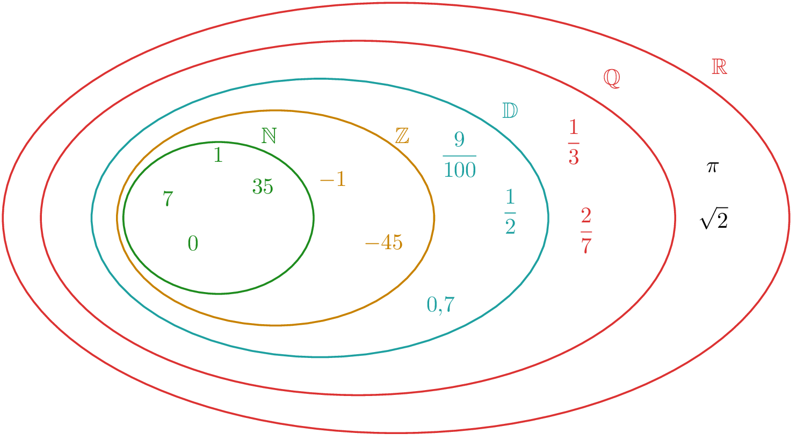
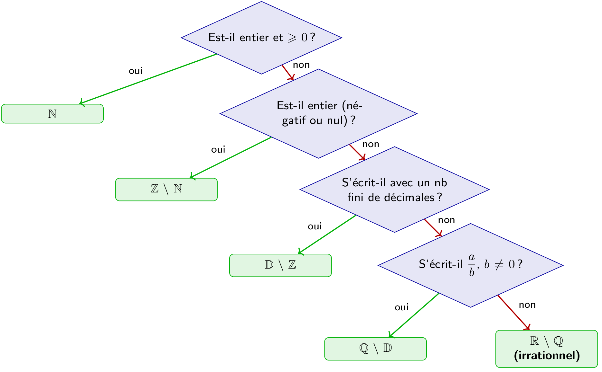

::: {.bloc .rem}
Anecdote historique : Le « scandale » de $\sqrt{2}$ — naissance des irrationnels

La secte pythagoricienne (Grèce antique, VIe–Ve siècle av. J.-C.) était convaincue que « tout est nombre », entendant par là que tout rapport entre grandeurs géométriques est un rapport de deux entiers.

**Le scandale.** Hippase de Métaponte aurait démontré que la diagonale d'un carré de côté $1$, de longueur $\sqrt{2}$, ne peut s'écrire $\dfrac{p}{q}$ avec $p, q \in \N^*$. La légende veut que ses frères de secte, incapables d'accepter ce résultat, l'aient noyé en mer Égée pour étouffer la découverte.

**La crise des fondements.** Cette découverte inaugure la première « crise des fondements » des mathématiques : si des grandeurs géométriques parfaitement réelles ne correspondent à aucune fraction, que sont vraiment les nombres ? Il faudra attendre Richard Dedekind (1872) et Georg Cantor pour que les réels soient rigoureusement définis — soit plus de **2 400 ans** après Hippase.

**Au programme (chapitre suivant) :** vous démontrerez que $\sqrt{2} \notin \Q$ par l'absurde, en reprenant l'argument d'Euclide (*Éléments*, livre X).
:::

## Ensemble des réels

::: {.bloc .def}
Définition : Ensemble des réels, nombres irrationnels

L'ensemble $\R$ des **nombres réels** est l'ensemble de tous les nombres représentables sur la droite graduée.

Un **nombre irrationnel** est un réel qui n'est pas rationnel. On note $\R \setminus \Q$ cet ensemble.
:::

## Hiérarchie des ensembles de nombres

  

$$\N \subset \Z \subset \D \subset \Q \subset \R$$

::: {.bloc .rem}
Irrationnels et rationnels : 

En notant $\mathbb{I} = \R \setminus \Q$ l'ensemble des irrationnels : $\Q \cap \mathbb{I} = \emptyset \et \Q \cup \mathbb{I} = \R$
:::

## Comment classer un nombre ?

  

## Exercice

::: {.bloc .exo}
 Classer un rationnel dans la hiérarchie des ensembles — Raisonner 

Déterminer le plus petit ensemble auquel appartient $\dfrac{7}{40}$ et $\dfrac{5}{6}$.

Afficher la correction :

$\dfrac{7}{40}= \dfrac{7}{2^3 \times 5} \in \D$ (écriture : $0{,}175$) et $\dfrac{5}{6} = \dfrac{5}{2 \times 3} \notin \D$.

:::

## Exercice

::: {.bloc .exo}
 Appartenance et ensembles de nombres — Raisonner 

Pour chacun des nombres suivants, indiquer le plus petit ensemble auquel il appartient parmi $\N$, $\Z$, $\D$, $\Q$, $\R \setminus \Q$.
$$\frac{-14}{2} \qquad \frac{5}{6} \qquad 0{,}125 \qquad \sqrt{5} \qquad \frac{22}{7} \qquad 4{,}0$$

Afficher la correction :

| Nombre | $\N$ | $\Z$ | $\D$ | $\Q$ | $\R$ |
|---|---|---|---|---|---|
| $\dfrac{-14}{2} = -7$ | | ✓ | | | |
| $\dfrac{5}{6}$ | | | | ✓ | |
| $0{,}125 = \dfrac{1}{8}$ | | | ✓ | | |
| $\sqrt{5}$ | | | | | ✓ |
| $\dfrac{22}{7}$ | | | | ✓ | |
| $4{,}0 = 4$ | ✓ | | | | |

:::
