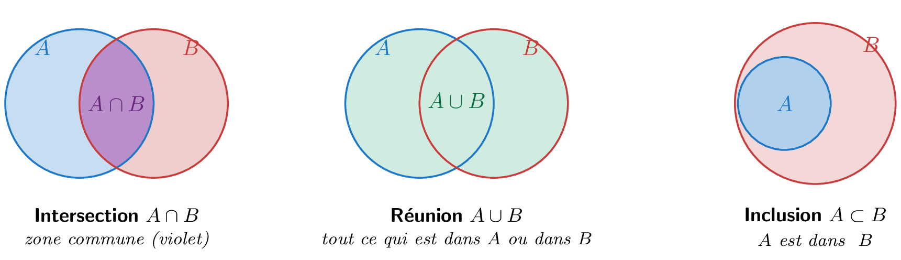

## Élément, appartenance, ensemble vide

::: {.bloc .def}
Définition : Ensemble, élément, appartenance

Un **ensemble** est une collection d'objets appelés **éléments**.

- On note $x \in E$ pour dire que $x$ est un élément de $E$ (« $x$ **appartient** à $E$ »).
- On note $x \notin E$ pour dire que $x$ n'appartient pas à $E$.
- L'ensemble qui ne contient aucun élément est appelé **ensemble vide**, noté $\emptyset$.
:::

## Inclusion, réunion, intersection

::: {.bloc .def}
Définition : Inclusion, réunion, intersection

Soient $A$ et $B$ deux ensembles.

1. On dit que $A$ est **inclus** dans $B$, noté $A \subset B$, lorsque tout élément de $A$ appartient à $B$.
2. On appelle **intersection** de $A$ et $B$, notée $A \cap B$, l'ensemble des éléments appartenant à la fois à $A$ et à $B$.
3. On appelle **réunion** de $A$ et $B$, notée $A \cup B$, l'ensemble des éléments appartenant à $A$ ou à $B$ (ou aux deux).
:::

::: {.bloc .rem}
Remarque : 

La notation $\emptyset$ est due à André Weil (groupe Bourbaki, XXe siècle).
Lorsque deux ensembles n'ont aucun élément en commun, leur intersection est l'ensemble vide : $A \cap B = \emptyset$.
:::

## Visualiser avec des diagrammes de Venn

  

## Exercice

::: {.bloc .exo}
 Appartenance, inclusion, réunion, intersection — Raisonner 

On considère les ensembles $A = \{1\,;\,2\,;\,3\,;\,6\}$, $B = \{2\,;\,4\,;\,6\,;\,8\}$ et $C = \{2\,;\,6\}$.

1. Parmi les propositions suivantes, lesquelles sont vraies ?
   $4 \in A$ ; $3 \notin B$ ; $6 \in A$ ; $5 \in B$.

Afficher la correction :

$4 \notin A$ (fausse) ; $3 \notin B$ (vraie) ; $6 \in A$ (vraie) ; $5 \notin B$ (fausse).

2. Montrer que $C \subset A$ et que $C \subset B$.

Afficher la correction :

$C \subset A$ car $2 \in A$ et $6 \in A$ : tout élément de $C$ appartient à $A$. $C \subset B$ car $2 \in B$ et $6 \in B$ : tout élément de $C$ appartient à $B$.

3. $\{1\,;\,3\} \subset B$ ? Justifier.

Afficher la correction :

$\{1\,;\,3\} \not\subset B$ car $1 \notin B$.

4. Déterminer $A \cap B$ et $A \cup B$.

Afficher la correction :

$A \cap B = \{2\,;\,6\}$ (éléments communs aux deux ensembles). $A \cup B = \{1\,;\,2\,;\,3\,;\,4\,;\,6\,;\,8\}$ (tous les éléments).

5. Peut-on dire que $A \subset B$ ? Pourquoi ?

Afficher la correction :

Non : $1 \in A$ mais $1 \notin B$, donc $A \not\subset B$.

:::
