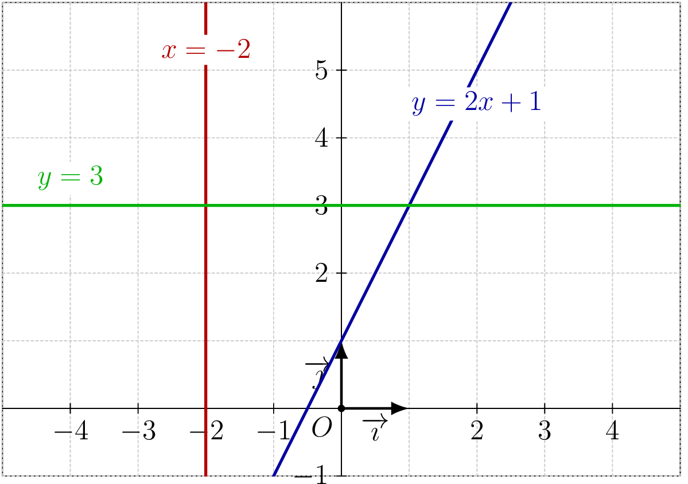

::: {.bloc .thm}
<span class="bloc-titre">Théorème : Équation réduite</span>

Dans un repère $\Oij$ du plan, toute droite $(d)$ admet :

- soit une équation de la forme $y = mx + p$, si et seulement si $(d)$ n'est pas parallèle à l'axe des ordonnées ;
- soit une équation de la forme $x = k$, si et seulement si $(d)$ est parallèle à l'axe des ordonnées.

Le réel $m$ est appelé **coefficient directeur** (ou **pente**) de la droite, et $p$ son **ordonnée à l'origine**.

Ces équations sont appelées **équations réduites** de la droite.
:::

<details class="bloc demo">
<summary>Démonstration :</summary>

Si $(d)$ est parallèle à l'axe des ordonnées, un vecteur directeur a pour coordonnées $(0\,;\,1)$, ce qui donne l'équation $x + 0\cdot y + c = 0$, soit $x = -c$.

Sinon, avec $b\neq 0$, l'équation cartésienne $ax+by+c=0$ donne :
$$ax+by+c=0 \iff y = -\dfrac{a}{b}x - \dfrac{c}{b},$$
ce qui donne la forme $y=mx+p$ avec $m=-\dfrac{a}{b}$ et $p=-\dfrac{c}{b}$.

</details>

::: {.bloc .rem}
<span class="bloc-titre">Remarque : </span>

- Une droite **horizontale** a pour équation $y = \text{constante}$ (coefficient directeur nul).
- Une droite **verticale** a pour équation $x = \text{constante}$ (pas de coefficient directeur).
:::

::: {.bloc .sfc}
<div class="bloc-titre">Savoir-Faire :<span class="exemp-extra"> Reconnaître si une équation définit une droite — Raisonner</span></div>

Parmi les équations suivantes, lesquelles sont des équations de droites ?

$$y = 2x + 1 \qquad y = 3 \qquad x = -2 \qquad y = x^2 + 1$$

<details class="bloc cor">
<summary>Afficher la correction :</summary>

$y = 2x+1$, $y=3$ et $x=-2$ sont des équations réduites de droites.

$y = x^2+1$ ne définit pas une droite : son expression n'est pas du premier degré.

</details>
:::

::: {.bloc .sfc}
<div class="bloc-titre">Savoir-Faire :<span class="exemp-extra"> Tracer des droites à partir de leur équation — Représenter</span></div>

Tracer dans un repère $\Oij$ les droites d'équations $y = 2x + 1$, $y = 3$ et $x = -2$.

<details class="bloc cor">
<summary>Afficher la correction :</summary>

<div style="text-align: center;">
  
</div>

</details>
:::

::: {.bloc .ex}
<div class="bloc-titre">Exercice :<span class="exemp-extra"> Repérer une erreur dans une équation de droite — Raisonner</span></div>

On cherche la droite de coefficient directeur $3$ passant par $A(1\,;\,2)$. Un élève affirme que son équation est $y=3x+2$. Cette affirmation est-elle correcte ?

<details class="bloc cor">
<summary>Afficher la correction :</summary>

Si la droite a pour équation $y=3x+2$, alors pour $x=1$ on obtient $y=3\times 1+2=5$.

Le point $A(1\,;\,2)$ n'appartient donc pas à cette droite. L'affirmation est fausse.

La bonne démarche : $y=3x+p$ avec $A\in(d)$ donne $2=3\times 1+p$, d'où $p=-1$.

Une équation de $(d)$ est $y=3x-1$.

</details>
:::

::: {.bloc .sfc}
<div class="bloc-titre">Savoir-Faire :<span class="exemp-extra"> Déterminer l'équation réduite d'une droite passant par deux points — Calculer</span></div>

On donne $A(3\,;\,-2)$, $B(-5\,;\,4)$ et $C(3\,;\,5)$.

Déterminer l'équation réduite de $(AB)$ et de $(AC)$.

<details class="bloc cor">
<summary>Afficher la correction :</summary>

1. La droite $(AB)$ :

   $A$ et $B$ ont des abscisses différentes, donc $(AB)$ admet une équation $y=mx+p$.

   $$m = \dfrac{-2-4}{3-(-5)} = \dfrac{-6}{8} = -\dfrac{3}{4}.$$

   Puisque $A\in(AB)$ : $-2 = -\dfrac{3}{4}\times 3 + p$, donc $p = -2+\dfrac{9}{4} = \dfrac{1}{4}$.

   L'équation réduite de $(AB)$ est $y = -\dfrac{3}{4}x + \dfrac{1}{4}$.

2. La droite $(AC)$ :

   $A$ et $C$ ont la même abscisse $3$, donc $(AC)$ est parallèle à l'axe des ordonnées et a pour équation $x = 3$.

</details>
:::

::: {.bloc .info}
<span class="bloc-titre">À retenir : Point méthode — passer d'une équation cartésienne à une équation réduite</span>

Soit $(d)$ d'équation $ax+by+c=0$ avec $b\neq 0$. On isole $y$ :
$$ax+by+c=0 \iff y = -\dfrac{a}{b}x - \dfrac{c}{b}.$$
Le coefficient directeur est $m = -\dfrac{a}{b}$ et l'ordonnée à l'origine est $p = -\dfrac{c}{b}$.

Si $b=0$, la droite est verticale et a pour équation $x = -\dfrac{c}{a}$.
:::

::: {.bloc .ex}
<div class="bloc-titre">Exercice :<span class="exemp-extra"> Passer d'une équation cartésienne à une équation réduite — Calculer</span></div>

Donner l'équation réduite des droites suivantes, puis préciser leur coefficient directeur et leur ordonnée à l'origine.

1. $(d_1)$ : $4x - 2y + 6 = 0$

<details class="bloc cor">
<summary>Afficher la correction :</summary>

Pour tout $x, y \in \R$, $4x-2y+6=0 \iff y = 2x+3$.

Le coefficient directeur est $m=2$ et l'ordonnée à l'origine est $p=3$.

</details>

2. $(d_2)$ : $3x + 5y - 10 = 0$

<details class="bloc cor">
<summary>Afficher la correction :</summary>

Pour tout $x, y \in \R$, $3x+5y-10=0 \iff y = -\dfrac{3}{5}x + 2$.

Le coefficient directeur est $m=-\dfrac{3}{5}$ et l'ordonnée à l'origine est $p=2$.

</details>

3. $(d_3)$ : $-2x + 8 = 0$

<details class="bloc cor">
<summary>Afficher la correction :</summary>

Pour tout $x \in \R$, $-2x+8=0 \iff x = 4$.

La droite est parallèle à l'axe des ordonnées : elle n'a pas de coefficient directeur.

</details>
:::

::: {.bloc .info}
<span class="bloc-titre">À retenir : Algorithme — équation de droite passant par deux points (Python)</span>

La fonction suivante détermine une équation réduite de la droite passant par deux points $A(x_A\,;\,y_A)$ et $B(x_B\,;\,y_B)$.

```python
def equation_droite(xA, yA, xB, yB):
    """Retourne m et p de y = m*x + p, ou signale la droite verticale."""
    if xA == xB:                          # droite parallele a l'axe des y
        print(f"Droite verticale : x = {xA}")
        return None
    m = (yB - yA) / (xB - xA)            # calcul du coefficient directeur
    p = yA - m * xA                       # calcul de l'ordonnee a l'origine
    print(f"Equation reduite : y = {m}*x + ({p})")
    return m, p

# Exemples d'appel
equation_droite(3, -2, -5, 4)    # A(3 ; -2), B(-5 ; 4)
equation_droite(3, -2,  3,  5)   # A(3 ; -2), C(3 ; 5) -> verticale
```
:::
