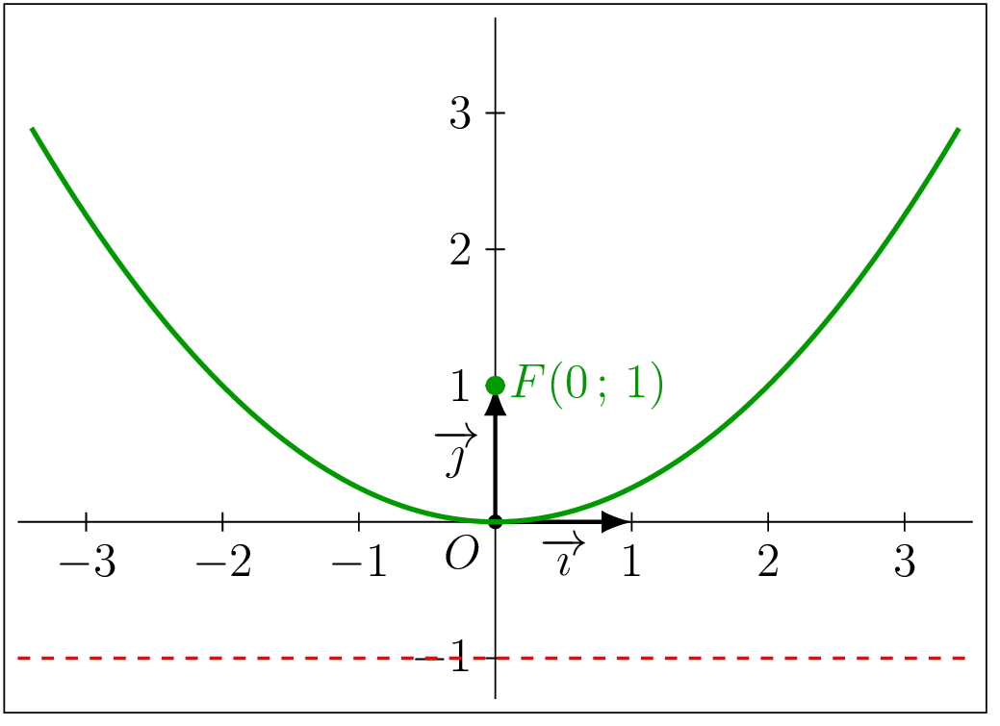

## Résolution algébrique — existence des solutions

::: {.bloc .thm}
<span class="bloc-titre">Théorème : Déterminant d'un système</span>

Soit le système
$$
(S) \,:\, \begin{cases}
ax + by + c = 0\\
a'x + b'y + c' = 0
\end{cases}
$$
Le nombre $\det(S) = ab' - a'b$ est appelé **déterminant du système** : c'est le déterminant des vecteurs directeurs des droites associées.

- Si $\det(S) \neq 0$, le système admet **une unique solution**.
- Si $\det(S) = 0$, le système admet **une infinité de solutions ou aucune solution**.
:::

::: {.bloc .rem}
<span class="bloc-titre">Remarque : </span>

On met d'abord le système sous la forme $ax+by+c=0$ pour identifier $a$, $b$, $a'$, $b'$ et calculer $\det(S) = ab'-a'b$.
:::

<details class="bloc demo">
<summary>Démonstration :</summary>

$\det(S) = ab'-a'b$ est le déterminant des vecteurs directeurs des deux droites. Il est nul si et seulement si les droites sont parallèles (donc sans intersection unique), non nul si et seulement si elles sont sécantes.

</details>

::: {.bloc .sfc}
<div class="bloc-titre">Savoir-Faire :<span class="exemp-extra"> Système avec ou sans solution — Calculer</span></div>

Le système suivant admet-il une solution unique ?
$$
(S) \,:\, \begin{cases}
2x + y = -2\\
5x + 4y = 1
\end{cases}
$$

<details class="bloc cor">
<summary>Afficher la correction :</summary>

On met sous la forme $ax+by+c=0$ :
$$\begin{cases}2x+y+2=0\\5x+4y-1=0\end{cases}$$

$\det(S) = 2\times 4 - 5\times 1 = 3 \neq 0$ : le système admet **une unique solution**.

</details>
:::

### Méthode par substitution

::: {.bloc .info}
<span class="bloc-titre">À retenir : Point méthode — résolution par substitution</span>

On exprime l'une des inconnues en fonction de l'autre à partir de l'une des équations, puis on substitue dans l'autre équation.

Cette méthode est particulièrement adaptée quand une équation est déjà sous la forme $y=\ldots$ ou $x=\ldots$.
:::

::: {.bloc .sfc}
<div class="bloc-titre">Savoir-Faire :<span class="exemp-extra"> Résoudre un système par substitution — Calculer</span></div>

Résoudre par substitution (et vérifier le résultat sur la figure de la résolution graphique) :
$$
(S)\,:\,\begin{cases}
5x + 2y + 3 = 0\\
-3x + y - 4 = 0
\end{cases}
$$

<details class="bloc cor">
<summary>Afficher la correction :</summary>

*Point clef :* on isole une inconnue dans l'une des équations, puis on substitue dans l'autre pour obtenir une équation à une seule inconnue.

De la deuxième équation : $y = 3x+4$.

On substitue dans la première :
$$5x + 2(3x+4) + 3 = 0 \iff 5x+6x+8+3=0 \iff 11x = -11 \iff x=-1.$$

Puis $y = 3\times(-1)+4 = 1$.

La solution est le couple $(-1\,;\,1)$, ce qui correspond bien au point $I$ lu graphiquement.

</details>
:::

### Méthode par combinaison

::: {.bloc .info}
<span class="bloc-titre">À retenir : Point méthode — résolution par combinaison</span>

On multiplie les équations par des réels judicieusement choisis pour rendre les coefficients d'une inconnue opposés, puis on additionne les deux équations pour éliminer cette inconnue.

Cette méthode est adaptée quand les coefficients de $x$ ou de $y$ sont facilement rendus opposés par multiplication.
:::

::: {.bloc .sfc}
<div class="bloc-titre">Savoir-Faire :<span class="exemp-extra"> Résoudre un système par combinaison — Calculer</span></div>

Résoudre par combinaison :
$$
(S) \,:\, \begin{cases}2x + y = -2\\
5x + 4y = 1
\end{cases}
$$

<details class="bloc cor">
<summary>Afficher la correction :</summary>

$\det(S) = 2\times 4 - 5\times 1 = 3\neq 0$ : unique solution.

On note $L_1$ et $L_2$ les deux équations du système.
$$
\begin{cases}
2x + y + 2 = 0 & (L_1)\\
5x + 4y - 1 = 0 & (L_2)
\end{cases}
$$
On effectue $4L_1 - L_2$ pour éliminer $y$ :
$$4(2x+y+2) - (5x+4y-1) = 0 \iff 3x + 9 = 0 \iff x = -3.$$
On effectue $5L_1 - 2L_2$ pour éliminer $x$ :
$$5(2x+y+2) - 2(5x+4y-1) = 0 \iff -3y + 12 = 0 \iff y = 4.$$

Le couple $(-3\,;\,4)$ est l'unique solution.

</details>
:::

::: {.bloc .ex}
<div class="bloc-titre">Exercice :<span class="exemp-extra"> Résoudre un système et interpréter géométriquement — Calculer</span></div>

Dans un repère $\Oij$, on considère les droites $(d_1) : 3x - 8y + 1 = 0$ et $(d_2) : 5x + 6y - 7 = 0$.

1. Calculer $\det(S)$ et en déduire la nature de l'intersection.

<details class="bloc cor">
<summary>Afficher la correction :</summary>

$\det(S) = 3\times 6 - 5\times(-8) = 18 + 40 = 58 \neq 0$ : les droites sont sécantes, le système admet une unique solution.

</details>

2. Résoudre le système par combinaison linéaire.

<details class="bloc cor">
<summary>Afficher la correction :</summary>

On note $L_1$ et $L_2$ les deux équations du système.
$$
\begin{cases}
3x - 8y + 1 = 0 & (L_1)\\
5x + 6y - 7 = 0 & (L_2)
\end{cases}
$$
On effectue $5L_1 - 3L_2$ pour éliminer $x$ :
$$5(3x-8y+1) - 3(5x+6y-7) = 0 \iff -58y + 26 = 0 \iff y = \dfrac{13}{29}.$$
On effectue $3L_1 + 4L_2$ pour éliminer $y$ :
$$3(3x-8y+1) + 4(5x+6y-7) = 0 \iff 29x - 25 = 0 \iff x = \dfrac{25}{29}.$$

L'unique solution est $\left(\dfrac{25}{29}\,;\,\dfrac{13}{29}\right)$.

</details>

3. Interpréter géométriquement.

<details class="bloc cor">
<summary>Afficher la correction :</summary>

Les droites $(d_1)$ et $(d_2)$ se coupent au point $I\left(\dfrac{25}{29}\,;\,\dfrac{13}{29}\right)$.

</details>
:::

::: {.bloc .ex}
<div class="bloc-titre">Exercice :<span class="exemp-extra"> Déterminer la position relative de deux droites et résoudre — Raisonner</span></div>

Dans un repère $\Oij$, on donne $(d_1) : 2x - 4y + 8 = 0$ et $(d_2) : x - 2y + 4 = 0$.

1. Calculer $\det(S)$.

<details class="bloc cor">
<summary>Afficher la correction :</summary>

$\det(S) = 2\times(-2) - 1\times(-4) = -4+4 = 0$.

</details>

2. Les équations sont-elles proportionnelles ?

<details class="bloc cor">
<summary>Afficher la correction :</summary>

On vérifie : $2x-4y+8 = 2(x-2y+4)$. Oui, les équations sont proportionnelles de rapport $2$.

</details>

3. Conclure sur la position relative des droites.

<details class="bloc cor">
<summary>Afficher la correction :</summary>

Les droites $(d_1)$ et $(d_2)$ sont **confondues** : le système admet une infinité de solutions.

</details>
:::

::: {.bloc .thm}
<span class="bloc-titre">Théorème : Alignement de trois points</span>

Trois points $A$, $B$, $C$ sont **alignés** si et seulement si les vecteurs $\ve{AB}$ et $\ve{AC}$ sont colinéaires, c'est-à-dire si leur déterminant est nul :
$$\det(\ve{AB},\ve{AC}) = (x_B-x_A)(y_C-y_A) - (x_C-x_A)(y_B-y_A) = 0.$$
:::

::: {.bloc .info}
<span class="bloc-titre">À retenir : Algorithme — étudier l'alignement de trois points (Python)</span>

```python
def sont_alignes(xA, yA, xB, yB, xC, yC):
    """Renvoie True si A, B, C sont alignes, False sinon."""
    det = (xB-xA)*(yC-yA) - (xC-xA)*(yB-yA)  # calcul du determinant de AB et AC
    if det == 0:                                # det nul : vecteurs colineaires
        print("Les trois points sont alignes.")
        return True
    else:                                       # det non nul : non colineaires
        print(f"Les trois points ne sont pas alignes (det = {det}).")
        return False

# Exemples d'appel
sont_alignes(0, 0, 1, 2, 2, 4)   # alignes (droite y = 2x)
sont_alignes(0, 0, 1, 1, 2, 3)   # non alignes
```
:::

## Approfondissement

::: {.bloc .ex}
<div class="bloc-titre">Exercice :<span class="exemp-extra"> Point de concours des médianes d'un triangle — Calculer, Raisonner</span></div>

Dans un repère $\Oij$ orthonormal, on considère le triangle $ABC$ avec $A(0\,;\,6)$, $B(-3\,;\,0)$, $C(3\,;\,0)$.

1. Déterminer l'équation de la médiane issue de $A$.

<details class="bloc cor">
<summary>Afficher la correction :</summary>

Le milieu $M_A$ de $[BC]$ a pour coordonnées $(0\,;\,0) = O$. La médiane $(AM_A)$ passe par $A(0\,;\,6)$ et $O(0\,;\,0)$ : son équation est $x=0$.

</details>

2. Déterminer l'équation de la médiane issue de $B$.

<details class="bloc cor">
<summary>Afficher la correction :</summary>

Le milieu $M_B$ de $[AC]$ a pour coordonnées $\left(\dfrac{3}{2}\,;\,3\right)$.

Le coefficient directeur de $(BM_B)$ est $m = \dfrac{3-0}{\dfrac{3}{2}-(-3)} = \dfrac{3}{\dfrac{9}{2}} = \dfrac{2}{3}$.

Comme $B(-3\,;\,0)\in(BM_B)$ : $0=\dfrac{2}{3}\times(-3)+p$, d'où $p=2$.

Équation : $y=\dfrac{2}{3}x+2$.

</details>

3. Déterminer le point de concours $G$ des deux médianes.

<details class="bloc cor">
<summary>Afficher la correction :</summary>

$$\begin{cases} x=0\\ y=\dfrac{2}{3}x+2 \end{cases}
\iff \begin{cases} x=0\\ y=2 \end{cases}.$$
Le point de concours est $G(0\,;\,2)$.

</details>

4. Vérifier que la troisième médiane passe également par $G$.

<details class="bloc cor">
<summary>Afficher la correction :</summary>

Le milieu $M_C$ de $[AB]$ a pour coordonnées $\left(-\dfrac{3}{2}\,;\,3\right)$.

Le coefficient directeur de $(CM_C)$ est $m = \dfrac{3-0}{-\dfrac{3}{2}-3} = -\dfrac{2}{3}$.

Comme $C(3\,;\,0)\in(CM_C)$ : $0=-\dfrac{2}{3}\times 3+p$, d'où $p=2$.

Équation : $y=-\dfrac{2}{3}x+2$.

Pour $x=0$ : $y=2$. Donc $G(0\,;\,2)\in(CM_C)$ : les trois médianes sont bien concourantes en $G$.

</details>
:::

::: {.bloc .ex}
<div class="bloc-titre">Exercice :<span class="exemp-extra"> Ensemble de points équidistants d'un point et d'une droite — Calculer, Raisonner</span></div>

Soit $F(0\,;\,1)$ et la droite $(d)$ d'équation $y = -1$.

1. Déterminer l'ensemble des points $M(x\,;\,y)$ équidistants de $F$ et de $(d)$, et identifier la courbe obtenue.

<details class="bloc cor">
<summary>Afficher la correction :</summary>

*Point clef :* la distance de $M(x\,;\,y)$ au point $F$ est $\sqrt{x^2+(y-1)^2}$ ; la distance de $M$ à la droite $(d) : y=-1$ est $\abs{y+1}$.

On résout $\sqrt{x^2+(y-1)^2} = \abs{y+1}$.

En élevant au carré : $x^2+y^2-2y+1 = y^2+2y+1$, soit $x^2 = 4y$, c'est-à-dire $y = \dfrac{x^2}{4}$.

Ce n'est pas une droite mais une **parabole**. Le point $F$ est son **foyer**, la droite $(d)$ sa **directrice**.

</details>

2. Représenter graphiquement cette parabole ainsi que $F$ et $(d)$.

<details class="bloc cor">
<summary>Afficher la correction :</summary>

<div style="text-align: center;">
  
</div>

</details>
:::

## Bilan — carte mentale

<div style="text-align: center;">
  
</div>

::: {.bloc .info}
<span class="bloc-titre">À retenir : Synthèse — ce qu'il faut retenir</span>

**Vecteur directeur et équation cartésienne**

- Depuis $ax+by+c=0$ : un vecteur directeur a pour coordonnées $(-b\,;\,a)$.
- Depuis un vecteur directeur de coordonnées $(-b\,;\,a)$ et un point $A$ : $ax+by+c=0$ avec $c=bm-an$ ($A=(n\,;\,m)$).

**Équation réduite**

- $y=mx+p$ (droite non verticale) ; $x=k$ (droite verticale).
- Passer de cartésienne à réduite : isoler $y$.

**Parallélisme et perpendicularité**

- Parallèles $\iff$ même coefficient directeur $\iff$ $ab'-a'b=0$.
- Perpendiculaires $\iff$ $m_1\times m_2 = -1$.

**Position relative de deux droites**

- $m_1 \neq m_2$ : sécantes (une solution).
- $m_1 = m_2$, $p_1\neq p_2$ : strictement parallèles (aucune solution).
- $m_1 = m_2$, $p_1 = p_2$ : confondues (infinité de solutions).

**Systèmes linéaires**

- Déterminant : $\Delta = ab'-a'b$. Si $\Delta\neq 0$, une unique solution.
- Deux méthodes : substitution (si une variable est isolée) ; combinaison (si les coefficients se simplifient bien).

**Alignement**

- $A$, $B$, $C$ alignés $\iff$ $\det(\ve{AB},\ve{AC})=0$.

**Droites remarquables d'un triangle**

- Médiane : passe par un sommet et le milieu du côté opposé.
- Hauteur : passe par un sommet, perpendiculaire au côté opposé.
- Médiatrice : passe par le milieu d'un côté, perpendiculaire à ce côté.
:::
