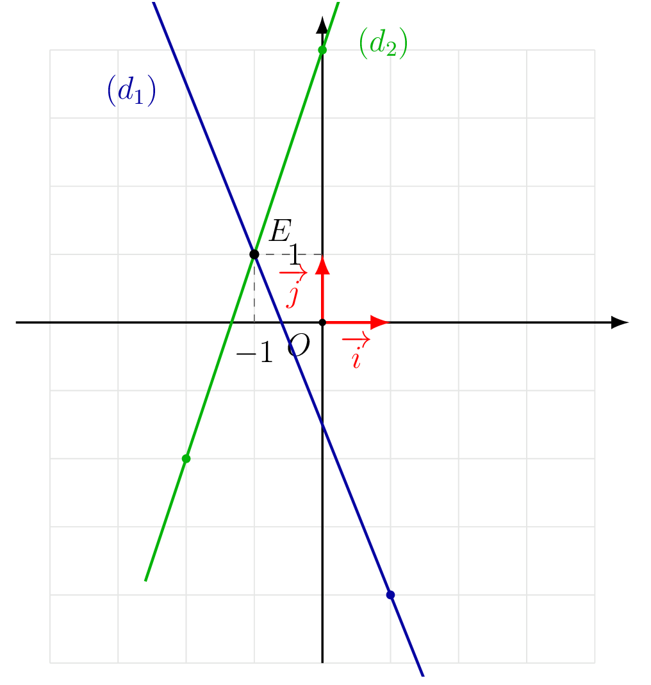

::: {.bloc .rem}
Remarque : 

Résoudre un système de deux équations à deux inconnues revient à chercher les coordonnées du point d'intersection de deux droites :

- droites **sécantes** : le système admet **une unique solution** ;
- droites **confondues** : le système admet **une infinité de solutions** ;
- droites **strictement parallèles** : le système n'admet **aucune solution**.
:::

## Définitions

::: {.bloc .def}
Définition : Système linéaire

Un **système linéaire** de deux équations à deux inconnues $x$ et $y$ est la donnée de deux équations de la forme :
$$\begin{cases}
ax + by + c = 0\\
a'x + b'y + c' = 0
\end{cases}$$
où $a, b, c, a', b', c'$ sont des réels donnés.
:::

::: {.bloc .def}
Définition : Solution d'un système

**Résoudre** un système d'équations, c'est déterminer tous les couples $(x\,;\,y)$ qui vérifient simultanément les deux équations.
:::

::: {.bloc .sfc}

Savoir-Faire : Reconnaître un système linéaire — Raisonner

Lequel des systèmes suivants est un système linéaire ?
$$
(S_1) \,:\, \begin{cases}2x+3y-5=0\\4x-7y+8=0\end{cases}
\qquad
(S_2) \,:\, \begin{cases}2x^2+3y-5=0\\4x-7y^2+8=0\end{cases}
$$

Afficher la correction :

$(S_1)$ est linéaire : les deux équations sont du premier degré en $x$ et $y$.

$(S_2)$ ne l'est pas : la première équation contient $x^2$ et la seconde contient $y^2$.

:::

## Résolution graphique

::: {.bloc .sfc}

Savoir-Faire : Résoudre graphiquement un système — Représenter

Résoudre graphiquement le système :
$$
(S)\,:\, \begin{cases}
5x + 2y + 3 = 0\\
-3x + y - 4 = 0
\end{cases}
$$

Afficher la correction :

*Point clef :* On met les deux équations de droites sous forme réduite, et on vérifie s'il existe une intersection.

Pour tout $x,y \in \R$, 
$$
(S) \iff \begin{cases}
y = -\dfrac{5}{2}x - \dfrac{3}{2}\\[4pt]
y = 3x + 4
\end{cases}
$$
Les coefficients directeurs $-\dfrac{5}{2}$ et $3$ étant différents, les droites sont sécantes.

  

Le point d'intersection des deux droites est $I(-1\,;\,1)$, unique solution du système.

:::
