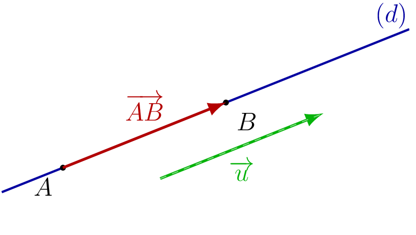
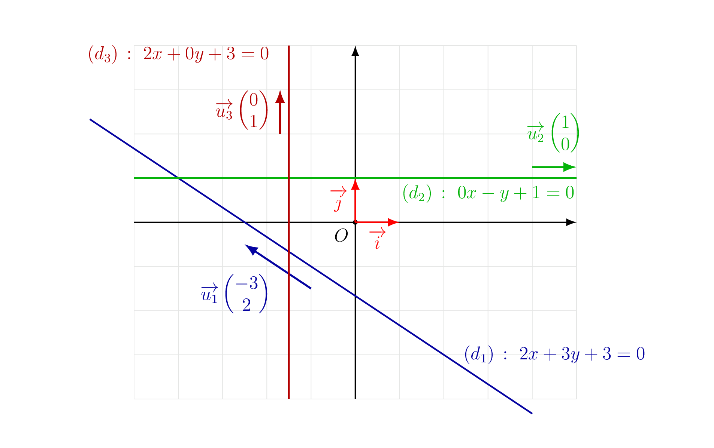
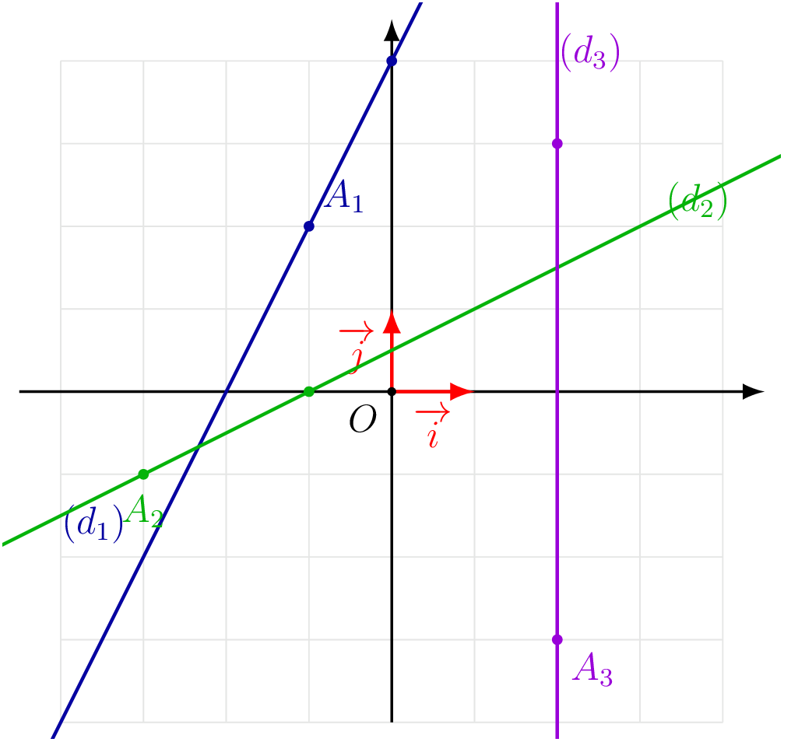

::: {.bloc .def}
Définition : Vecteur directeur

On dit qu'un vecteur $\ve{u}$ est un **vecteur directeur** d'une droite $(d)$ si et seulement si $\ve{u}$ et $(d)$ ont la même direction, c'est-à-dire si, pour tous points $A$, $B$ de $(d)$, les vecteurs $\ve{u}$ et $\ve{AB}$ sont colinéaires.
:::

::: {.bloc .info}
À retenir : Illustration graphique

  

:::

::: {.bloc .rem}
Remarque : 

Un vecteur directeur de $(d)$ est colinéaire à tout vecteur $\ve{AB}$ formé par deux points distincts $A$, $B$ de $(d)$.
:::

::: {.bloc .thm}
Théorème : Équation cartésienne

Dans un repère $\Oij$ du plan, soit $(d)$ une droite et $a$, $b$ deux réels dont l'un au moins est non nul.

Le vecteur $\ve{u}$ de coordonnées $(-b\,;\,a)$ est un vecteur directeur de $(d)$ si et seulement si $(d)$ admet une équation de la forme
$$ax + by + c = 0.$$
Cette équation est appelée **équation cartésienne** de la droite $(d)$.
:::

Démonstration :

Soient $A\,(n\,;\,m)$ un point de $(d)$ et $M\,(x\,;\,y)$ un point quelconque du plan.

Le vecteur $\ve{AM}$ a pour coordonnées $(x-n\,;\,y-m)$.

$M \in (d)$ si et seulement si $\ve{AM}$ et $\ve{u}$ sont colinéaires.
D'après le critère de colinéarité (déterminant nul) :
$$
\ve{u} \text{ de coordonnées } (-b\,;\,a) \text{ vecteur directeur de }(d)
\iff a(x-n)-(-b)(y-m)=0.
$$
En posant $c = bm - an$, on obtient $ax+by+c=0$.

Réciproquement, tout couple $(a,b)$ avec $a^2+b^2\neq 0$ définit ainsi une droite et un vecteur directeur de coordonnées $(-b\,;\,a)$.

::: {.bloc .rem}
Remarque : 

1. Cette propriété montre que **toute droite du plan** admet une équation cartésienne de la forme $ax+by+c=0$.
2. L'équation cartésienne n'est pas unique : si $ax+by+c=0$ est une équation de $(d)$, alors pour tout réel $k\neq 0$, $kax+kby+kc=0$ en est une autre.
   Ainsi une droite admet une infinité d'équation cartésienne.
:::

::: {.bloc .info}
À retenir : Illustration

  

:::

::: {.bloc .info}
À retenir : Point méthode — Déterminer une équation cartésienne

Deux stratégies sont possibles.

**Méthode 1 — À partir du vecteur directeur par identification.**
Si la droite $(d)$ admet $\ve{u}\vecol{u_1}{u_2}$ comme vecteur directeur,
une équation cartésienne est de la forme $ax+by+c=0$ avec $a=u_2$ et $b=-u_1$.
On détermine $c$ en substituant les coordonnées d'un point connu $A(x_A\,;\,y_A)$ de $(d)$ :
$$ax_A + by_A + c = 0 \iff c = -ax_A - by_A.$$

**Méthode 2 — À partir du déterminant.**
Un point $M(x\,;\,y)$ appartient à $(d)$ si et seulement si
$\ve{AM}$ et $\ve{u}$ sont colinéaires :
$$\det(\ve{AM},\ve{u}) = 0
\iff (x-x_A)\,u_2 - (y-y_A)\,u_1 = 0.$$
On développe et on simplifie pour obtenir la forme $ax+by+c=0$.
:::

::: {.bloc .sfc}

Savoir-Faire : Relier une équation cartésienne et un vecteur directeur — Calculer

On considère la droite $(d)$ d'équation $4x-3y+2=0$. Donner deux vecteurs directeurs de $(d)$.

Afficher la correction :

L'équation est de la forme $ax+by+c=0$ avec $a=4$ et $b=-3$.

Un vecteur directeur de $(d)$ a pour coordonnées $(3\,;\,4)$.

Tout vecteur colinéaire convient, par exemple le vecteur de coordonnées $(6\,;\,8)$.

:::

::: {.bloc .sfc}

Savoir-Faire : Déterminer une équation cartésienne (Méthode 1) — Calculer

Soit $\Oij$ un repère du plan, $A(-5\,;\,1)$ et $\ve{u}$ un vecteur de coordonnées $(-2\,;\,3)$.

Déterminer une équation cartésienne de la droite $(d)$ passant par $A$ et de vecteur directeur $\ve{u}$.

Afficher la correction :

On a  $\ve{u} (-2\,;\,3)$, donc une équation cartésienne de $(d)$ est de la forme $3x + 2y + c = 0$.

Or $A \in (d)$, donc $3 \times (-5) + 2 \times 1 + c = 0$, soit $c = 13$.

Une équation cartésienne de $(d)$ est $3x + 2y + 13 = 0$.

:::

::: {.bloc .ex}

Exercice : Utiliser une équation cartésienne — Calculer

Dans un repère $\Oij$, on considère la droite $(d)$ d'équation $3x-2y+1=0$.

1. Le point $P(1\,;\,2)$ appartient-il à $(d)$ ?

Afficher la correction :

On vérifie : $3\times 1 - 2\times 2 + 1 = 3-4+1 = 0$. Donc $P\in(d)$.

2. Donner un vecteur directeur de $(d)$.

Afficher la correction :

L'équation est de la forme $ax+by+c=0$ avec $a=3$, $b=-2$. Un vecteur directeur de $(d)$ a pour coordonnées $(2\,;\,3)$.

3. Déterminer l'ordonnée du point de $(d)$ d'abscisse $3$.

Afficher la correction :

On résout $3\times 3 - 2y + 1 = 0$, soit $10 = 2y$, d'où $y=5$. Le point cherché a pour coordonnées $(3\,;\,5)$.

:::

::: {.bloc .sfc}

Savoir-Faire : Lecture graphique d'une équation cartésienne — Représenter, Calculer

Le plan est muni d'un repère $\Oij$. On donne ci-dessous les droites $(d_1)$, $(d_2)$ et $(d_3)$.

  

Déterminer une équation cartésienne de chacune des droites $(d_1)$, $(d_2)$ et $(d_3)$.

Afficher la correction :

*Point clef :* lecture graphique d'un vecteur directeur de la droite et d'un point de la droite.

- $(d_1)$ a pour vecteur directeur $\ve{u_1}\vecol{1}{2}$ et passe par le point $A_1(-1\,;\,2)$.

  Elle admet une équation cartésienne de la forme $-2x+y+c=0$ et vérifie $-2\times(-1)+2+c=0$.

  On déduit que $c=-4$, ainsi
  $$(d_1)\,:\ -2x+y-4=0.$$

- $(d_2)$ a pour vecteur directeur $\ve{u_2}\vecol{2}{1}$ et passe par le point $A_2(-3\,;\,-1)$.

  Elle admet une équation cartésienne de la forme $x-2y+c=0$ et vérifie $-3-2\times(-1)+c=0$.

  On déduit que $c=1$, ainsi
  $$(d_2)\,:\ x-2y+1=0.$$

- $(d_3)$ a pour vecteur directeur $\ve{u_3}\vecol{0}{1}$ et passe par le point $A_3(2\,;\,-3)$.

  Elle admet une équation cartésienne de la forme $x+c=0$ et vérifie $2+c=0$.

  On déduit que $c=-2$, ainsi
  $$(d_3)\,:\ x-2=0.$$

:::

::: {.bloc .sfc}

Savoir-Faire : Déterminer une équation cartésienne (Méthode 2) — Calculer

Soit $\Oij$ un repère du plan, $A(1\,;\,-2)$ et $\ve{u}$ un vecteur de coordonnées $(3\,;\,4)$.

Déterminer une équation cartésienne de la droite $(d)$ passant par $A$ et de vecteur directeur $\ve{u}$.

Afficher la correction :

*Point clef :* $M(x\,;\,y) \in (d)$ si et seulement si $\ve{AM}$ et $\ve{u}$ sont colinéaires, c'est-à-dire $\det(\ve{AM}, \ve{u}) = 0$.

Un point $M(x\,;\,y)$ appartient à $(d)$ si et seulement si $\ve{AM}$ et $\ve{u}$ sont colinéaires :
$$
(x-1)\times 4 - (y+2)\times 3 = 0
\iff 4x - 4 - 3y - 6 = 0
\iff 4x - 3y - 10 = 0.
$$

Une équation cartésienne de $(d)$ est $4x-3y-10=0$.

:::

::: {.bloc .ex}

Exercice : Déterminer une équation cartésienne à partir de deux points — Calculer

Soit $\Oij$ un repère du plan et $A(-2\,;\,5)$, $B(1\,;\,3)$ deux points.

Déterminer une équation cartésienne de la droite $(AB)$.

Afficher la correction :

Un point $M(x\,;\,y)$ appartient à $(AB)$ si et seulement si $\ve{AB}$ et $\ve{AM}$ sont colinéaires :
$$\begin{aligned}
M(x\,;\,y)\in(AB)
&\iff \ve{AB} \text{ et } \ve{AM} \text{ colinéaires}\\
&\iff (1-(-2))(y-5)-(3-5)(x-(-2))=0\\
&\iff 3(y-5)+2(x+2)=0\\
&\iff 2x+3y-11=0.
\end{aligned}$$
Une équation cartésienne de $(AB)$ est $2x+3y-11=0$.

:::
