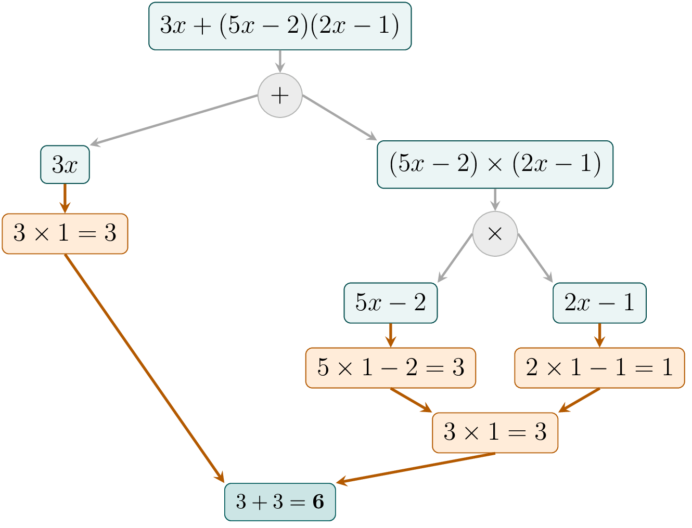

::: {.bloc .def}
Définition : Développement, factorisation, réduction

- **Développer** un produit, c'est transformer une expression en une **somme**.
- **Factoriser** une expression, c'est transformer une expression en un **produit**.
- **Réduire** une expression, c'est regrouper les termes semblables pour obtenir
  l'expression la plus simple possible.
:::

::: {.bloc .rem}
Remarque : 

Développer et factoriser sont deux transformations complémentaires.

- On développe pour obtenir une somme plus simple à manipuler.
- On factorise pour faire apparaître une structure utile, notamment pour résoudre une équation.
:::

::: {.bloc .rem}
Remarque : 

L'expression $3x+(5x-2)(2x-1)$ n'est ni sous forme factorisée, ni sous forme développée réduite.
Cependant, c'est bien une **somme** : la dernière opération effectuée est une addition.

Pour s'en convaincre, calculons cette expression pour $x=1$ en respectant les priorités opératoires :

  

L'arbre montre que les multiplications sont effectuées **avant** l'addition finale :
l'expression est donc une somme de deux termes : $3x$ et $(5x-2)(2x-1)$.
:::

::: {.bloc .sfc}

Savoir-Faire : Identifier la structure d'une expression — Raisonner

Pour chaque expression, déterminer la dernière opération effectuée et en déduire si l'expression
est une somme, un produit ou un quotient.

1. $A=(2x-3)(x+1)-(x^2-1)\div(x-1)$

Afficher la correction :

La dernière opération est une soustraction entre $(2x-3)(x+1)$ et $(x^2-1)\div(x-1)$.

Donc $A$ est une somme (différence de deux termes).

2. $B=\bigl((3x-2)(x+4)+5x\bigr)\div(2x-1)$

Afficher la correction :

La dernière opération est une division entre $(3x-2)(x+4)+5x$ et $2x-1$.

Donc $B$ est un quotient.

:::
