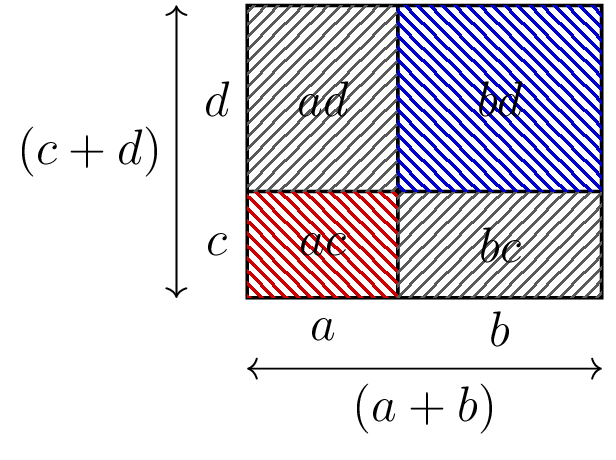

::: {.bloc .thm}
Propriété : Simple et double distributivité

Pour tous réels $k$, $a$, $b$, $c$ et $d$ :
$$k(a+b)=ka+kb \et (a+b)(c+d)=ac+ad+bc+bd$$
:::

Démonstration :

On illustre la double distributivité par l'égalité des aires.

Le grand rectangle a pour dimensions $(a+b)$ et $(c+d)$, donc son aire vaut $(a+b)(c+d)$.

Il est découpé en quatre rectangles d'aires $ac$, $ad$, $bc$, $bd$, d'où l'égalité.

  

::: {.bloc .sfc}

Savoir-Faire : Développer et réduire avec la distributivité — Calculer

Développer et réduire $(x-4)(2x-5)$.

Afficher la correction :

Pour tout réel $x$, 
$$(x-4)(2x-5)=2x^2-5x-8x+20=2x^2-13x+20$$

:::

::: {.bloc .sfc}

Savoir-Faire : Factoriser en faisant apparaître un facteur commun — Raisonner

Factoriser $(2x-6)(5-x)-(x-3)(1-2x)$.

Afficher la correction :

Pour tout réel $x$,
$$\begin{aligned}
(2x-6)(5-x)-(x-3)(1-2x)
&= 2(x-3)(5-x)+(x-3)(2x-1)\\
&= (x-3)\left[2(5-x)+(2x-1)\right]\\
&= (x-3)(10-2x+2x-1)\\
&= 9(x-3)
\end{aligned}$$

:::

::: {.bloc .rem}
Remarque : Erreur à éviter

Lorsqu'un signe $-$ précède une expression entre parenthèses, il faut le distribuer sur chaque terme.
Par exemple, pour tout réel $x$, $$-(x-3)(1-2x) = (x-3)\times(-(1-2x)) = (x-3)(2x-1)$$
:::

::: {.bloc .ex}

Exercice : Factoriser en faisant apparaître un facteur commun — Calculer

1. Factoriser $(2x-3)(5x+1)+(3-2x)(x-3)$.

Afficher la correction :

***Point clef :** on remarque que $3-2x=-(2x-3)$,
ce qui fait apparaître le facteur commun $(2x-3)$.*

Pour tout réel $x$,
$$\begin{aligned}
(2x-3)(5x+1)+(3-2x)(x-3)
&= (2x-3)(5x+1)-(2x-3)(x-3)\\
&= (2x-3)\left[(5x+1)-(x-3)\right]\\
&= (2x-3)(4x+4)\\
&= 4(2x-3)(x+1)
\end{aligned}$$

2. Factoriser $6x(x+4)+3(x+4)^2$.

Afficher la correction :

***Point clef :** on pré-factorise chaque terme par $3$
pour faire apparaître le facteur commun $(x+4)$.*

Pour tout réel $x$,
$$
6x(x+4)+3(x+4)^2= 3\times 2x(x+4)+3(x+4)(x+4)= 3(x+4)\left[2x+(x+4)\right]= 3(x+4)(3x+4)
$$

3. Factoriser $(3x-1)(2x+5)-(3x-1)$.

Afficher la correction :

***Point clef :** le terme $(3x-1)$ seul s'écrit
$(3x-1)\times 1$ ; le facteur commun $(3x-1)$ apparaît immédiatement.*

Pour tout réel $x$,
$$\begin{aligned}
(3x-1)(2x+5)-(3x-1)
&= (3x-1)(2x+5)-(3x-1)\times 1\\
&= (3x-1)\left[(2x+5)-1\right]\\
&= (3x-1)(2x+4)\\
&= 2(3x-1)(x+2)
\end{aligned}$$

:::
