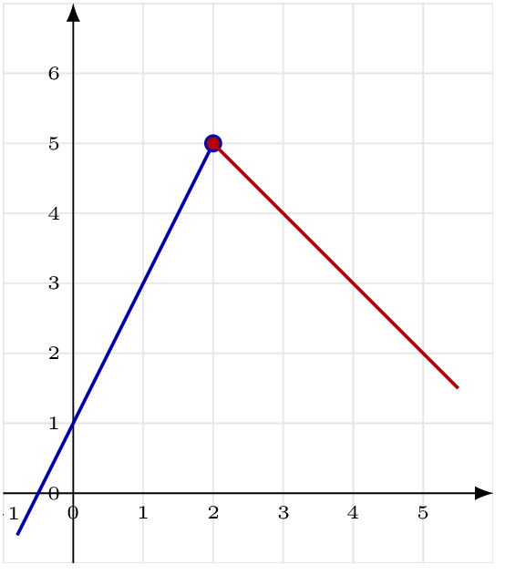
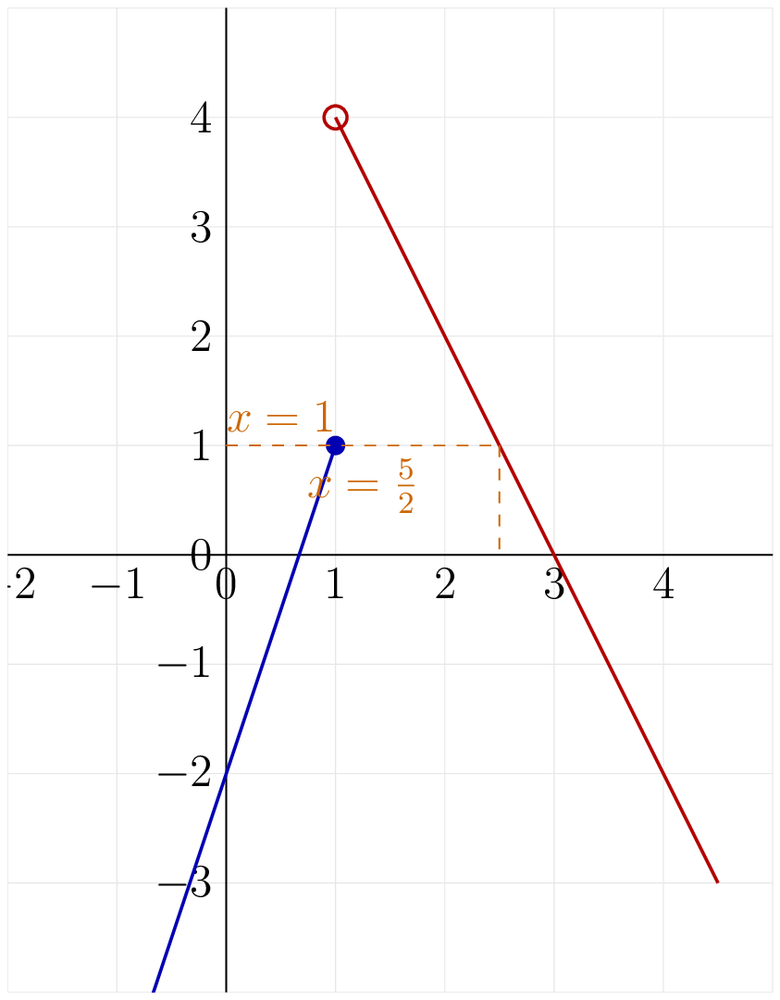

::: {.bloc .def}
Définition : Fonction affine par morceaux

Une **fonction affine par morceaux** est une fonction qui est affine sur chacun des morceaux où elle est définie.
:::

::: {.bloc .ex}

Exercice : Calculer des images — Calculer

Soit $f$ définie par
$$f(x) = \begin{cases} 2x+1 & \text{si } x < 2 \\ -x+7 & \text{si } x \geq 2 \end{cases}$$

Calculer $f(0)$, $f(2)$, $f(5)$.

Afficher la correction :

*Point clef :* on identifie d'abord l'intervalle auquel appartient la valeur, puis on applique l'expression correspondante.

- $0<2$ : $f(0)=2\times 0+1=1$.
- $2\geq 2$ : $f(2)=-2+7=5$.
- $5\geq 2$ : $f(5)=-5+7=2$.

:::

::: {.bloc .ex}

Exercice : Chercher les antécédents — Calculer, Raisonner

Avec la même fonction $f$, chercher les antécédents de $3$.

Afficher la correction :

*Point clef :* pour une fonction définie par morceaux, on résout l'équation séparément sur chaque intervalle de définition, puis on vérifie que la solution trouvée appartient bien à cet intervalle.

- Pour tout $x <2$, $2x+1=3 \iff 2x=2 \iff x=1$. Or $1<2$, donc $x=1$ est un antécédent.
- Pour tout $x\geq 2$, $-x+7=3 \iff -x=-4 \iff x=4$. Or $4\geq 2$. Donc $x=4$ est un antécédent.

$3$ a **deux antécédents** : $1$ et $4$.

:::

::: {.bloc .sf}

Savoir faire : Méthode — Tracer une fonction affine par morceaux

1. Pour chaque morceau, identifier l'expression affine et la condition sur $x$.
2. Calculer deux points par morceau en choisissant des valeurs de $x$ dans le domaine correspondant.
3. À la valeur de jonction, placer un **point fermé** $\bullet$ si la valeur est incluse ($\leq$ ou $\geq$), et un **point ouvert** $\circ$ si elle est exclue ($<$ ou $>$).
4. Tracer chaque morceau de droite séparément.
:::

::: {.bloc .ex}

Exercice : Tracer une fonction affine par morceaux

Tracer la représentation graphique de $f$ définie par
$$f(x) = \begin{cases} 2x+1 & \text{si } x < 2 \\ -x+7 & \text{si } x \geq 2 \end{cases}$$

Afficher la correction :

**Morceau 1** ($x<2$) : deux points — $f(0)=1$ et $f(1)=3$. Point ouvert en $x=2$ car $x<2$.

**Morceau 2** ($x\geq 2$) : deux points — $f(2)=5$ et $f(4)=3$. Point fermé en $x=2$ car $x\geq 2$.

  

:::

## Exercice

::: {.bloc .exo}
 Calculer avec une fonction définie par morceaux — Calculer, Raisonner 

Soit $g$ définie par
$$g(x) = \begin{cases} 3x-2 & \text{si } x \leq 1 \\ -2x+6 & \text{si } x > 1 \end{cases}$$

1. Calculer $g(-1)$ et $g(3)$.

Afficher la correction :

$-1\leq 1$ donc $g(-1)=3\times(-1)-2=-5$ et $3>1$ donc $g(3)=-2\times 3+6=0$.

2. Chercher les antécédents de $1$ par $g$.

Afficher la correction :

- Pour tout $x\leq 1$, $3x-2=1 \iff 3x=3 \iff x=1$. Or $1\leq 1$ donc $1$ est un antécédent de $1$ par $g$.
- Pour tout $x>1$, $-2x+6=1 \iff -2x=-5 \iff x=\dfrac{5}{2}$. Or $\dfrac{5}{2}>1$, donc $\dfrac{5}{2}$ est un antécédent de $1$ par $g$.

Les antécédents de $1$ sont $\mathbf{1}$ et $\mathbf{\dfrac{5}{2}}$.

3. Chercher les antécédents de $4$ par $g$.

Afficher la correction :

- Pour tout $x\leq 1$, $3x=6 \iff x=2$. Or $2\leq 1$ est faux, donc $x=2$ n'est pas un antécédent.
- Pour tout $x>1$, on résout $-2x+6=4$. $-2x=-2 \iff x=1$. Or $1>1$ est faux, donc $x=1$ n'est pas un antécédent.

$4$ n'a **aucun antécédent**.

4. Tracer la représentation graphique de la fonction $g$, et retrouver les résultats des questions précédentes.

Afficher la correction :

**Morceau 1** ($x\leq 1$) : $g(0)=-2$ et $g(1)=1$. Point fermé en $x=1$.

**Morceau 2** ($x>1$) : $g(2)=2$ et $g(4)=-2$. Point ouvert en $x=1$.

  

On retrouve graphiquement :

- $g(-1)=-5$, $g(1)=1$, $g(3)=0$.
- La droite horizontale $y=1$ coupe la courbe en $x=1$ et $x=\dfrac{5}{2}$ : ce sont bien les deux antécédents de $1$.
- La droite horizontale $y=4$ ne coupe pas la courbe : $4$ n'a aucun antécédent.

:::
