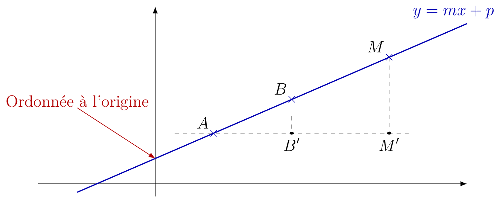
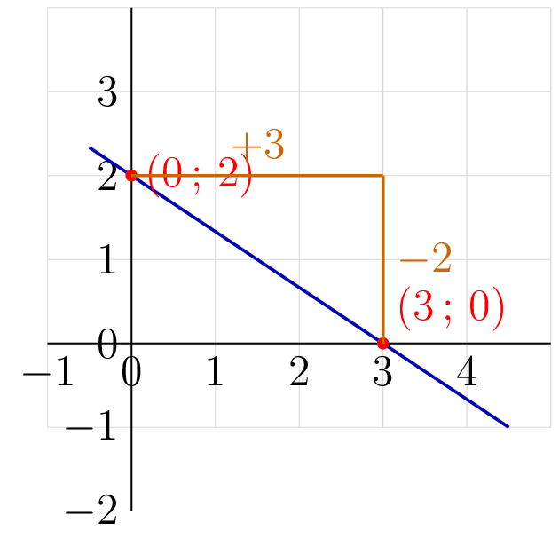
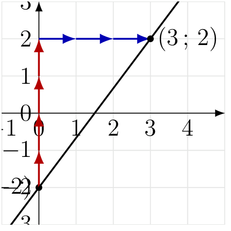
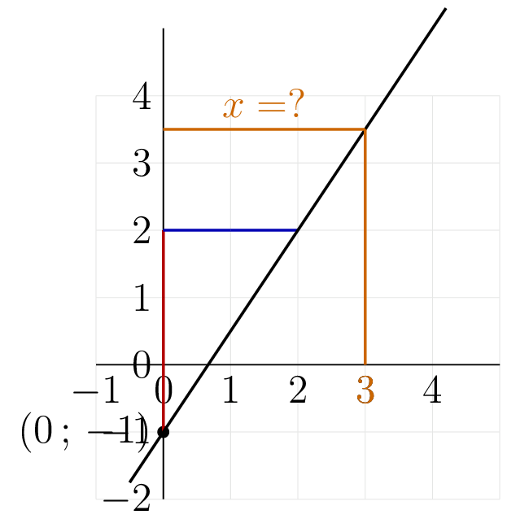

::: {.bloc .thm}
Propriété : Représentation d'une fonction affine

La courbe représentative d'une fonction affine $f(x)=mx+p$ est une **droite** non parallèle à l'axe des ordonnées.

- Elle coupe l'axe des ordonnées au point $(0\,;\,p)$.
- Elle a pour coefficient directeur $m$.

On dit que la fonction admet pour représentative la droite d'équation $y=mx+p$.
:::

Démonstration : 

On se place dans un repère orthogonal $(O\,;\,I,\,J)$. Soit $(d)$ la droite passant par $A(x_A\,;\,y_A)$ et $B(x_B\,;\,y_B)$ avec $x_A \neq x_B$. On pose
$$m = \frac{y_B - y_A}{x_B - x_A} \quad \text{et} \quad p = y_A - mx_A$$

Soit $M(x\,;\,y)$ un point du plan. On note $A'$, $B'$, $M'$ les projetés orthogonaux respectifs de $A$, $B$, $M$ sur la droite horizontale d'ordonnée $y_A$.

  

**Sens direct.** Supposons $M \in (d)$ avec $x \neq x_A$.

Les droites $(BB')$ et $(MM')$ sont verticales, donc parallèles. D'après le théorème de Thalès dans le triangle $AM'M$, la droite $(B'B)$ est parallèle à $(M'M)$ et coupe $[AM']$ en $B'$ et $[AM]$ en $B$, donc :
$$\frac{AB'}{AM'} = \frac{BB'}{MM'}$$

Or $AB' = x_B - x_A$, $AM' = x - x_A$, $BB' = y_B - y_A$ et $MM' = y - y_A$, d'où :
$$\frac{x_B - x_A}{x - x_A} = \frac{y_B - y_A}{y - y_A}$$

Donc $(y - y_A)(x_B - x_A) = (y_B - y_A)(x - x_A)$, d'où, puisque $x_B - x_A \neq 0$ :
$$y - y_A = \frac{y_B - y_A}{x_B - x_A}(x - x_A) = m(x - x_A)$$

d'où $y = mx + (y_A - mx_A) = mx + p$. Ainsi tout point de $(d)$ vérifie $y = mx + p$.

**Réciproque.** Soit $M(x_0\,;\,y_0)$ tel que $y_0 = mx_0 + p$.

*Si $x_0 = x_A$* : alors $y_0 = mx_A + p = mx_A + y_A - mx_A = y_A$, donc $M = A \in (d)$.

*Si $x_0 \neq x_A$* : notons $M^*$ le point de $(d)$ d'abscisse $x_0$. D'après le sens direct, $M^*$ a pour ordonnée $mx_0 + p = y_0$. Donc $M^* = M$, et $M \in (d)$.

**Conclusion :** l'ensemble des points du plan vérifiant $y = mx + p$ est exactement la droite $(d)$.

::: {.bloc .rem}
Remarque : 

- Si deux points ont la **même abscisse** ($x_1 = x_2$), la droite passant par ces points n'est pas la représentation d'une fonction, car un même réel $x$ aurait plusieurs images.
- L'ordonnée à l'origine de $f$ est $f(0)=p$ : c'est l'ordonnée du point d'intersection de la droite avec l'axe des ordonnées.
:::

::: {.bloc .rem}
Interprétation de la pente : 

Le coefficient directeur $m=\dfrac{a}{b}$ indique l'inclinaison de la droite par rapport à l'axe des abscisses : quand on **avance de $b$** vers la droite, on **monte de $a$** (ou descend si $a<0$).
:::

::: {.bloc .sfc}

Savoir-Faire : Tracer la droite représentative : méthode 1

Tracer la droite représentative de la fonction $f$ définie par $f(x)=-\dfrac{2}{3}x+2$.

Afficher la correction :

Soit $(d)$ la représentation graphique de $f$.

On choisit des valeurs de $x$ multiples de $3$ (dénominateur de $m$) pour éviter les fractions dans les calculs.

- $f(3)=-\dfrac{2}{3} \times 3 + 2 = 0$, donc $A(3\,;\,0)$ est un point de $(d)$.
- $f(6)=-\dfrac{2}{3}\times 6 +2=-4+2=-2$, donc $B(6\,;\,-2)$ est un point de $(d)$.

  

:::

::: {.bloc .sfc}

Savoir-Faire : Tracer la droite représentative : méthode 2

Tracer la droite représentative de la fonction $f$ définie par $f(x)=\dfrac{4}{3}x - 2$.

Afficher la correction :

La représentation graphique de $f$ admet $-2$ comme ordonnée à l'origine et admet $\dfrac{4}{3}$ comme coefficient directeur ainsi

  

:::

::: {.bloc .rem}
Antécédent pour les fonctions affines : 

Pour une fonction affine $f(x)=mx+p$ avec $m\neq 0$, tout réel admet **un unique antécédent**.
:::

::: {.bloc .ex}

Exercice : Tracer une droite et lire un antécédent — Représenter, Calculer

Tracer la droite représentative de $g(x)=\dfrac{3}{2}x-1$. Lire graphiquement un antécédent de $3{,}5$ par $g$, puis le vérifier algébriquement.

Afficher la correction :

*Point clef :* pour tracer une droite, on place le point d'ordonnée à l'origine $(0\,;\,p)$, puis on utilise la pente $m$ pour trouver un second point.

L'ordonnée à l'origine est $p=-1$ et le coefficient directeur est $m=\dfrac{3}{2}$ : quand on avance de $2$, on monte de $3$.

Lecture graphique : la droite atteint l'ordonnée $3{,}5$ en $x=3$, donc l'antécédent de $3{,}5$ par $g$ est $\mathbf{3}$.

Vérification : $\dfrac{3}{2}\times 3-1=\dfrac{9}{2}-1=\dfrac{7}{2}=3{,}5$. Donc $g(3)=3{,}5$, et donc $3$ est bien l'antécédent de $3{,}5$ par $g$.

  

:::
