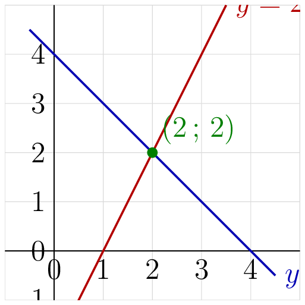

::: {.bloc .ex}

Exercice : Résoudre $f(x)=k$ algébriquement — Calculer

Résoudre $3x-1=5$.

Afficher la correction :

Pour tout réel $x$, $3x-1=5 \iff 3x=6 \iff x=2$.

L'équation a pour solution $S= \{2\}$.

:::

::: {.bloc .ex}

Exercice : Résoudre $f(x)=g(x)$ algébriquement — Calculer

Résoudre $-2x+7=3x-3$.

Afficher la correction :

Pour tout réel $x$,
$$-2x+7=3x-3 \iff -2x-3x=-3-7 \iff -5x=-10 \iff x=2$$

L'équation a pour unique solution $S= \{2\}$.

:::

::: {.bloc .rem}
Lien avec l'intersection de droites : 

Résoudre $f(x)=g(x)$, c'est trouver la valeur de $x$ pour laquelle les représentations graphiques de $f$ et $g$ se coupent.

**Graphiquement :** le point d'intersection des droites $y=f(x)$ et $y=g(x)$ a pour abscisse la solution de $f(x)=g(x)$.
:::

::: {.bloc .ex}

Exercice : Résolution graphique — Représenter, Calculer

Résoudre graphiquement $-x+4=2x-2$.

Afficher la correction :

*Point clef :* on réécrit l'équation sous la forme $f(x)=g(x)$ avec $f(x)=-x+4$ et $g(x)=2x-2$, puis on cherche l'abscisse du point d'intersection des deux droites.

On trace les droites $y=-x+4$ et $y=2x-2$.

Les deux droites se coupent au point $(2\,;\,2)$, ainsi $S=\{2\}$.

  

:::
