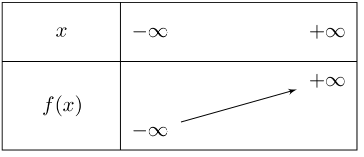
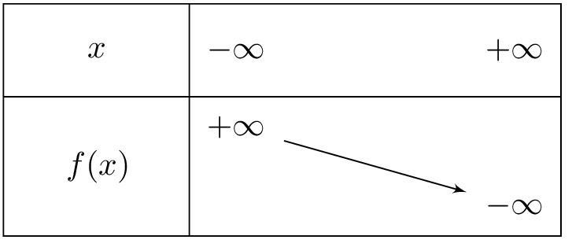

::: {.bloc .thm}
Propriété : Variations selon le signe de $m$

Soit $f(x)=mx+p$ une fonction affine.

- Si $m>0$ : $f$ est **strictement croissante** sur $\R$.
- Si $m<0$ : $f$ est **strictement décroissante** sur $\R$.
- Si $m=0$ : $f$ est **constante** sur $\R$.
:::

Démonstration : 

Soient $x_1$ et $x_2$ deux réels avec $x_1<x_2$. On calcule :
$$f(x_2)-f(x_1)=(mx_2+p)-(mx_1+p)=m(x_2-x_1)$$

Comme $x_2-x_1>0$ :

- si $m>0$ alors $m(x_2-x_1)>0$, soit $f(x_2)>f(x_1)$ : $f$ est strictement croissante.
- si $m<0$ alors $m(x_2-x_1)<0$, soit $f(x_2)<f(x_1)$ : $f$ est strictement décroissante.
- si $m=0$ alors $f(x_2)=f(x_1)$ : $f$ est constante.

## Représenter les variations

::: {.bloc .info}
Représentation graphique des variations

Pour représenter graphiquement les variations d'une fonction affine, on utilise un tableau de variations indiquant le sens de variation.

  
$m>0$ : $f$ strictement croissante

  
$m<0$ : $f$ strictement décroissante

  
  

:::

::: {.bloc .sfc}

Savoir-Faire : Dresser le tableau de variations — Représenter

Pour chaque fonction, dresser le tableau de variations :
$$f(x)=4x-1 \qquad g(x)=-\frac{1}{3}x+2 \qquad h(x)=7$$

Afficher la correction :

$f$ : $m=4>0$, donc $f$ est strictement croissante.

$g$ : $m=-\dfrac{1}{3}<0$, donc $g$ est strictement décroissante.

$h$ : $m=0$, donc $h$ est constante (tableau des variations inutile)

  
  

:::

::: {.bloc .ex}

Exercice : Reconnaître $m$ à partir d'un tableau de variations — Raisonner

Une fonction affine est décroissante sur $\R$.

1. Que peut-on dire du signe de $m$ ?

Afficher la correction :

$m<0$.

2. Donner deux exemples de fonctions affines décroissantes.

Afficher la correction :

Par exemple $f(x)=-x+1$ et $g(x)=-3x-2$.

:::
