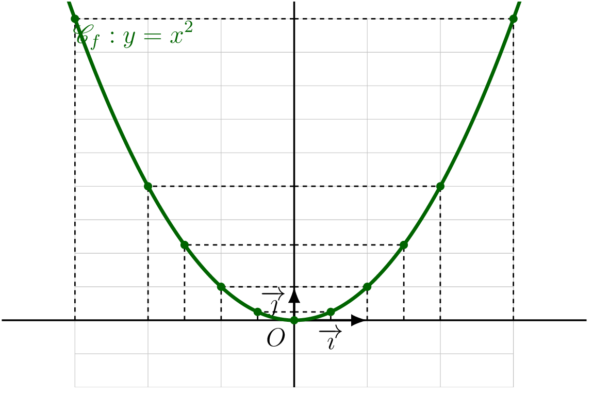
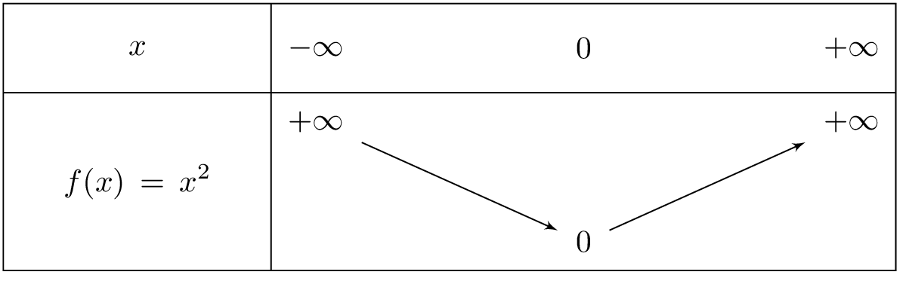
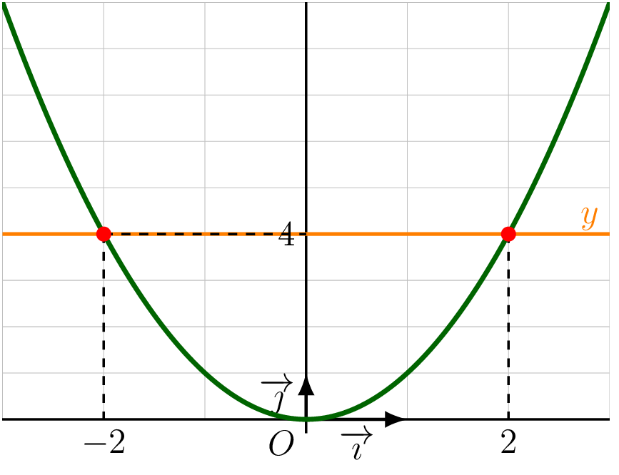
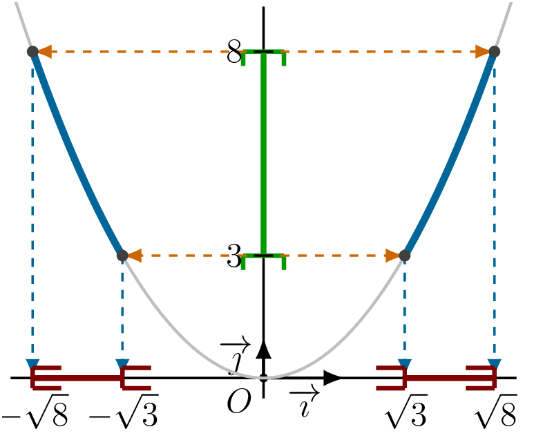

## Définition et propriétés

::: {.bloc .def}
Définition : Fonction carré

On appelle **fonction carré** la fonction qui à tout réel $x$ associe son carré.
$$f : x \longmapsto x^2 \qquad D_f = \R$$
:::

::: {.bloc .rem}
Remarque : 

Un nombre strictement négatif n'admet aucun antécédent par la fonction carré.
En effet, $x^2 \geqslant 0$ pour tout $x \in \R$.

La représentation graphique de la fonction carré n'est pas une droite : pour tout $x \neq y$,
$$\frac{f(x) - f(y)}{x - y} = \frac{x^2 - y^2}{x - y} = x + y$$
ce rapport n'est pas constant, donc les accroissements ne sont pas proportionnels.
:::

::: {.bloc .def}
Définition : Parabole

La représentation graphique de la fonction carré est appelée **parabole**, d'équation $y = x^2$.
:::

::: {.bloc .info}
À retenir : Construction et observations

On établit d'abord le tableau de valeurs :

<table>
<tbody>
<tr><td>$x$</td><td>$-3$</td><td>$-2$</td><td>$-\dfrac{3}{2}$</td><td>$-1$</td><td>$-\dfrac{1}{2}$</td><td>$0$</td><td>$\dfrac{1}{2}$</td><td>$1$</td><td>$\dfrac{3}{2}$</td><td>$2$</td><td>$3$</td></tr>
<tr><td>$x^2$</td><td>$9$</td><td>$4$</td><td>$\dfrac{9}{4}$</td><td>$1$</td><td>$\dfrac{1}{4}$</td><td>$0$</td><td>$\dfrac{1}{4}$</td><td>$1$</td><td>$\dfrac{9}{4}$</td><td>$4$</td><td>$9$</td></tr>
</tbody>
</table>

  

**Observations :**

- Deux points d'abscisses opposées ont la même ordonnée.
- L'axe des ordonnées est un axe de symétrie de $\mathscr{C}_f$.
- Sur la partie négative, la fonction carré est décroissante, donc les ordonnées sont rangées dans l'ordre inverse des abscisses.
- Sur la partie positive, la fonction carré est croissante donc les ordonnées sont rangées dans le même ordre que les abscisses.
:::

::: {.bloc .thm}
Théorème : Symétrie de la fonction carré

L'axe des ordonnées est l'unique axe de symétrie de $\mathscr{C}_f$.
:::

Démonstration :

Soit $x$ un réel et soit $M(x\,;\,x^2)$ et $M'(-x\,;\,f(-x)) = M'(-x\,;\,x^2)$.
Ces deux points ont la même ordonnée et des abscisses opposées : ils sont symétriques par rapport à l'axe des ordonnées.
Ceci étant valable pour tout $x$, l'axe des ordonnées est un axe de symétrie de $\mathscr{C}_f$.

::: {.bloc .thm}
Théorème : Variations de la fonction carré

La fonction carré est **décroissante** sur $]-\infty\,;\,0]$ et **croissante** sur $[0\,;\,+\infty[$.
Elle admet un **minimum** égal à $0$ en $x = 0$.
:::

Démonstration :

Soient $a, b \in [0\,;\,+\infty[$ avec $a < b$.
$$b^2 - a^2 = (b-a)(b+a)$$
Or $a < b$ donc $b - a > 0$, et $a, b \geqslant 0$ donc $b + a \geqslant 0$.
Ainsi $b^2 - a^2 \geqslant 0$, soit $a^2 \leqslant b^2$ : la fonction carré est croissante sur $[0\,;\,+\infty[$.

Le résultat sur $]-\infty\,;\,0]$ s'obtient par symétrie.

::: {.bloc .info}
À retenir : Tableau de variations

  

:::

::: {.bloc .info}
À retenir : Ordre et fonction carré

- Deux nombres **négatifs** sont rangés dans l'**ordre inverse** de leurs carrés.
- Deux nombres **positifs** sont rangés dans le **même ordre** que leurs carrés.
:::

::: {.bloc .sfc}

Savoir-Faire : Encadrement avec la fonction carré — Calculer

1. Soit $x$ vérifiant $-3 < x < -2$. Encadrer $x^2$.

Afficher la correction :

La fonction carré inverse l'ordre sur $[-3\,;\,-2] \subset ]-\infty\,;\,0]$, donc :
$$-3 < x < -2 \Longrightarrow (-3)^2 > x^2 > (-2)^2 \Longrightarrow 4 < x^2 < 9$$

2. Soit $x$ vérifiant $-3 \leqslant x \leqslant 4$. Encadrer $x^2$.

Afficher la correction :

Sur $[-3\,;\,0]$, la fonction carré inverse l'ordre, donc $-3 \leqslant x \leqslant 0 \Longrightarrow 0 \leqslant x^2 \leqslant 9$.

Sur $[0\,;\,4]$, elle conserve l'ordre, donc $0 \leqslant x \leqslant 4 \Longrightarrow 0 \leqslant x^2 \leqslant 16$.

Ainsi  $$-3 \leqslant x \leqslant 4 \Longrightarrow 0 \leqslant x^2 \leqslant 16$$

:::

## Résolution graphique d'équations et d'inéquations

::: {.bloc .info}
À retenir : Point méthode — Résolution graphique

Pour résoudre graphiquement $f(x) = k$ ou $f(x) \leqslant k$ :

- **Équation $f(x) = k$ :** on trace la droite horizontale $y = k$, on repère le ou les points d'intersection avec $\mathscr{C}_f$, puis on lit les abscisses correspondantes à l'aide de tirets pointillés.

- **Inéquation $f(x) \leqslant k$ :** on procède en trois étapes colorées :
  1. On colorie en **vert** la partie de l'axe des ordonnées correspondant aux ordonnées concernées.
  2. On colorie en **bleu** la partie de la courbe $\mathscr{C}_f$ dont les ordonnées vérifient la condition.
  3. On colorie en **rouge** la partie de l'axe des abscisses qui correspond aux abscisses solution.
:::

::: {.bloc .sfc}

Savoir-Faire : Résolution graphique d'équation avec la fonction carré — Représenter

Résoudre graphiquement $x^2 = 4$.

Afficher la correction :

***Point clef :** on trace la droite $y = k$, on lit les abscisses des points d'intersection avec $\mathscr{C}_f$.*

  

Ainsi $x^2 = 4 \Longleftrightarrow x = -2 \ou x = 2$.

:::

::: {.bloc .sfc}

Savoir-Faire : Résolution graphique d'inéquation avec la fonction carré — Calculer

Résoudre $3 < x^2 \leqslant 8$.

Afficher la correction :

***Point clef :** on colorie la partie de la courbe dont les ordonnées vérifient la condition, puis on lit les abscisses correspondantes sur l'axe des $x$.*

  

Ainsi 
$$3 < x^2 \leqslant 8 \Longleftrightarrow x \in \left[-\sqrt{8}\,;\,-\sqrt{3}\,\right[ \cup \left]\,\sqrt{3}\,;\,\sqrt{8}\,\right]$$

:::
