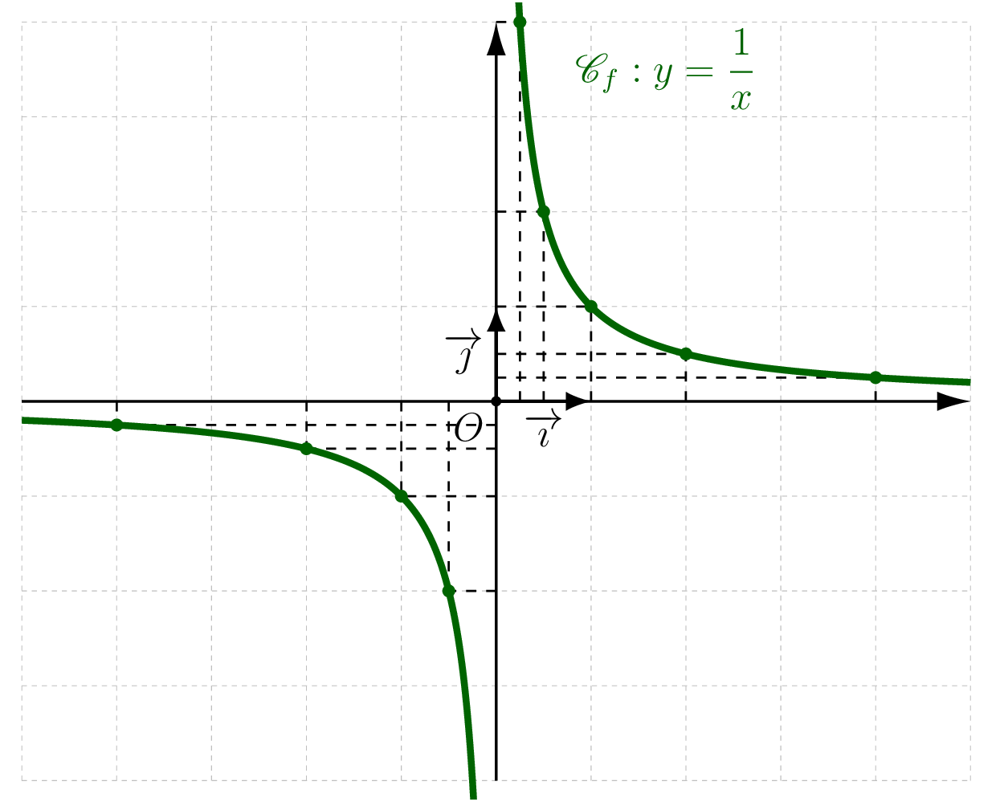
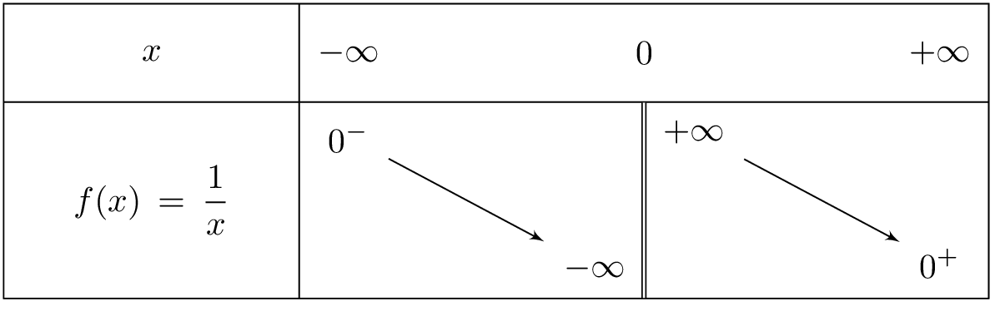
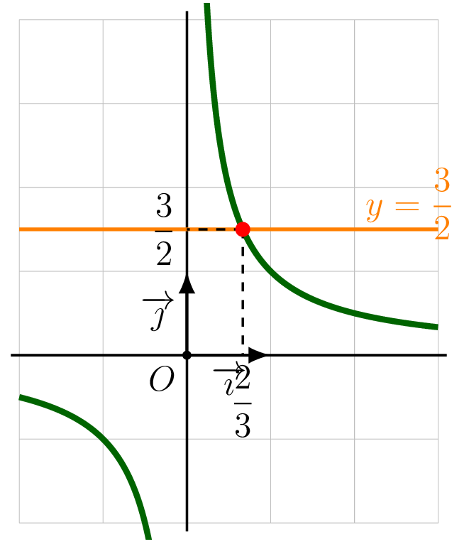
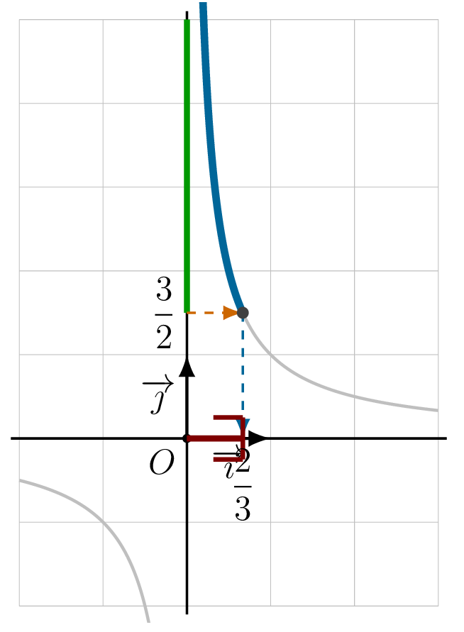
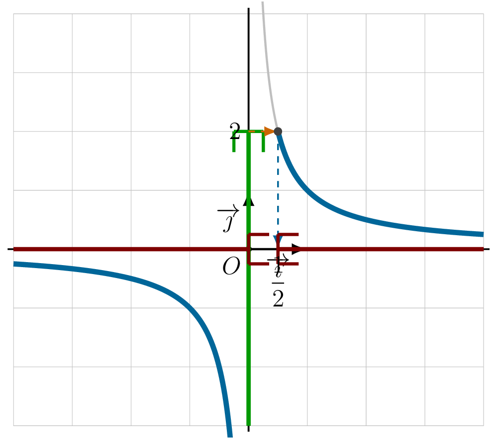

## Définition et propriétés

::: {.bloc .def}
Définition : Fonction inverse

On appelle **fonction inverse** la fonction qui à chaque réel non nul associe son inverse.
$$f : x \longmapsto \frac{1}{x} \qquad D_f = \R^*$$
:::

::: {.bloc .rem}
Remarque : 

Chaque réel non nul admet un unique antécédent par la fonction inverse, et image et antécédent sont de même signe. En effet, pour $k \neq 0$ : $\dfrac{1}{x} = k \Longleftrightarrow x = \dfrac{1}{k}$.

La représentation graphique de la fonction inverse n'est pas une droite : pour tout $x \neq y$ dans $\R^*$,
$$\frac{f(x)-f(y)}{x-y} = \frac{\dfrac{1}{x}-\dfrac{1}{y}}{x-y} = -\frac{1}{xy}$$
ce rapport n'est pas constant.
:::

::: {.bloc .def}
Définition : Hyperbole

La représentation graphique de la fonction inverse est appelée **hyperbole**, d'équation $y = \dfrac{1}{x}$.
:::

::: {.bloc .info}
À retenir : Construction et observations

On établit d'abord le tableau de valeurs :

<table>
<tbody>
<tr><td>$x$</td><td>$-4$</td><td>$-2$</td><td>$-1$</td><td>$-\dfrac{1}{2}$</td><td>$-\dfrac{1}{4}$</td><td>$\dfrac{1}{4}$</td><td>$\dfrac{1}{2}$</td><td>$1$</td><td>$2$</td><td>$4$</td></tr>
<tr><td>$\dfrac{1}{x}$</td><td>$-\dfrac{1}{4}$</td><td>$-\dfrac{1}{2}$</td><td>$-1$</td><td>$-2$</td><td>$-4$</td><td>$4$</td><td>$2$</td><td>$1$</td><td>$\dfrac{1}{2}$</td><td>$\dfrac{1}{4}$</td></tr>
</tbody>
</table>

  

**Observations :**

- Deux points d'abscisses opposées sont symétriques par rapport à l'origine.
- La représentation graphique admet l'origine du repère comme centre de symétrie.
- Sur chaque demi-intervalle ($]-\infty\,;\,0[$ et $]0\,;\,+\infty[$), les ordonnées sont rangées dans l'ordre *inverse* des abscisses.
:::

::: {.bloc .thm}
Théorème : Symétrie de la fonction inverse

La représentation graphique de la fonction inverse admet l'origine comme centre de symétrie.
:::

Démonstration :

Soit $x$ un réel non nul et soit $M(x\,;\,f(x))$ et $N(-x\,;\,f(-x))$. Le milieu de $[MN]$ a pour coordonnées :
$$\left(\frac{x+(-x)}{2}\,;\,\frac{f(x)+f(-x)}{2}\right) = \left(0\,;\,\frac{\dfrac{1}{x}-\dfrac{1}{x}}{2}\right) = (0\,;\,0)$$
Les points $M$ et $N$ sont donc symétriques par rapport à l'origine.

::: {.bloc .thm}
Théorème : Variations de la fonction inverse

La fonction inverse est **décroissante** sur $]-\infty\,;\,0[$ et **décroissante** sur $]0\,;\,+\infty[$.
:::

Démonstration :

Soient $a, b \in \,]0\,;\,+\infty[$ avec $a < b$.
$$f(a) - f(b) = \frac{1}{a} - \frac{1}{b} = \frac{b-a}{ab}$$
Comme $a, b > 0$, on a $ab > 0$ et $b - a > 0$, donc $f(a) - f(b) > 0$, soit $f(a) > f(b)$ : la fonction inverse est décroissante sur $]0\,;\,+\infty[$.

Le résultat sur $]-\infty\,;\,0[$ s'obtient par imparité.

::: {.bloc .info}
À retenir : Tableau de variations

  

:::

::: {.bloc .info}
À retenir : Ordre et fonction inverse

- Deux nombres **positifs** sont rangés dans l'**ordre inverse** de leurs inverses.
- Deux nombres **négatifs** sont rangés dans l'**ordre inverse** de leurs inverses.
:::

::: {.bloc .sfc}

Savoir-Faire : Encadrement avec la fonction inverse — Calculer

1. Soit $x$ vérifiant $-4 \leqslant x < -1$. Encadrer $\dfrac{1}{x}$.

Afficher la correction :

La fonction inverse inverse l'ordre sur $]-\infty\,;\,0[$, donc :
$$-4 \leqslant x < -1 \Longrightarrow \frac{1}{-1} < \frac{1}{x} \leqslant \frac{1}{-4} \Longrightarrow -1 < \frac{1}{x} \leqslant -\frac{1}{4}$$

2. Soit $x$ vérifiant $-3 \leqslant x \leqslant 4$ avec $x \neq 0$. Encadrer $\dfrac{1}{x}$.

Afficher la correction :

Sur $[-3\,;\,0[$, la fonction inverse inverse l'ordre : $-3 \leqslant x < 0 \Longrightarrow \dfrac{1}{x} \leqslant -\dfrac{1}{3}$.

Sur $]0\,;\,4]$, la fonction inverse inverse l'ordre : $0 < x \leqslant 4 \Longrightarrow \dfrac{1}{x} \geqslant \dfrac{1}{4}$.

Ainsi $-3 \leqslant x \leqslant 4$ et  $x \neq 0$ 
$$\dfrac{1}{x} \in \left]-\infty\,;\,-\dfrac{1}{3}\right] \cup \left[\dfrac{1}{4}\,;\,+\infty\right[$$

:::

## Résolution graphique d'équations et d'inéquations

::: {.bloc .sfc}

Savoir-Faire : Résolution graphique d'équation avec la fonction inverse — Représenter

Résoudre graphiquement $\dfrac{1}{x} = \dfrac{3}{2}$.

Afficher la correction :

***Point clef :** on trace la droite $y = k$, on lit les abscisses des points d'intersection avec $\mathscr{C}_f$.*

On trace la droite $y = \dfrac{3}{2}$. Le point d'intersection avec l'hyperbole a pour abscisse $x = \dfrac{2}{3}$.

Ainsi $\dfrac{1}{x} = \dfrac{3}{2} \Longleftrightarrow x = \dfrac{2}{3}$.

  

:::

::: {.bloc .sfc}

Savoir-Faire : Résolution graphique d'inéquation — Représenter

Résoudre $\dfrac{1}{x} > \dfrac{3}{2}$.

Afficher la correction :

$\dfrac{1}{x} > \dfrac{3}{2} \Longleftrightarrow x \in \left]0\,;\,\dfrac{2}{3}\right[$.

  

:::

::: {.bloc .sfc}

Savoir-Faire : Résolution graphique d'inéquation — Représenter

Résoudre $\dfrac{1}{x} < 2$ sur $\R^*$.

Afficher la correction :

On cherche les abscisses des points dont les ordonnées sont strictement inférieures à $2$.

Ainsi $\dfrac{1}{x} < 2 \Longleftrightarrow x \in \left]-\infty\,;\,0\right[\,\cup\,\left]\dfrac{1}{2}\,;\,+\infty\right[$.

  

::: 
