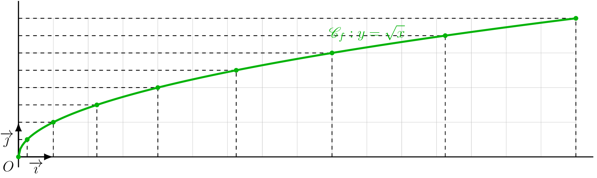
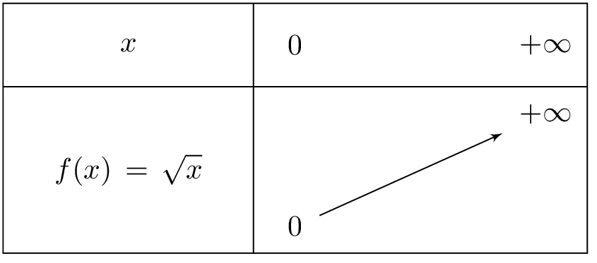
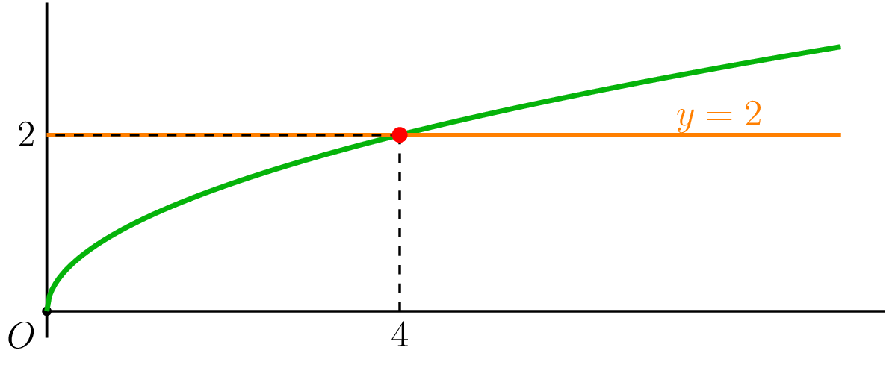
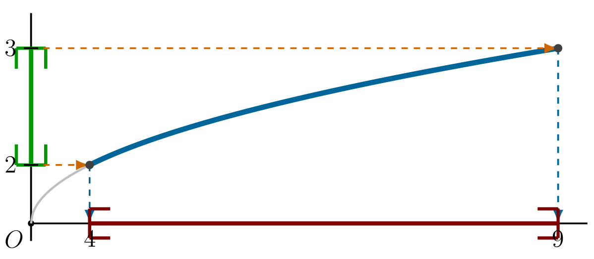

## Définition et propriétés

::: {.bloc .def}
Définition : Fonction racine carrée

On appelle **fonction racine carrée** la fonction qui à tout réel $x \geqslant 0$ associe l'unique réel positif $\sqrt{x}$ vérifiant $(\sqrt{x})^2 = x$.
$$f : x \longmapsto \sqrt{x} \qquad D_f = [0\,;\,+\infty[$$
:::

::: {.bloc .rem}
Remarque : 

Pour tout réel $x$, on a $\sqrt{x^2} = |x|$, et non $\sqrt{x^2} = x$.
Par exemple, $\sqrt{(-3)^2} = \sqrt{9} = 3 = |-3|$.

La représentation graphique de la fonction racine carrée n'est pas une droite. En effet, pour $0 \leqslant x < y$ :
$$\frac{\sqrt{y} - \sqrt{x}}{y - x} = \frac{1}{\sqrt{y}+\sqrt{x}} \neq \text{constante}$$
:::

::: {.bloc .info}
À retenir : Construction et observations

On établit d'abord le tableau de valeurs :

<table>
<tbody>
<tr><td>$x$</td><td>$0$</td><td>$\dfrac{1}{4}$</td><td>$1$</td><td>$\dfrac{9}{4}$</td><td>$4$</td><td>$\dfrac{25}{4}$</td><td>$9$</td><td>$\dfrac{49}{4}$</td><td>$16$</td></tr>
<tr><td>$\sqrt{x}$</td><td>$0$</td><td>$\dfrac{1}{2}$</td><td>$1$</td><td>$\dfrac{3}{2}$</td><td>$2$</td><td>$\dfrac{5}{2}$</td><td>$3$</td><td>$\dfrac{7}{2}$</td><td>$4$</td></tr>
</tbody>
</table>

  

**Observations :**

- La courbe est définie uniquement pour $x \geqslant 0$.
- Les abscisses et les ordonnées sont rangées dans le même ordre : la fonction racine carrée est croissante sur $[0\,;\,+\infty[$.
- La courbe part de l'origine et monte de plus en plus lentement.
:::

::: {.bloc .thm}
Théorème : Variations de la fonction racine carrée

La fonction racine carrée est **croissante** sur $[0\,;\,+\infty[$.
:::

Démonstration :

Soient $0 \leqslant a < b$.
$$f(b) - f(a) = \sqrt{b} - \sqrt{a} = \frac{(\sqrt{b} - \sqrt{a})(\sqrt{b}+\sqrt{a})}{\sqrt{b}+\sqrt{a}} = \frac{b - a}{\sqrt{b}+\sqrt{a}}$$
Or $b > a$ donc $b - a > 0$, et $\sqrt{b} + \sqrt{a} > 0$, donc $f(b) - f(a) > 0$ : la fonction racine carrée est croissante.

::: {.bloc .info}
À retenir : Tableau de variations

  

:::

::: {.bloc .info}
À retenir : Ordre et fonction racine carrée

- Deux nombres **positifs** sont rangés dans le **même ordre** que leurs racines carrées.
:::

## Résolution graphique d'équations et d'inéquations

::: {.bloc .sfc}

Savoir-Faire : Résolution graphique d'équation — Représenter

Résoudre graphiquement $\sqrt{x} = 2$.

Afficher la correction :

On trace la droite $y = 2$. Le point d'intersection avec la courbe a pour abscisse $x = 4$.

  

Ainsi $\sqrt{x} = 2 \Longleftrightarrow x = 4$.

:::

::: {.bloc .sfc}

Savoir-Faire : Résolution graphique d'inéquation — Représenter

Résoudre $2 \leqslant \sqrt{x} \leqslant 3$.

Afficher la correction :

  

Ainsi $2 \leqslant \sqrt{x} \leqslant 3 \Longleftrightarrow x \in \left[4\,;\,9\right]$.

:::
