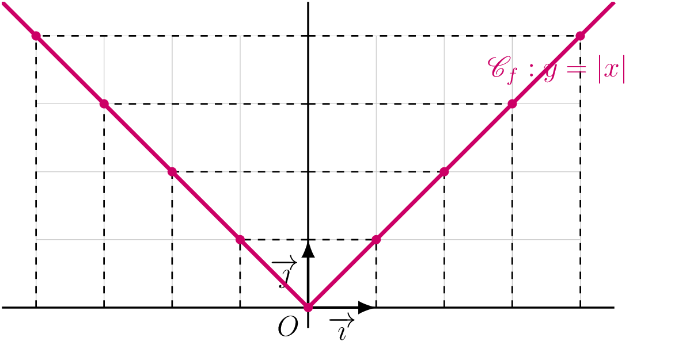
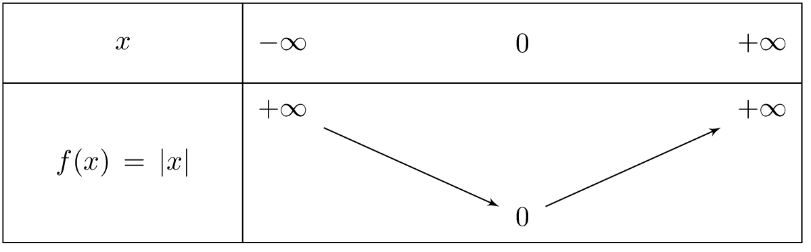
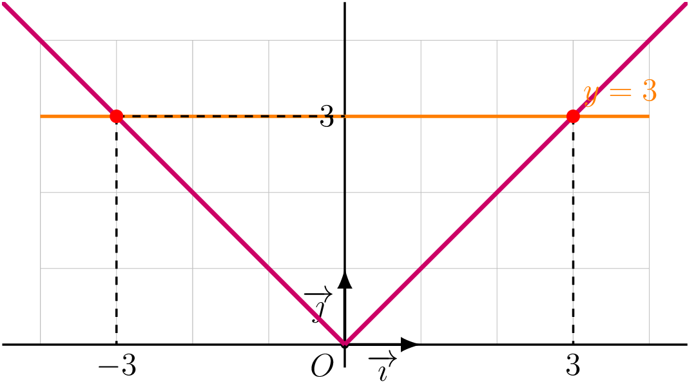
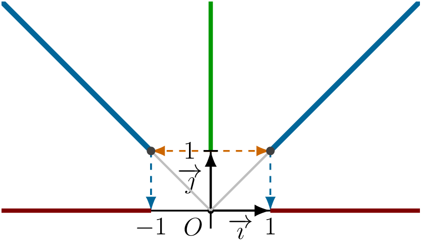

## Définition et propriétés

::: {.bloc .def}
Définition : Fonction valeur absolue

On appelle **fonction valeur absolue** la fonction qui à tout réel $x$ associe sa valeur absolue.
$$f : x \longmapsto \abs{x} \qquad D_f = \R$$
On rappelle que $\abs{x}= \begin{cases} x & \text{si } x \geqslant 0 \\ -x & \text{si } x < 0 \end{cases}$
:::

::: {.bloc .rem}
Remarque : 

La valeur absolue mesure la **distance** entre $x$ et $0$ sur la droite numérique.
Plus généralement, $\abs{a - b}$ mesure la distance entre $a$ et $b$.

Tout réel positif $k$ admet deux antécédents par la fonction valeur absolue : $k$ et $-k$.
En effet, $\abs{x} = k \Longleftrightarrow x = k \ou x = -k$.

On déduit que la représentation graphique de la valeur absolue n'est pas une droite.
:::

::: {.bloc .info}
À retenir : Construction et observations 

On établit d'abord le tableau de valeurs :

<table>
<tbody>
<tr><td>$x$</td><td>$-4$</td><td>$-3$</td><td>$-2$</td><td>$-1$</td><td>$0$</td><td>$1$</td><td>$2$</td><td>$3$</td><td>$4$</td></tr>
<tr><td>$|x|$</td><td>$4$</td><td>$3$</td><td>$2$</td><td>$1$</td><td>$0$</td><td>$1$</td><td>$2$</td><td>$3$</td><td>$4$</td></tr>
</tbody>
</table>

  

**Observations :**

- Deux points d'abscisses opposées ont la même ordonnée.
- L'axe des ordonnées est un axe de symétrie de $\mathscr{C}_f$.
- Sur $]-\infty\,;\,0]$, la fonction valeur absolue est décroissante.
- Sur $[0\,;\,+\infty[$, la fonction valeur absolue est croissante.
:::

::: {.bloc .thm}
Théorème : Symétrie de la fonction valeur absolue

L'axe des ordonnées est l'unique axe de symétrie de $\mathscr{C}_f$.
:::

Démonstration :

Soit $x$ un réel et soit $M(x\,;\,|x|)$ et $M'(-x\,;\,|-x|) = M'(-x\,;\,|x|)$.
Ces deux points ont la même ordonnée et des abscisses opposées : ils sont symétriques par rapport à l'axe des ordonnées.

::: {.bloc .thm}
Théorème : Variations de la fonction valeur absolue

La fonction valeur absolue est **décroissante** sur $]-\infty\,;\,0]$ et **croissante** sur $[0\,;\,+\infty[$.
Elle admet un **minimum** égal à $0$ en $x = 0$.
:::

Démonstration :

Soient $0 \leqslant a < b$.
$$f(b) - f(a) = |b| - |a| = b - a > 0$$
donc la fonction valeur absolue est croissante sur $[0\,;\,+\infty[$.

Le résultat sur $]-\infty\,;\,0]$ s'obtient par parité.

::: {.bloc .info}
À retenir : Tableau de variations

  

:::

::: {.bloc .info}
À retenir : Ordre et fonction valeur absolue

- Deux nombres **négatifs** sont rangés dans l'**ordre inverse** de leurs valeurs absolues.
- Deux nombres **positifs** sont rangés dans le **même ordre** que leurs valeurs absolues.
:::

## Résolution graphique d'équations et d'inéquations

::: {.bloc .sfc}

Savoir-Faire : Résolution graphique d'équation avec la valeur absolue — Représenter

Résoudre graphiquement $|x| = 3$.

Afficher la correction :

On trace la droite $y = 3$. Les deux points d'intersection ont pour abscisses $x = -3$ et $x = 3$.

  

Ainsi $\abs{x}  = 3 \Longleftrightarrow x = -3 \ou x = 3$.

:::

::: {.bloc .sfc}

Savoir-Faire : Résolution graphique d'inéquation — Représenter

Résoudre $|x| > 1$.

Afficher la correction :

On cherche les abscisses des points dont les ordonnées sont strictement supérieures à $1$.

D'après la figure ci-dessous, $\abs{x} > 1 \Longleftrightarrow x \in \left]-\infty\,;\,-1\right[\,\cup\,\left]1\,;\,+\infty\right[$.

  

:::
