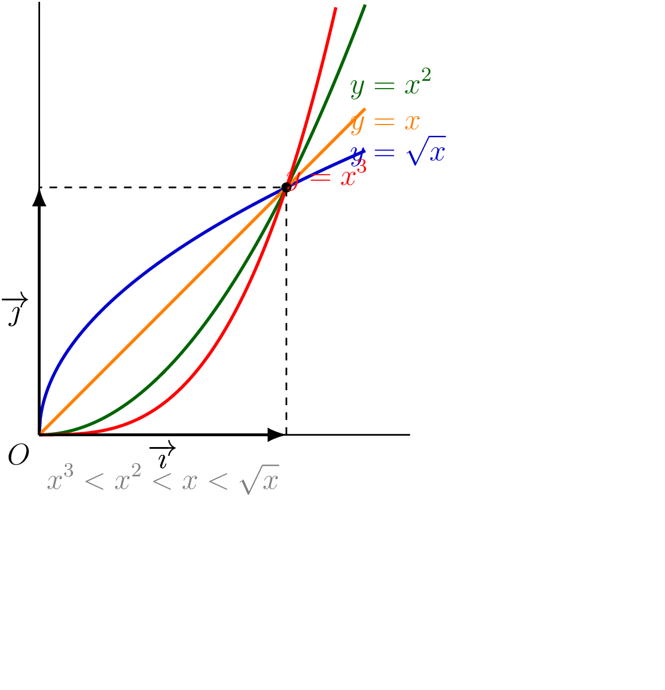

On peut étendre la comparaison précédente en y ajoutant la fonction racine carrée.

::: {.bloc .thm}
Théorème : Position relative de $\sqrt{x}$, $x$, $x^2$ et $x^3$ pour $x \geqslant 0$

Pour $x \geqslant 0$ :

- Si $x \in \{0\,;\,1\}$, alors $x^3 = x^2 = x = \sqrt{x}$.
- Si $x \in \,]0\,;\,1[$, alors $x^3 < x^2 < x < \sqrt{x}$.
- Si $x \in \,]1\,;\,+\infty[$, alors $\sqrt{x} < x < x^2 < x^3$.
:::

Démonstration :

D'après le théorème précédent, il reste à situer $\sqrt{x}$ par rapport à $x$.

Soient $x \in \,]0\,;\,1[$ et $u = \sqrt{x}$. Alors $0 < u < 1$ (car la racine carrée conserve l'ordre et $\sqrt{1} = 1$).
Par le théorème précédent appliqué à $u \in ]0\,;\,1[$ : $u^2 < u$, soit $x < \sqrt{x}$.
On a bien $x^3 < x^2 < x < \sqrt{x}$.

Pour $x > 1$ : de même $\sqrt{x} > 1$, et $(\sqrt{x})^2 = x > \sqrt{x}$ (car $\sqrt{x} > 1$).
On a bien $\sqrt{x} < x$.

::: {.bloc .info}
À retenir : Illustration graphique

   

:::

::: {.bloc .rem}
Remarque : 

Ce graphique illustre bien la hiérarchie : pour $x \in ]0\,;\,1[$, la courbe de $\sqrt{x}$ est la plus « haute » et celle de $x^3$ est la plus « basse ». Pour $x > 1$, la situation s'inverse complètement.
:::

::: {.bloc .sfc}

Savoir-Faire : Comparer des réels à l'aide des fonctions de référence — Raisonner

Comparer les réels suivants en justifiant.

$0{,}3^2$ et $0{,}3^3$ — $\sqrt{0{,}7}$ et $0{,}7$ — $(1{,}5)^2$ et $\sqrt{1{,}5}$.

Afficher la correction :

1. Comme $0 < 0{,}3 < 1$, le théorème de position relative donne $0{,}3^3 < 0{,}3^2$.

2. Comme $0 < 0{,}7 < 1$, le théorème donne $0{,}7 < \sqrt{0{,}7}$.

3. Comme $1{,}5 > 1$, le théorème donne $\sqrt{1{,}5} < 1{,}5 < (1{,}5)^2$.
   Donc $(1{,}5)^2 > \sqrt{1{,}5}$.

:::

::: {.bloc .sfc}

Savoir-Faire : Comparer des images par composition — Raisonner

On sait que $\dfrac{1}{3} \leqslant x \leqslant \dfrac{1}{2}$. Comparer $\sqrt{x}$, $x$, $x^2$ et $x^3$.

Afficher la correction :

Comme $0 < \dfrac{1}{3} \leqslant x \leqslant \dfrac{1}{2} < 1$, on a $x \in \,]0\,;\,1[$.

D'après le théorème de position relative : $x^3 < x^2 < x < \sqrt{x}$.

En particulier, pour $x = \dfrac{1}{2}$ :
$$\left(\frac{1}{2}\right)^3 = \frac{1}{8} < \left(\frac{1}{2}\right)^2 = \frac{1}{4} < \frac{1}{2} < \sqrt{\frac{1}{2}} = \frac{\sqrt{2}}{2} \approx 0{,}707$$

:::

::: {.bloc .ex}

Exercice : Position relative et composition — Raisonner

On considère une fonction $f$ qui **inverse l'ordre** sur $[0\,;\,10]$ et vérifie $f(5) = 1$ et $f(10) > 0$.

1. Comparer $\sqrt{f(a)}$ et $\sqrt{f(b)}$ pour $a, b \in [0\,;\,10]$ avec $a < b$.

Afficher la correction :

Soit $0 \leqslant a < b \leqslant 10$. Comme $f$ inverse l'ordre sur $[0\,;\,10]$ :
$$f(10) \leqslant f(b) < f(a) \leqslant f(0) \quad \text{avec } f(10) > 0$$
Toutes ces valeurs sont positives. La fonction racine carrée conserve l'ordre sur $[0\,;\,+\infty[$, donc :
$$\sqrt{f(b)} < \sqrt{f(a)} \quad \text{soit} \quad \sqrt{f(a)} > \sqrt{f(b)}$$

2. Comparer $(f(x))^2$, $f(x)$ et $(f(x))^3$ selon que $x \in [0\,;\,5]$ ou $x \in [5\,;\,10]$.

Afficher la correction :

- Si $x \in [0\,;\,5]$ : $f$ inverse l'ordre, donc $f(x) \geqslant f(5) = 1$, soit $f(x) \geqslant 1$.
  D'après le théorème de position relative (cas $t \geqslant 1$) appliqué à $t = f(x)$ :
  $$f(x) \leqslant (f(x))^2 \leqslant (f(x))^3$$
- Si $x \in [5\,;\,10]$ : $f$ inverse l'ordre, donc $f(x) \leqslant f(5) = 1$, soit $0 < f(x) \leqslant 1$.
  D'après le théorème de position relative (cas $0 < t \leqslant 1$) :
  $$(f(x))^3 \leqslant (f(x))^2 \leqslant f(x)$$

:::

## Bilan — Tableau de synthèse des fonctions de référence

::: {.bloc .info}
À retenir : 

<table>
<thead>
<tr><th>Fonction</th><th>Expression</th><th>Domaine</th><th>Courbe</th><th>Ordre</th></tr>
</thead>
<tbody>
<tr><td>Carré</td><td>$f(x) = x^2$</td><td>$\R$</td><td>Parabole</td><td>Inversé sur $]-\infty\,;\,0]$ / conservé sur $[0\,;\,+\infty[$</td></tr>
<tr><td>Inverse</td><td>$f(x) = \dfrac{1}{x}$</td><td>$\R^*$</td><td>Hyperbole</td><td>Inversé sur chaque demi-intervalle</td></tr>
<tr><td>Cube</td><td>$f(x) = x^3$</td><td>$\R$</td><td></td><td>Conservé sur $\R$</td></tr>
<tr><td>Racine carrée</td><td>$f(x) = \sqrt{x}$</td><td>$[0\,;\,+\infty[$</td><td></td><td>Conservé sur $[0\,;\,+\infty[$</td></tr>
</tbody>
</table>

:::
