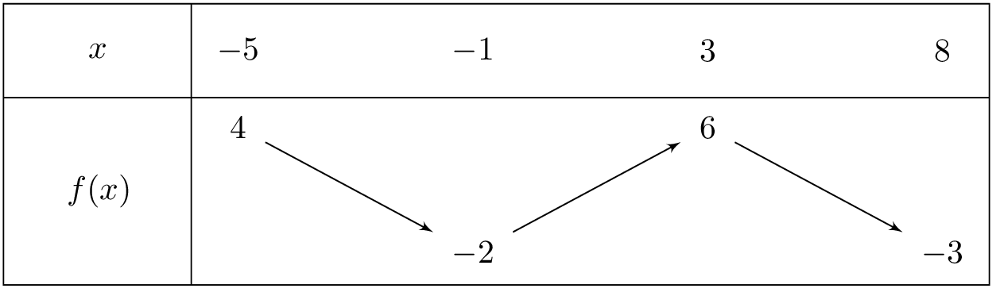
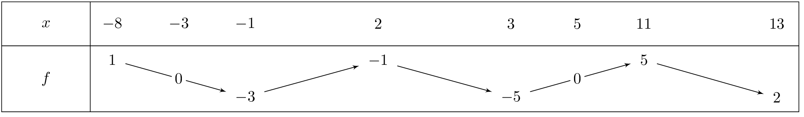

::: {.bloc .def}
Définition : Minimum, maximum, extremum

Soit $f$ définie sur $D_f$ et $I$ un intervalle de $D_f$, et $a \in I$.

1. On dit que $f$ admet un **minimum** en $a$ sur $I$ lorsque pour tout $x \in I$,
   $f(a) \leqslant f(x)$.
   La valeur $f(a)$ est appelée le **minimum** de $f$ sur $I$.
2. On dit que $f$ admet un **maximum** en $a$ sur $I$ lorsque pour tout $x \in I$,
   $f(a) \geqslant f(x)$.
   La valeur $f(a)$ est appelée le **maximum** de $f$ sur $I$.
3. On dit que $f$ admet un **extremum** en $a$ lorsqu'elle y admet un minimum ou un maximum.
:::

::: {.bloc .rem}
Remarque : 

Un extremum est dit **global** sur $I$ lorsque c'est le plus grand (ou le plus petit) de toutes les valeurs prises par $f$ sur $I$. Un extremum est dit **local** en $a$ lorsque c'est le plus grand (ou le plus petit) des valeurs prises par $f$ au voisinage de $a$, c'est-à-dire sur un intervalle ouvert contenant $a$. Aux bornes d'un intervalle fermé, on ne parle pas d'extremum local.
:::

::: {.bloc .sfc}

Savoir-Faire : Lire les extremums sur un tableau de variations — Représenter

On donne le tableau de variations de la fonction $f$ définie sur $[-5\,;\,8]$.

  

1. Déterminer le maximum et le minimum de $f$ sur $[-5\,;\,8]$.

Afficher la correction :

Le **maximum** de $f$ sur $[-5\,;\,8]$ est $6$, atteint en $x = 3$.
Le **minimum** de $f$ sur $[-5\,;\,8]$ est $-3$, atteint en $x = 8$.

2. En $x = 3$, $f$ admet-elle un maximum local ? En $x = 8$, $f$ admet-elle un maximum local ? Justifier.

Afficher la correction :

En $x = 3$ : $f$ est croissante sur $[-1\,;\,3]$ puis décroissante sur $[3\,;\,8]$.
Il existe donc un intervalle ouvert autour de $3$ sur lequel $f(3) = 6$ est la plus grande valeur.
Donc $f$ admet bien un **maximum local** en $x = 3$.

En $x = 8$ : $8$ est une borne de l'intervalle de définition. Il n'existe pas d'intervalle
ouvert autour de $8$ sur lequel $f$ est définie. On ne peut donc **pas parler de maximum local** en $x = 8$.

3. Peut-on avoir $f(x) = 7$ pour $x \in [-5\,;\,8]$ ? Justifier.

Afficher la correction :

Le maximum de $f$ sur $[-5\,;\,8]$ est $6 < 7$.
Donc pour tout $x \in [-5\,;\,8]$, $f(x) \leqslant 6 < 7$ : on ne peut pas avoir $f(x) = 7$.

:::

::: {.bloc .ex}

Exercice : Exploiter un tableau de variations — Raisonner

On considère une fonction $f$ dont on donne le tableau de variations :

  

1. Compléter par le symbole qui convient ($<$, $>$, $=$ ou $?$) :
   $$f(-5) \ldots f(-4) \qquad f(0) \ldots f(3) \qquad f(4) \ldots f(12) \qquad f(0) \ldots f(8)$$

Afficher la correction :

- $f$ est décroissante sur $[-8\,;\,-1]$ et $-8 \leqslant -5 \leqslant -4 \leqslant -1$,
  donc $f(-5) > f(-4)$.
- $0 \in [-1\,;\,2]$ et $3$ est une borne entre deux intervalles de monotonie différents.
  Des variations de $f$, on tire $-3 < f(0) < -1$ et $f(3) = -5$.
  Or $[-3\,;\,-1] \cap \{-5\} = \emptyset$ et $-5 < -3$, donc $f(3) < f(0)$, soit $f(0) > f(3)$.
- $4 \in [3\,;\,11]$ donc $f$ est croissante sur $[3\,;\,11]$ avec $f(3) = -5$ et $f(5) = 0$,
  donc $-5 < f(4) < 0$.
  $12 \in [11\,;\,13]$ donc $f$ est décroissante avec $f(11) = 5$ et $f(13) = 2$,
  donc $2 < f(12) < 5$.
  Or $f(4) < 0 < 2 < f(12)$, donc $f(4) < f(12)$.
- $0 \in [-1\,;\,2]$ donc $-3 < f(0) < -1$ et $8 \in [3\,;\,11]$ donc $-5 < f(8) < 5$.
  Or $[-3\,;\,-1] \cap [-5\,;\,5] \neq \emptyset$, on ne peut donc pas conclure : $f(0) \,?\, f(8)$.

2. Peut-on comparer $f(a)$ et $f(b)$ sachant que $a \in [-8\,;\,3]$ et $b \in [-1\,;\,2]$ ?

Afficher la correction :

$f$ n'est pas monotone sur $[-8\,;\,3]$ : elle est décroissante sur $[-8\,;\,-1]$, croissante sur
$[-1\,;\,2]$, puis décroissante sur $[2\,;\,3]$. On ne peut donc pas comparer $f(a)$ et $f(b)$ en général.

3. Quel est le maximum de $f$ sur $[-8\,;\,13]$ ? Le minimum ?

Afficher la correction :

Le maximum de $f$ est $5$, atteint en $x = 11$.
Le minimum de $f$ est $-5$, atteint en $x = 3$.

4. Donner un encadrement de $f(x)$ pour $x \in [-1\,;\,5]$.

Afficher la correction :

Sur $[-1\,;\,5]$, $f$ admet un minimum en $x = 3$ valant $-5$ et un maximum en $x = 2$ valant $-1$.
Donc pour tout $x \in [-1\,;\,5]$ : $-5 \leqslant f(x) \leqslant -1$.

5. Peut-on avoir $f(x) = -4$ pour $x \in [-8\,;\,-1]$ ?

Afficher la correction :

$f$ est décroissante sur $[-8\,;\,-1]$ avec $f(-8) = 1$ et $f(-1) = -3$.
Donc pour tout $x \in [-8\,;\,-1]$, $-3 \leqslant f(x) \leqslant 1$.
Or $-4 < -3$, donc on ne peut pas avoir $f(x) = -4$ sur cet intervalle.

6. Déterminer le signe de $f(x)$ sur $[-8\,;\,13]$.

Afficher la correction :

D'après le tableau, $f$ s'annule en $x = -3$ et en $x = 5$.

- Sur $[-8\,;\,-3]$ : $f$ décroît de $1$ à $0$, donc $f(x) \geqslant 0$.
- Sur $[-3\,;\,5]$ : $f$ vaut $0$ aux deux bornes et prend des valeurs négatives
  ($-3$, $-1$, $-5$) entre les deux, donc $f(x) \leqslant 0$.
- Sur $[5\,;\,13]$ : $f$ croît de $0$ à $5$ puis décroît jusqu'à $2$, donc $f(x) \geqslant 0$.

:::

::: {.bloc .sfc}

Savoir-Faire : Déterminer un extremum par étude de signe — Raisonner

On considère la fonction $f$ définie sur $\R$ par $f(x) = 3(x-5)^2 + 9$.

1. Montrer que $f(x) \geqslant 9$ pour tout réel $x$.

Afficher la correction :

On étudie le signe de $f(x) - 9$ :
$$f(x) - 9 = 3(x-5)^2 + 9 - 9 = 3(x-5)^2.$$
Comme $(x-5)^2 \geqslant 0$ pour tout $x \in \R$ et $3 > 0$, on a
$3(x-5)^2 \geqslant 0$, donc $f(x) - 9 \geqslant 0$, c'est-à-dire
$f(x) \geqslant 9$.

2. En déduire la valeur minimale de $f$ et l'antécédent correspondant.

Afficher la correction :

La valeur minimale de $f$ est $9$. Elle est atteinte lorsque
$(x-5)^2 = 0$, soit $x = 5$.

3. La valeur $9$ est-elle atteinte ?

Afficher la correction :

$f(5) = 3 \times 0 + 9 = 9$ : oui, la valeur $9$ est atteinte en
$x = 5$.

:::
