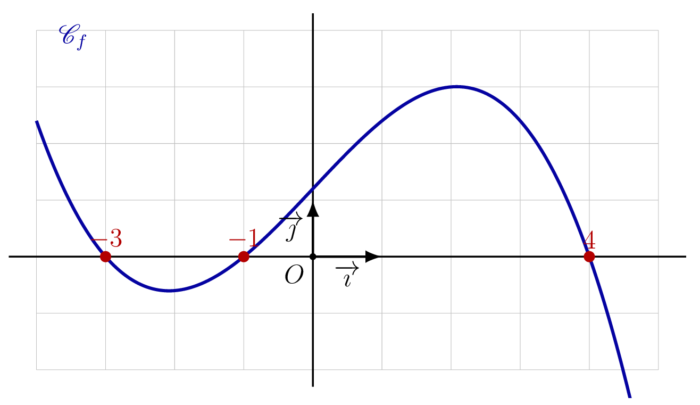
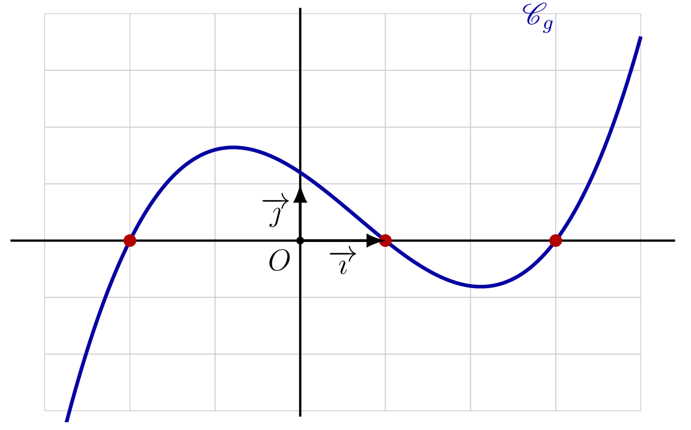
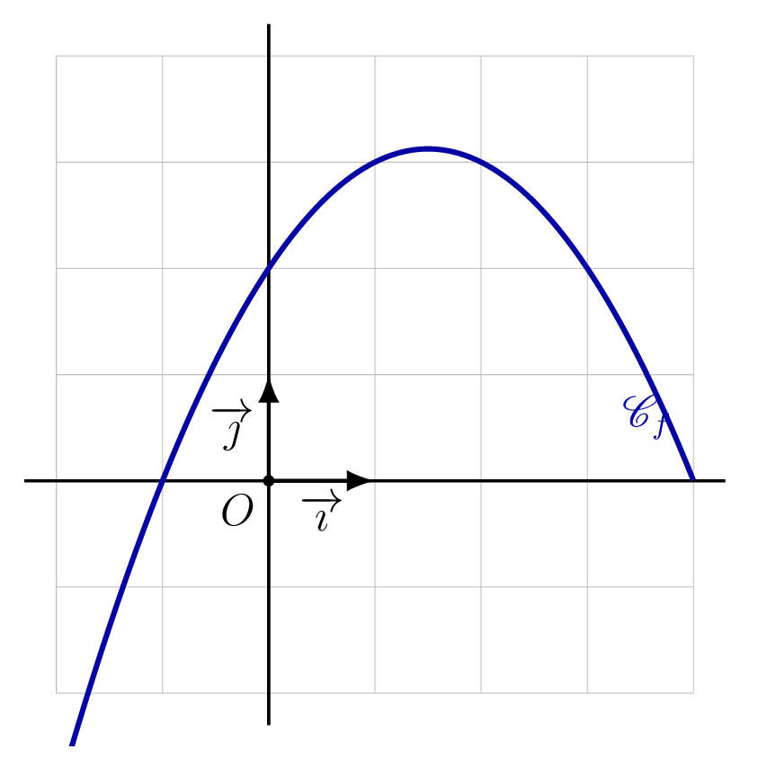
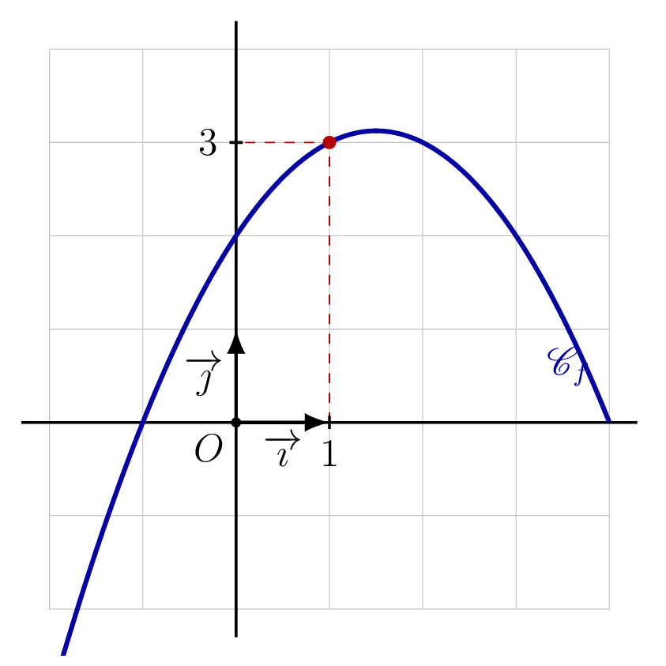
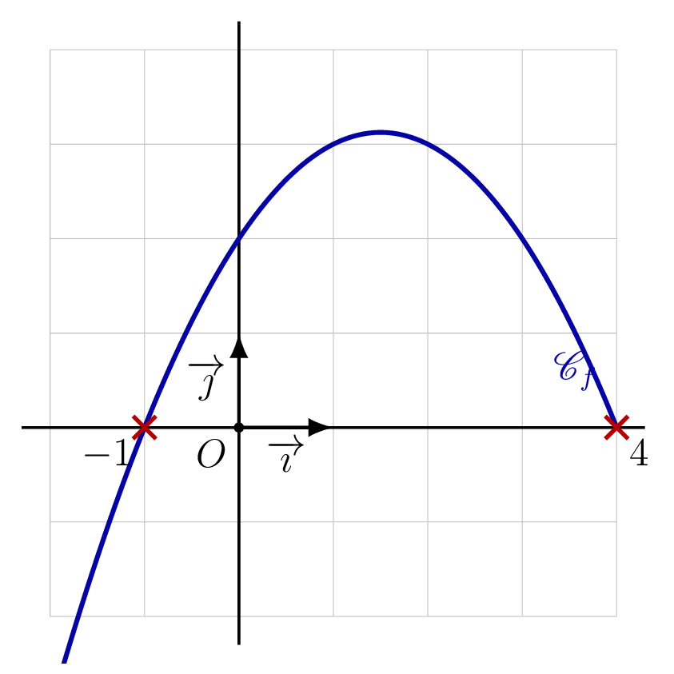
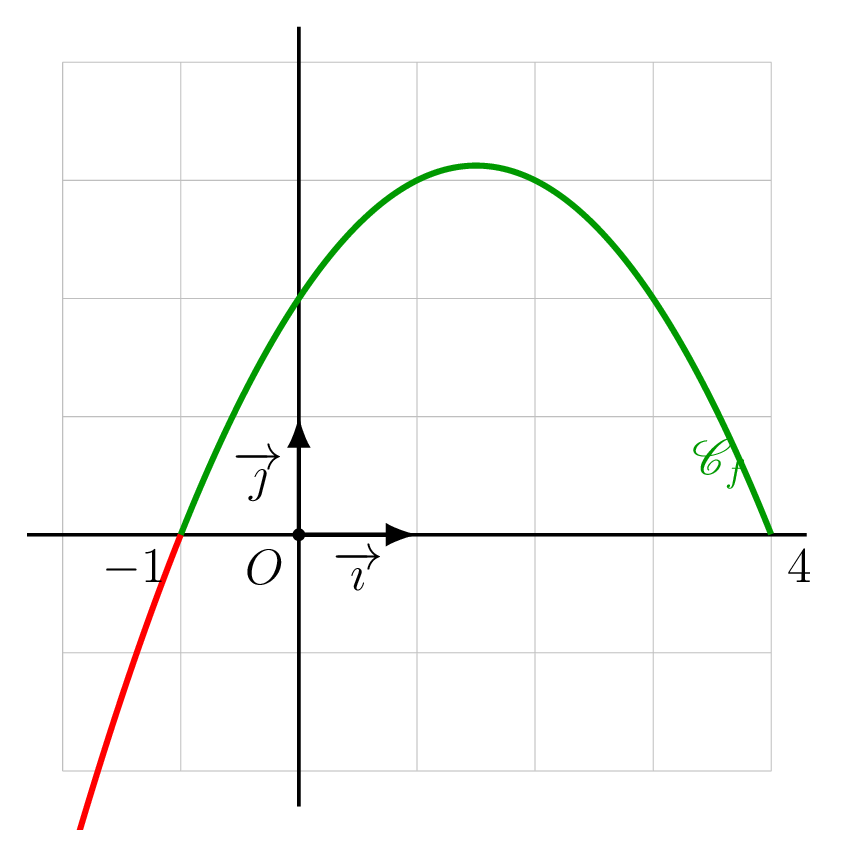
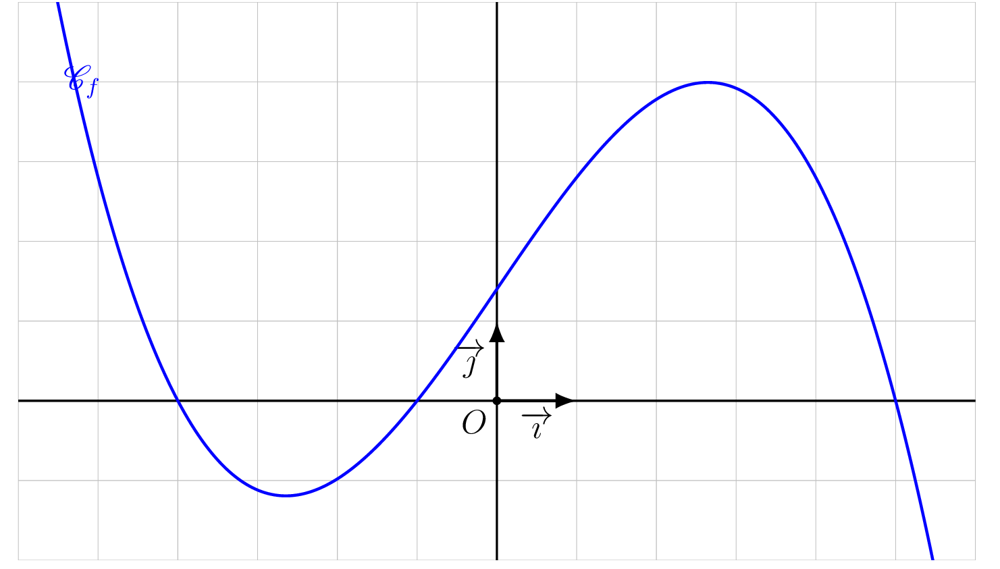
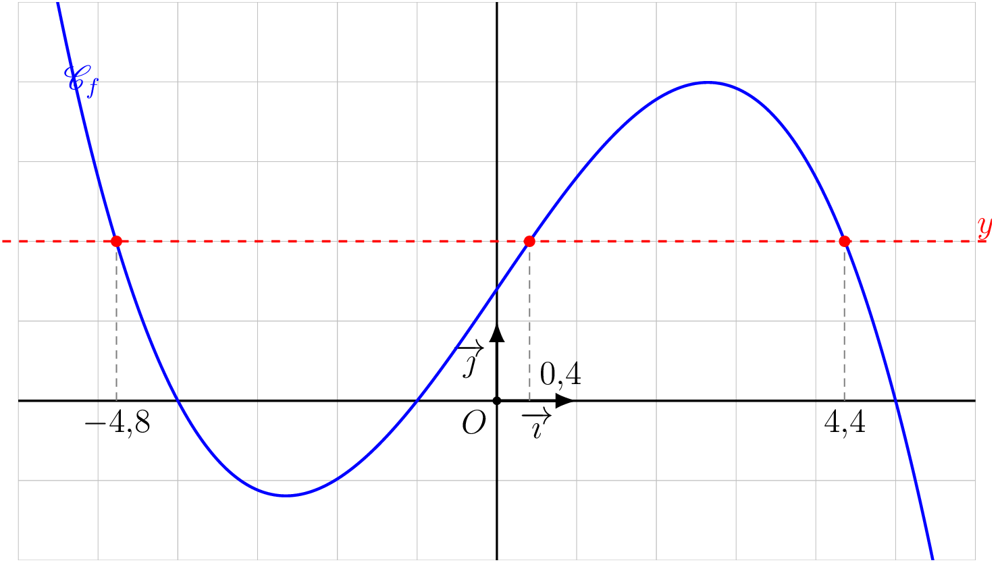
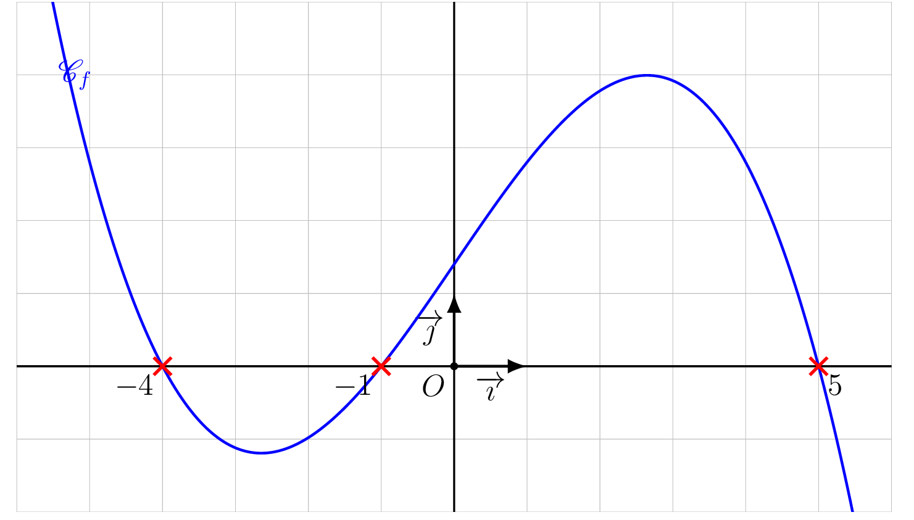
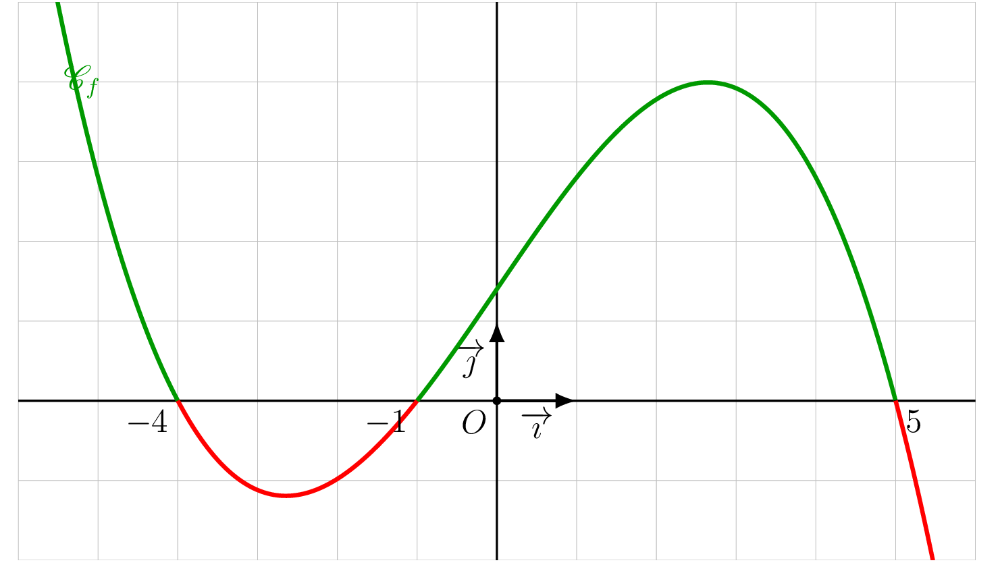

## Résolution graphique de $f(x) = 0$, $f(x) > 0$, $f(x) < 0$

::: {.bloc .thm}
Théorème : Lecture graphique des solutions

Soit $f$ une fonction définie sur $I$, de courbe représentative $\mathscr{C}_f$.

- Les solutions de $f(x) = 0$ sont les abscisses des points d'intersection
  de $\mathscr{C}_f$ avec l'axe des abscisses.
- Les solutions de $f(x) > 0$ sont les abscisses des points de $\mathscr{C}_f$
  situés **au-dessus** de l'axe des abscisses.
- Les solutions de $f(x) < 0$ sont les abscisses des points de $\mathscr{C}_f$
  situés **en dessous** de l'axe des abscisses.
:::

Démonstration :

Pour tout $x \in I$, le point $M\bigl(x\,;\,f(x)\bigr)$ appartient à $\mathscr{C}_f$.
Son ordonnée est $f(x)$, donc :

- $f(x) = 0 \Longleftrightarrow M$ est sur l'axe des abscisses.
- $f(x) > 0 \Longleftrightarrow M$ est au-dessus de l'axe des abscisses.
- $f(x) < 0 \Longleftrightarrow M$ est en dessous de l'axe des abscisses.

::: {.bloc .rem}
Remarque : 

- La courbe représentative permet de résoudre graphiquement des équations
  et inéquations en comparant la courbe à l'axe des abscisses.
- On ne lit jamais une solution sur l'axe **vertical** : les solutions
  de $f(x) = 0$ sont des **abscisses**, pas des ordonnées.
:::

::: {.bloc .info}
À retenir : Point méthode : construire un tableau de signes

1. Repérer les **zéros** de $f$ (abscisses des intersections avec l'axe des abscisses).
2. Repérer les intervalles où la courbe est **au-dessus** ou **en dessous** de l'axe.
3. Remplir le tableau : $+$ au-dessus, $-$ en dessous, $0$ aux zéros.
:::

::: {.bloc .sfc}

Savoir-Faire : Déterminer le signe d'une fonction graphiquement — Représenter

On considère la fonction $f$ dont on donne la représentation graphique.

  

Déterminer le signe de $f(x)$ sur $[-4\,;\,5]$ et dresser le tableau de signes de $f$.

Afficher la correction :

*Point clef :* $f(x) > 0$ là où la courbe est **au-dessus** de l'axe des abscisses, $f(x) < 0$ là où elle est **en dessous**, et $f(x) = 0$ aux points d'intersection avec l'axe.

La courbe $\mathscr{C}_f$ se situe **au-dessus** de l'axe des abscisses sur $[-3\,;\,-1]\,\cup\,[4\,;\,5]$.

Donc pour tout $x \in [-3\,;\,-1]\,\cup\,[4\,;\,5]$, $f(x) \geqslant 0$.

La courbe $\mathscr{C}_f$ se situe **en dessous** de l'axe des abscisses sur $[-4\,;\,-3[\,\cup\,]-1\,;\,4[$.

Donc pour tout $x \in [-4\,;\,-3]\,\cup\,[-1\,;\,4[$, $f(x) \leqslant 0$.

:::

::: {.bloc .info}
À retenir : Tableau des signes

On résume ces résultats dans le tableau de signes :

  

:::

::: {.bloc .sfc}

Savoir-Faire : Lire le tableau de signes d'une fonction — Représenter

On considère la courbe représentative $\mathscr{C}_g$ de la fonction $g$ définie sur $[-3\,;\,4]$,
représentée ci-dessous.

  

Résoudre graphiquement $g(x) = 0$ et dresser le tableau de signes de $g$ sur $[-3\,;\,4]$.

Afficher la correction :

La courbe coupe l'axe des abscisses en $x = -2$, $x = 1$ et $x = 3$.
Donc $\mathscr{S} = \{-2\,;\,1\,;\,3\}$.

  

La courbe est en dessous de l'axe sur $[-3\,;\,-2[\,\cup\,]1\,;\,3[$, donc $g(x) < 0$ sur ces intervalles.

:::

::: {.bloc .ex}

Exercice : Images, antécédents et lecture graphique — Représenter

On considère la représentation graphique $\mathscr{C}_f$ de la fonction $f$ définie sur $[-2\,;\,4]$.

  

1. Lire graphiquement $f(1)$ et $f(-1)$.

Afficher la correction :

$f(1) = 3$ (lecture de l'ordonnée du point d'abscisse $1$).

$f(-1) = 0$ : le point d'abscisse $-1$ est sur l'axe des abscisses.

  

2. Déterminer graphiquement les antécédents de $0$ par $f$.

Afficher la correction :

  

Les antécédents de $0$ sont les abscisses des points de $\mathscr{C}_f$ d'ordonnée $0$.
Graphiquement, la courbe coupe l'axe des abscisses en $x = -1$ et $x = 4$.
Donc les antécédents de $0$ par $f$ sont $-1$ et $4$.

3. Dresser le tableau de signes de $f$ sur $[-2\,;\,4]$.

Afficher la correction :

  

La courbe est au-dessus de l'axe entre $-1$ et $4$ (exclu), et en dessous sur $[-2\,;\,-1[$.

  

:::

## Résolution graphique d'une équation

::: {.bloc .thm}
Théorème : Résolution graphique d'une équation

Soient $f$ et $g$ deux fonctions définies sur $I$, de représentations
graphiques $\mathscr{C}_f$ et $\mathscr{C}_g$, et soit $k$ un réel.

1. Les solutions de l'équation $f(x) = k$ sont les **abscisses**
   des points de $\mathscr{C}_f$ d'ordonnée $k$.
2. Les solutions de l'équation $f(x) = g(x)$ sont les **abscisses**
   des points d'**intersection** de $\mathscr{C}_f$ et $\mathscr{C}_g$.
:::

Démonstration :

Il s'agit d'appliquer la définition d'un antécédent.
Si $f(x) = g(x)$, alors $M(x\,;\,f(x))$ a aussi pour coordonnées
$M(x\,;\,g(x))$, donc $M \in \mathscr{C}_f \cap \mathscr{C}_g$.

::: {.bloc .info}
À retenir : Point méthode — Résoudre graphiquement $f(x) = k$ ou $f(x) = g(x)$

- **Équation $f(x) = k$ :** on trace la droite horizontale $y = k$,
  
  on repère le ou les points d'intersection avec $\mathscr{C}_f$, puis on lit
  les abscisses correspondantes à l'aide de tirets pointillés.

- **Équation $f(x) = g(x)$ :** on repère le ou les points
  
  d'intersection de $\mathscr{C}_f$ et $\mathscr{C}_g$, puis on lit
  les abscisses correspondantes à l'aide de tirets pointillés.
:::

::: {.bloc .sfc}

Savoir-Faire : Résoudre graphiquement une équation — Représenter, Calculer

On considère la représentation graphique $\mathscr{C}_f$ de la fonction $f$
définie sur $[-6\,;\,6]$ donnée ci-dessous.

  

Résoudre graphiquement $f(x) = 2$.

Afficher la correction :

Les solutions de $f(x) = 2$ sont les abscisses des points de $\mathscr{C}_f$
d'ordonnée $2$. On lit graphiquement :
$$\mathcal{S}_1 = \{-4{,}8\,;\,0{,}4\,;\,4{,}4\}.$$

  

:::

::: {.bloc .ex}

Exercice : Résolution graphique d'une équation — Représenter, Calculer

On considère la fonction $f$ définie sur $[-6\,;\,6]$ représentée ci-dessus.

1. Résoudre graphiquement $f(x) = 0$.

Afficher la correction :

  

Les solutions de $f(x) = 0$ sont les abscisses des points
d'intersection de $\mathscr{C}_f$ avec l'axe des abscisses.
On lit : $\mathcal{S}_3 = \{-4\,;\,-1\,;\,5\}$.

2. En déduire le tableau de signes de $f$ sur $[-6\,;\,6]$.

Afficher la correction :

  

$f$ est négative (courbe sous l'axe) sur $[-4\,;\,-1] \cup [5\,;\,6]$,
positive sur $[-6\,;\,-4] \cup [-1\,;\,5]$.

  

:::
