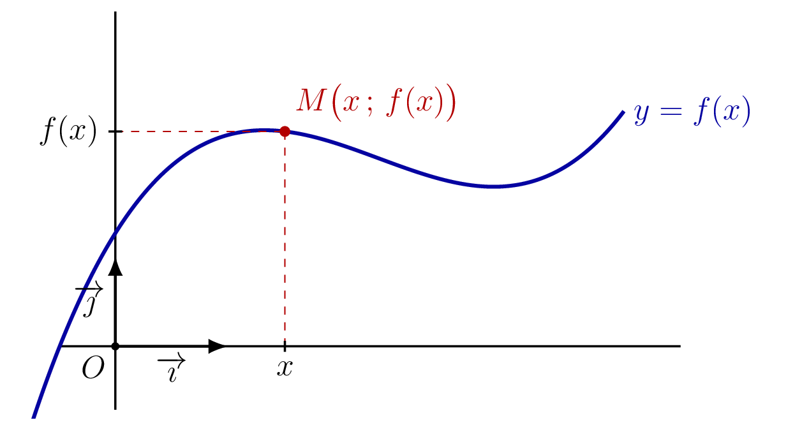
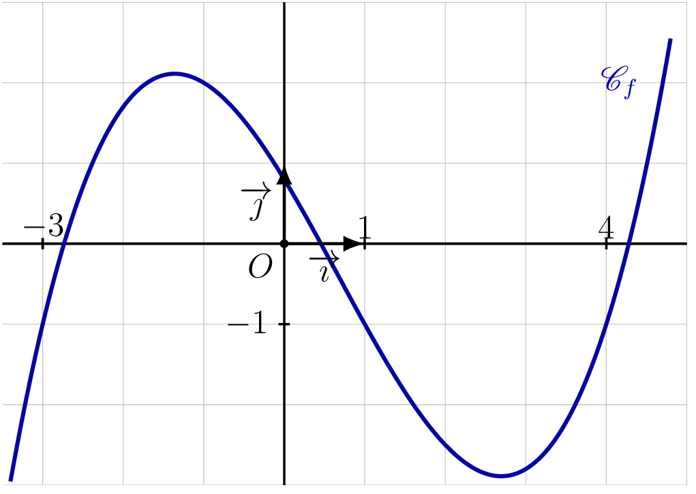
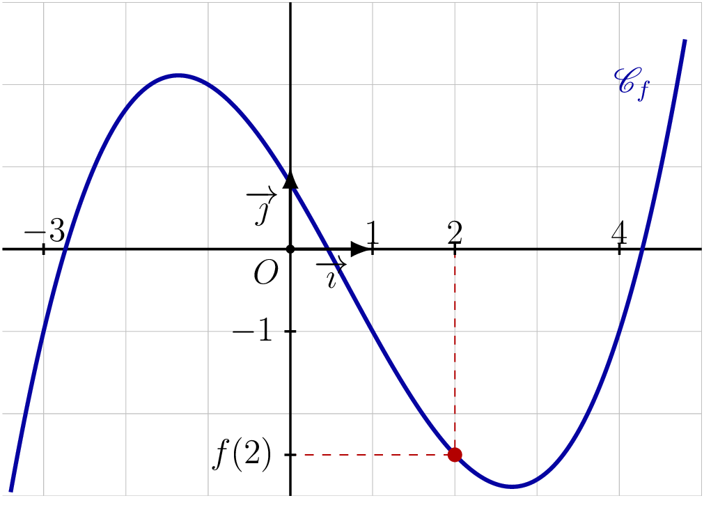
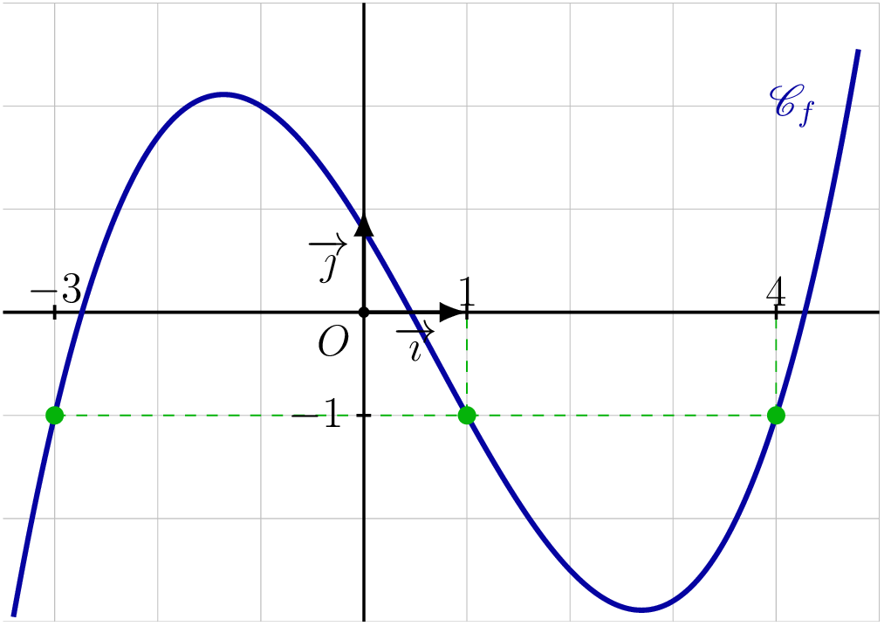
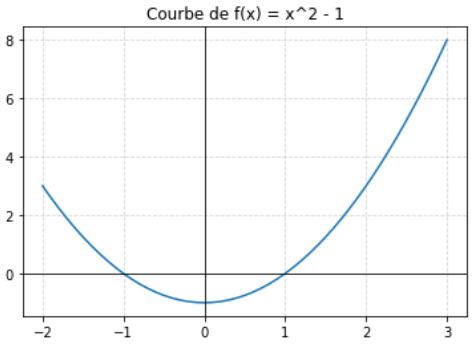

## Tableau de valeurs

::: {.bloc .info}
<span class="bloc-titre">À retenir : </span>

Un **tableau de valeurs** regroupe des couples $(x\,;\,f(x))$ pour des valeurs choisies de $x$.
C'est l'un des modes de représentation d'une fonction.

Il ne donne que quelques images : il ne permet pas de connaître **toutes** les images de $f$, ni de déduire le comportement général de la fonction.
:::

::: {.bloc .sfc}
<div class="bloc-titre">Savoir-Faire :<span class="exemp-extra"> Construire un tableau de valeurs — Calculer</span></div>

Soit $f$ définie par $f(x) = x^2 - 1$.

1. Compléter le tableau de valeurs suivant :

<div style="overflow-x:auto;">
<table>
<tbody>
<tr><td>$x$</td><td>$-2$</td><td>$-1$</td><td>$0$</td><td>$1$</td><td>$2$</td><td>$3$</td></tr>
<tr><td>$f(x)$</td><td></td><td></td><td></td><td></td><td></td><td></td></tr>
</tbody>
</table>
</div>

<details class="bloc cor">
<summary>Afficher la correction :</summary>

<div style="overflow-x:auto;">
<table>
<tbody>
<tr><td>$x$</td><td>$-2$</td><td>$-1$</td><td>$0$</td><td>$1$</td><td>$2$</td><td>$3$</td></tr>
<tr><td>$f(x)$</td><td>$3$</td><td>$0$</td><td>$-1$</td><td>$0$</td><td>$3$</td><td>$8$</td></tr>
</tbody>
</table>
</div>

</details>

2. Écrire un programme Python qui construit automatiquement ce tableau de valeurs.

<details class="bloc cor">
<summary>Afficher la correction :</summary>

~~~{=html}
<div class="exo-wrap">
  <div class="editor-shell" id="exo1">
    <div class="bar-top"><span class="cell-num">Correction exercice  </span></div>
    <textarea id="code">
def f(x):
    return x**2 - 1          # definition de la fonction

for x in range(-2, 4):       # x prend les valeurs -2, -1, 0, 1, 2, 3
    print(x, f(x))           # affiche x et son image f(x) 
</textarea>
    <div class="output" id="out"><pre></pre></div>
    <div class="toolbar">
      <button class="btn" id="run" disabled></button>
      <button class="btn" id="check" disabled></button>
      <button class="btn" id="download"></button>
      <button class="btn" id="reset"></button>
      <button class="btn" id="clear"></button>
      <button class="btn" id="save"></button>
    </div>
  </div>
</div>
~~~

Ce code affiche :

```
-2 3
-1 0
0 -1
1 0
2 3
3 8
```

</details>
:::

## Représentation graphique

::: {.bloc .def}
<span class="bloc-titre">Définition : Courbe représentative</span>

On appelle **courbe représentative** de $f$ sur $D_f$, notée $\mathscr{C}_f$,
l'ensemble des points $M$ du plan de coordonnées $(x\,;\,f(x))$, pour $x \in D_f$.

La courbe $\mathscr{C}_f$ admet pour équation $y = f(x)$.
:::

::: {.bloc .info}
<span class="bloc-titre">À retenir : Interprétation graphique</span>

<div style="text-align: center;">
  
</div>

$$M(x\,;\,y) \in \mathscr{C}_f \Longleftrightarrow x \in D_f \et y = f(x)$$
:::

::: {.bloc .sfc}
<div class="bloc-titre">Savoir-Faire :<span class="exemp-extra"> Appartenance d'un point à une courbe — Raisonner</span></div>

Soit $f$ définie pour tout réel $x$ par $f(x) = 2(x-1)^2 - 8$.

1. La courbe $\mathscr{C}_f$ admet-elle un point d'ordonnée $-12$ ? Si oui, donner ses coordonnées.

<details class="bloc cor">
<summary>Afficher la correction :</summary>

Pour tout réel $x$,
$$f(x)= -12 \iff 2(x-1)^2 - 8 = -12 \iff (x-1)^2 = -2$$
Cette équation n'a aucune solution réelle car le carré d'un réel est toujours positif ou nul.
Donc $\mathscr{C}_f$ n'admet aucun point d'ordonnée $-12$.

</details>

2. Le point $A(-\sqrt{2}\,;\,3{,}656854)$ appartient-il à $\mathscr{C}_f$ ? Justifier.

<details class="bloc cor">
<summary>Afficher la correction :</summary>

$f(-\sqrt{2}) = 2(-\sqrt{2}-1)^2 - 8 = 2(2 + 2\sqrt{2} + 1) - 8 = 6 + 4\sqrt{2} - 8 = -2 + 4\sqrt{2}$

Or $-2 + 4\sqrt{2} \approx 3{,}656854$.

Les quantités ne sont pas égales. Donc le point n'appartient pas à la représentation graphique de $\mathscr{C}_f$.

</details>
:::

::: {.bloc .info}
<span class="bloc-titre">À retenir : Point méthode : lire une image</span>

1. Repérer l'abscisse $a$ sur l'axe horizontal.
2. Monter ou descendre verticalement jusqu'à la courbe.
3. Lire l'ordonnée du point obtenu : c'est $f(a)$.
:::

::: {.bloc .info}
<span class="bloc-titre">À retenir : Point méthode : lire un antécédent</span>

1. Repérer $b$ sur l'axe vertical.
2. Aller horizontalement jusqu'à la courbe.
3. Lire les abscisses des points d'intersection : ce sont les antécédents de $b$.
:::

::: {.bloc .sfc}
<div class="bloc-titre">Savoir - faire :<span class="exemp-extra"> Lire des images et des antécédents — Représenter</span></div>

On considère la courbe $\mathscr{C}_f$ de la fonction $f$ définie sur $[-3{,}5\,;\,5]$.

<div style="text-align: center;">
  
</div>

1. Lire graphiquement $f(2)$.

<details class="bloc cor">
<summary>Afficher la correction :</summary>

On lit $f(2) = -2{,}5$.

<div style="text-align: center;">
  
</div>

</details>

2. Déterminer graphiquement les antécédents de $-1$ par $f$. 

<details class="bloc cor">
<summary>Afficher la correction :</summary>

<div style="text-align: center;">
  
</div>


Les antécédents de $-1$ sont les abscisses des points de $\mathscr{C}_f$ d'ordonnée $-1$.
Graphiquement : $x = -3$, $x = 1$ et $x = 4$. 

</details>
:::

::: {.bloc .info}
<span class="bloc-titre">À retenir : Tracé de la courbe avec Python</span>

Le code ci-dessous trace la courbe de $f(x) = x^2 - 1$ sur $[-2\,;\,3]$.


```python
import matplotlib.pyplot as plt        # importation de la bibliotheque graphique

def f(x):
    return x**2 - 1                    # definition de la fonction

x = [i/10 for i in range(-20, 31)]    # valeurs de x entre -2 et 3 par pas de 0.1
y = [f(xi) for xi in x]               # calcul des images correspondantes

plt.plot(x, y)                         # trace la courbe
plt.axhline(0, color='black', linewidth=0.8)   # trace l'axe des abscisses
plt.axvline(0, color='black', linewidth=0.8)   # trace l'axe des ordonnees
plt.grid(True, linestyle='--', alpha=0.5)      # affiche une grille
plt.title("Courbe de f(x) = x^2 - 1")         # titre du graphique
plt.show()                             # affiche le graphique
```

<div style="text-align: center;">
  
</div>

~~~{=html}
<div class="exo-wrap">
  <div class="editor-shell" id="exo1">
    <div class="bar-top"><span class="cell-num">Représentation graphique  </span></div>
    <textarea id="code">
import matplotlib.pyplot as plt        # importation de la bibliotheque graphique

def f(x):
    return x**2 - 1                    # definition de la fonction

x = [i/10 for i in range(-20, 31)]    # valeurs de x entre -2 et 3 par pas de 0.1
y = [f(xi) for xi in x]               # calcul des images correspondantes

plt.plot(x, y)                         # trace la courbe
plt.axhline(0, color='black', linewidth=0.8)   # trace l'axe des abscisses
plt.axvline(0, color='black', linewidth=0.8)   # trace l'axe des ordonnees
plt.grid(True, linestyle='--', alpha=0.5)      # affiche une grille
plt.title("Courbe de f(x) = x^2 - 1")         # titre du graphique
plt.show()                             # affiche le graphique
</textarea>
    <div class="output" id="out"><pre></pre></div>
    <div class="toolbar">
      <button class="btn" id="run" disabled></button>
      <button class="btn" id="check" disabled></button>
      <button class="btn" id="download"></button>
      <button class="btn" id="reset"></button>
      <button class="btn" id="clear"></button>
      <button class="btn" id="save"></button>
    </div>
  </div>
</div>
~~~ 
:::
