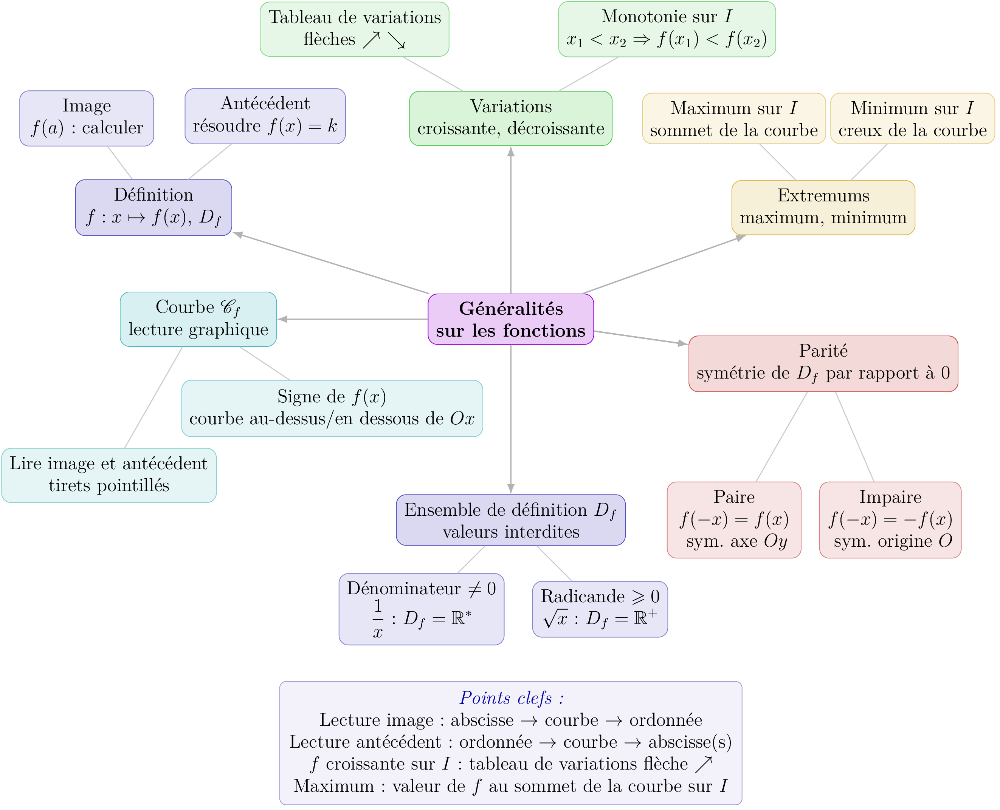

::: {.bloc .ex}
<div class="bloc-titre">Exercice :<span class="exemp-extra"> Analyser un programme Python — Calculer, Analyser</span></div>

On considère la fonction $f$ définie sur $[0\,;\,4]$ par $f(x) = x^2 - 3x + 1$
et le programme Python suivant :

```python
def f(x):
    return x**2 - 3*x + 1
    
def mystere(a, b, n):
    pas = (b - a) / n
    for i in range(n):
        x1 = a + i * pas
        x2 = a + (i + 1) * pas
        if f(x1) > f(x2):
            return False
    return True
```

1. Que calcule `pas` ? À quoi correspondent `x1` et `x2` ?

<details class="bloc cor">
<summary>Afficher la correction :</summary>

`pas` est la longueur $\dfrac{b-a}{n}$ de chacun des $n$ sous-intervalles de $[a\,;\,b]$.
`x1` et `x2` sont les deux extrémités du $i$-ème sous-intervalle.

</details>

2. Que permet de faire la fonction `mystere(a, b, n)` ?

<details class="bloc cor">
<summary>Afficher la correction :</summary>

La fonction découpe $[a\,;\,b]$ en $n$ sous-intervalles de même longueur et vérifie,
pour chaque sous-intervalle, que $f(x_1) \leqslant f(x_2)$.
Elle renvoie `False` dès qu'elle est violée, `True` si elle est satisfaite partout.

</details>

3. On exécute `mystere(0, 4, 100)`. La fonction renvoie `False`.
   Que peut-on affirmer ?

<details class="bloc cor">
<summary>Afficher la correction :</summary>

Il existe un sous-intervalle sur lequel $f(x_1) > f(x_2)$ : $f$ **n'est pas croissante** sur $[0\,;\,4]$.

</details>

4. On exécute `mystere(2, 4, 100)`. La fonction renvoie `True`.
   Peut-on en conclure que $f$ est croissante sur $[2\,;\,4]$ ?

<details class="bloc cor">
<summary>Afficher la correction :</summary>

Non. La fonction ne teste que $100$ paires de points, pas tous les réels de $[2\,;\,4]$.
Cela suggère que $f$ est probablement croissante, mais **cela ne constitue pas une preuve mathématique**.
Pour prouver la croissance, il faudrait utiliser la méthode algébrique.

</details>
:::

## Bilan — carte mentale

<div style="text-align: center;">
  
</div>
