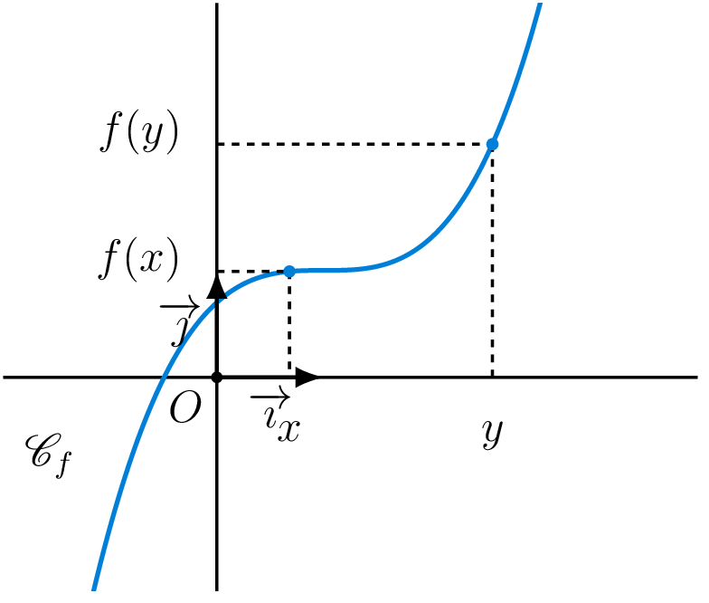
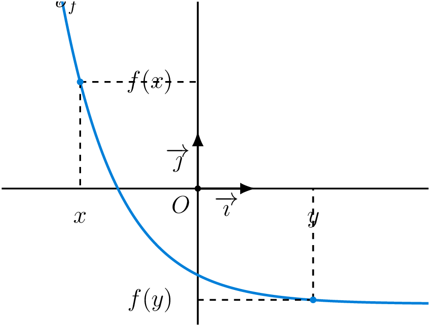
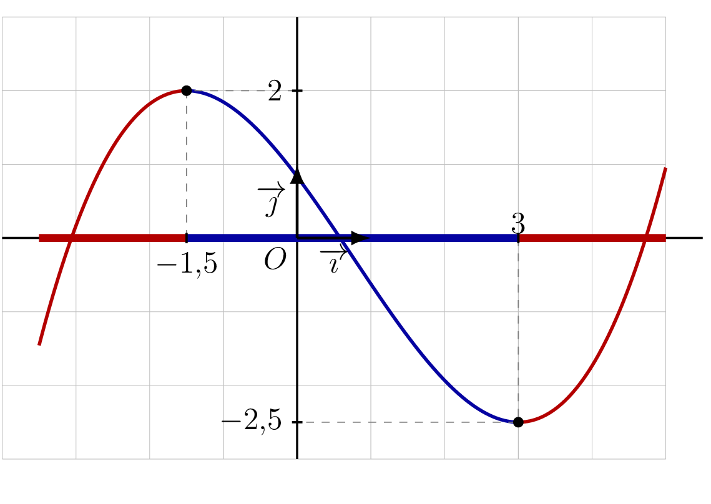
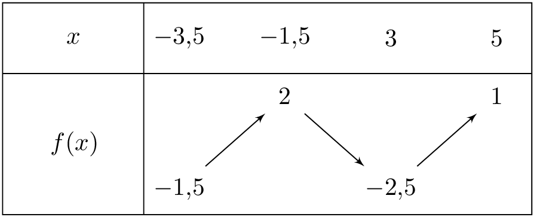
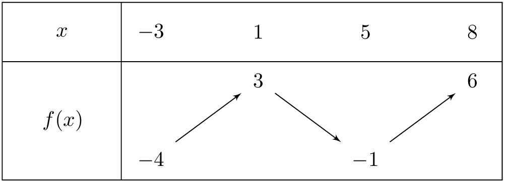

## Fonctions croissante et décroissante

On considère une fonction $f$ définie sur $D_f$, et $I$ un intervalle de $D_f$.

::: {.bloc .def}
Définition : Fonction monotone

Soit $f$ une fonction définie sur un intervalle $I$.

1. On dit que $f$ est **croissante** sur $I$ si images et antécédents sont rangés
   dans le **même ordre** :
   $$\text{pour tout } x, y \in I \,,\quad x \leqslant y \Longrightarrow f(x) \leqslant f(y)$$
2. On dit que $f$ est **décroissante** sur $I$ si images et antécédents sont rangés
   dans l'**ordre contraire** :
   $$\text{pour tout } x, y \in I \,,\quad x \leqslant y \Longrightarrow f(x) \geqslant f(y)$$

Une fonction est dite **monotone** sur $I$ lorsqu'elle est soit croissante, soit décroissante sur $I$.
:::

::: {.bloc .info}
À retenir : Illustration graphique

<strong>Fonction croissante :</strong>

On dit qu'une fonction croissante <strong>conserve l'ordre</strong>.

<strong>Fonction décroissante :</strong>

On dit qu'une fonction décroissante <strong>inverse l'ordre</strong>.

:::

::: {.bloc .rem}
Remarque : 

Une fonction qui est à la fois croissante et décroissante sur $I$ est dite **constante** sur $I$ :
il existe un réel $k$ tel que pour tout $x \in I$, $f(x) = k$.
Sa représentation graphique sur $I$ est une droite parallèle à l'axe des abscisses, d'équation $y = k$.
:::

::: {.bloc .info}
À retenir : Point méthode : prouver la monotonie par le calcul

Soient $x$ et $y$ deux réels de $I$ avec $x \leqslant y$.
On étudie le signe de $f(y) - f(x)$ :

- Si $f(y) - f(x) \geqslant 0$, c'est-à-dire $f(x) \leqslant f(y)$ : $f$ est **croissante** sur $I$.
- Si $f(y) - f(x) \leqslant 0$, c'est-à-dire $f(x) \geqslant f(y)$ : $f$ est **décroissante** sur $I$.

En classe de Seconde, on n'utilise pas la dérivée : la seule méthode est l'étude du signe de $f(y) - f(x)$.
:::

::: {.bloc .sfc}

Savoir-Faire : Croissance de la fonction carré — Raisonner

Montrer que la fonction $f$ définie sur $[0\,;\,+\infty[$ par $f(x) = x^2$ est croissante sur $[0\,;\,+\infty[$.

Afficher la correction :

Soient $x, y \in [0\,;\,+\infty[$ avec $x \leqslant y$. Étudions le signe de $f(y) - f(x)$ :
$$f(y) - f(x) = y^2 - x^2 = (y-x)(y+x)$$
Or $x \leqslant y$ donc $y - x \geqslant 0$, et $x \geqslant 0$, $y \geqslant 0$ donc $y + x \geqslant 0$.

Donc $f(y) - f(x) = (y-x)(y+x) \geqslant 0$, soit $f(x) \leqslant f(y)$.

Ainsi $f$ est **croissante** sur $[0\,;\,+\infty[$.

:::

::: {.bloc .sfc}

Savoir-Faire : Décroissance de la fonction inverse décalée — Raisonner

Montrer que la fonction $g$ définie sur $]-3\,;\,+\infty[$ par $g(x) = \dfrac{1}{x+3}$ est décroissante
sur $]-3\,;\,+\infty[$.

Afficher la correction :

Soient $x, y \in ]-3\,;\,+\infty[$ avec $x \leqslant y$. Étudions le signe de $g(x) - g(y)$ :
$$g(x) - g(y) = \frac{1}{x+3} - \frac{1}{y+3} = \frac{(y+3) - (x+3)}{(x+3)(y+3)} = \frac{y - x}{(x+3)(y+3)}$$
Or :

- $x \leqslant y$ donc $y - x \geqslant 0$ ;
- $x > -3$ donc $x + 3 > 0$, et $y > -3$ donc $y + 3 > 0$, ainsi $(x+3)(y+3) > 0$.

Donc $g(x) - g(y) \geqslant 0$, soit $g(x) \geqslant g(y)$.

Ainsi $g$ est **décroissante** sur $]-3\,;\,+\infty[$.

:::

## Tableau de variations

::: {.bloc .def}
Définition : Tableau de variations

Étudier les variations d'une fonction, c'est indiquer les intervalles sur lesquels elle est croissante
et ceux sur lesquels elle est décroissante.
Les résultats sont regroupés dans un **tableau de variations**.
:::

::: {.bloc .info}
À retenir : Point méthode : donner ou étudier les variations ?

- **Donner le tableau de variations** : on résume les variations dans un tableau
  en précisant les valeurs atteintes aux points remarquables.
- **Étudier les variations** : on décrit les variations par une phrase en français,
  en précisant les intervalles de croissance et de décroissance.
:::

::: {.bloc .sfc}

Savoir-Faire : Lire un tableau de variations — Représenter

On considère la représentation graphique d'une fonction $f$ sur $[-3{,}5\,;\,5]$.

Décrire les variations de $f$ et donner son tableau de variations.

  

Afficher la correction :

***Point clef :** on lit le tableau de variations en suivant la courbe de gauche à droite. Là où la courbe monte, $f$ est croissante ; là où elle descend, $f$ est décroissante.*

La fonction $f$ est croissante sur $[-3{,}5\,;\,-1{,}5]$ et sur $[3\,;\,5]$, décroissante sur $[-1{,}5\,;\,3]$.

  

:::

::: {.bloc .info}
À retenir : Point méthode : exploiter un tableau de variations

- **Encadrer $f(a)$** : repérer l'intervalle de monotonie $[c\,;\,d]$ contenant $a$,
  puis utiliser le sens de variation pour encadrer $f(a)$ entre $f(c)$ et $f(d)$.

- **$a$ et $b$ dans le même intervalle** $[c\,;\,d]$ :
  - $f$ croissante sur $[c\,;\,d]$ : $a \leqslant b \Longrightarrow f(a) \leqslant f(b)$.
  - $f$ décroissante sur $[c\,;\,d]$ : $a \leqslant b \Longrightarrow f(a) \geqslant f(b)$.

- **$a$ et $b$ dans des intervalles différents** : encadrer $f(a)$ et $f(b)$
  séparément, puis examiner si les intervalles obtenus se chevauchent.
  - S'ils sont disjoints, on peut conclure.
  - Sinon, on ne peut pas comparer à partir du seul tableau.
:::

::: {.bloc .sfc}

Savoir-Faire : Exploiter un tableau de variations — Raisonner

On donne le tableau de variations de la fonction $f$ définie sur $[-3\,;\,8]$.

  

1. Encadrer $f(2)$.

Afficher la correction :

$f$ est décroissante sur $[1\,;\,5]$ et $1 \leqslant 2 \leqslant 5$,
donc $f(5) \leqslant f(2) \leqslant f(1)$, soit $-1 \leqslant f(2) \leqslant 3$.

2. Comparer $f(2)$ et $f(4)$.

Afficher la correction :

$f$ est décroissante sur $[1\,;\,5]$ et $1 \leqslant 2 \leqslant 4 \leqslant 5$,
donc $f(2) \geqslant f(4)$.

3. Peut-on avoir $f(7) = 7$ ? Justifier.

Afficher la correction :

$f$ est croissante sur $[5\,;\,8]$ et $5 \leqslant 7 \leqslant 8$,
donc $f(5) \leqslant f(7) \leqslant f(8)$, soit $-1 \leqslant f(7) \leqslant 6$.
Or $7 > 6$, donc on ne peut pas avoir $f(7) = 7$.

4. Peut-on comparer $f(0)$ et $f(4)$ ? Justifier.

Afficher la correction :

$0 \in [-3\,;\,1]$ et $4 \in [1\,;\,5]$, qui sont deux intervalles de monotonie différents.

$f$ est croissante sur $[-3\,;\,1]$ et $-3 \leqslant 0 \leqslant 1$,
donc $f(-3) \leqslant f(0) \leqslant f(1)$, soit $-4 \leqslant f(0) \leqslant 3$.

$f$ est décroissante sur $[1\,;\,5]$ et $1 \leqslant 4 \leqslant 5$,
donc $f(5) \leqslant f(4) \leqslant f(1)$, soit $-1 \leqslant f(4) \leqslant 3$.

Or $[-4\,;\,3] \cap [-1\,;\,3] = [-1\,;\,3] \neq \emptyset$ : les encadrements se chevauchent,
on ne peut donc pas comparer $f(0)$ et $f(4)$ à partir du seul tableau de variations.

:::
