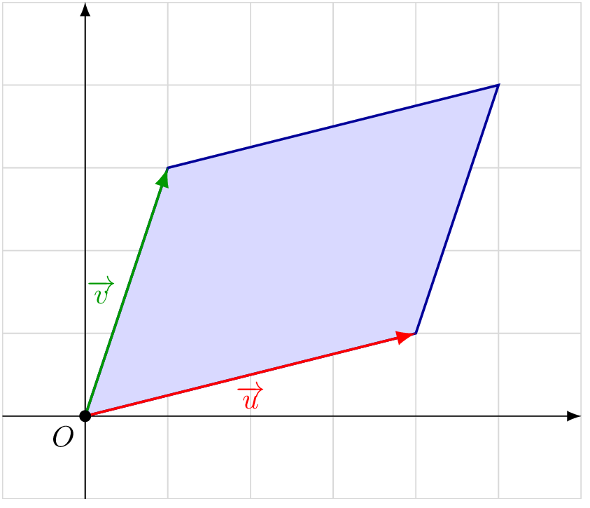

::: {.bloc .thm}
Propriété : Aire d'un parallélogramme

Soit $\Oij$ un repère orthonormé et $\ve{u}\vecol{x}{y}$, $\ve{v}\vecol{x'}{y'}$ deux vecteurs
non colinéaires. L'aire du parallélogramme construit sur $\ve{u}$ et $\ve{v}$ est
$$\mathscr{A} = \abs{\det(\ve{u},\ve{v})} = \abs{xy' - x'y}.$$

  

:::

Démonstration :

On se place dans le cas $0 < x < x'$ et $0 < y < y'$.

Soit $O$ l'origine, $A(x\,;\,y)$, $B(x'\,;\,y')$, $A'(x\,;\,0)$, $B'(x'\,;\,0)$.

Par soustraction d'aires trapézoïdales :
$$\mathscr{A}_{OAB}
  = \mathscr{A}_{OBB'} - \mathscr{A}_{OAA'} - \mathscr{A}_{ABB'A'}
  = \dfrac{1}{2}x'y' - \dfrac{1}{2}xy - \dfrac{1}{2}(y+y')(x'-x)$$
En développant, on obtient $\mathscr{A}_{OAB} = \dfrac{1}{2}(xy'-x'y)$.

L'aire du parallélogramme, deux fois celle du triangle, vaut $xy' - x'y$,
et dans le cas général $\abs{xy'-x'y} = \abs{\det(\ve{u},\ve{v})}$.

  

::: {.bloc .rem}
Remarque : 

L'aire du triangle formé par deux vecteurs $\ve{u}$ et $\ve{v}$ est la moitié
de l'aire du parallélogramme :
$$\mathscr{A}_{\triangle} = \dfrac{1}{2}\abs{\det(\ve{u},\ve{v})}$$
:::

::: {.bloc .sfc}

Savoir - faire : Calculer l'aire d'un parallélogramme — Calculer 

Soit $A(-1\,;\,-1)$, $B(2\,;\,5)$, $C(-2\,;\,-4)$.
Déterminer $D$ tel que $ABCD$ soit un parallélogramme, puis calculer son aire.

Afficher la correction :

$ABCD$ est un parallélogramme si et seulement si $\ve{AD} = \ve{BC}$.
$\ve{BC}\vecol{-4}{-9}$, donc $x_D = -1+(-4) = -5$ et $y_D = -1+(-9) = -10$ : $D(-5\,;\,-10)$.

$\ve{AB}\vecol{3}{6}$ et $\ve{AD}\vecol{-4}{-9}$.
$$\mathscr{A}_{ABCD} = \abs{\det(\ve{AB},\ve{AD})} = \abs{3 \times (-9) - (-4) \times 6}
  = \abs{-27 + 24} = 3.$$

:::

::: {.bloc .info}
À retenir : Méthode — Distance d'un point à une droite

1. Calculer l'aire du triangle avec les deux côtés de l'angle droit
   (si le triangle est rectangle) ou via $\mathscr{A} = \dfrac{1}{2}\abs{\det(\ve{u},\ve{v})}$.
2. Identifier la base et calculer sa longueur.
3. Utiliser : $\mathscr{A} = \dfrac{1}{2} \times \text{base} \times \text{hauteur}$.
4. Résoudre pour obtenir la hauteur $= d(A,(d))$.
:::

::: {.bloc .ex}

Exercice : Synthèse — Géométrie repérée — Calculer, Raisonner 

Soit $A(1\,;\,2)$, $B(5\,;\,-1)$, $C(3\,;\,4)$.

1. Calculer $\ve{AB}$, $\ve{AC}$ et $\norm{\ve{AB}}$.

Afficher la correction :

$$\ve{AB}\vecol{4}{-3},\quad \ve{AC}\vecol{2}{2},\quad \norm{\ve{AB}} = \sqrt{4^2+(-3)^2} = \sqrt{25} = 5$$

2. Déterminer les coordonnées du milieu $I$ de $[BC]$.

Afficher la correction :

$$I\left(\dfrac{5+3}{2}\,;\,\dfrac{-1+4}{2}\right) = \left(4\,;\,\dfrac{3}{2}\right)$$

3. Les points $A$, $I$, $C$ sont-ils alignés ?

Afficher la correction :

$\ve{AI}\vecol{3}{-\frac{1}{2}}$ et $\ve{AC}\vecol{2}{2}$.
$$\det(\ve{AI},\ve{AC}) = 3 \times 2 - 2 \times \left(-\dfrac{1}{2}\right) = 6 + 1 = 7 \neq 0$$
Donc $A$, $I$, $C$ ne sont **pas alignés**.

4. Calculer l'aire du triangle $ABC$.

Afficher la correction :

$$\mathscr{A}_{ABC} = \dfrac{1}{2}\abs{\det(\ve{AB},\ve{AC})}
= \dfrac{1}{2}\abs{4 \times 2 - 2 \times (-3)}
= \dfrac{1}{2}\abs{8+6} = \dfrac{1}{2} \times 14 = 7$$

5. En déduire la distance du point $A$ à la droite $(BC)$.

Afficher la correction :

*Point clef :* pour calculer la distance d'un point à une droite, on exprime l'aire du triangle de deux façons et on résout l'égalité obtenue.

Soit $H$ le projeté orthogonal de $A$ sur $(BC)$.
$$BC = \sqrt{(3-5)^2+(4-(-1))^2} = \sqrt{4+25} = \sqrt{29}$$
En exprimant l'aire avec la base $BC$ :
$$\mathscr{A}_{ABC} = \dfrac{1}{2} \times BC \times AH
\quad\Longrightarrow\quad
7 = \dfrac{1}{2} \times \sqrt{29} \times AH
\quad\Longrightarrow\quad
AH = \dfrac{14}{\sqrt{29}}$$
Donc $d(A,(BC)) = \dfrac{14}{\sqrt{29}}$.

:::
