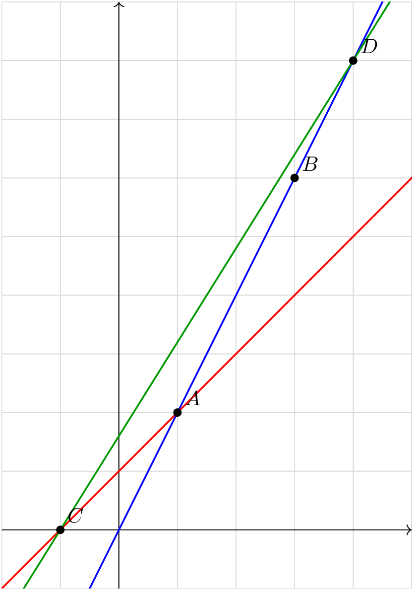

## Déterminant de deux vecteurs

::: {.bloc .def}
Définition : Déterminant de deux vecteurs

Soit $\ve{u}\vecol{x}{y}$ et $\ve{v}\vecol{x'}{y'}$ deux vecteurs.
On appelle **déterminant** du couple $(\ve{u}\,;\,\ve{v})$ le réel
$$\det(\ve{u},\ve{v}) = \begin{vmatrix} x & x' \\ y & y' \end{vmatrix} = xy' - x'y.$$
:::

::: {.bloc .rem}
Remarque : 

L'ordre des vecteurs a de l'importance : $\det(\ve{u},\ve{v}) = -\det(\ve{v},\ve{u})$.
:::

::: {.bloc .sfc}

Savoir - faire : Calculer un déterminant — Calculer 

Soit $\ve{u}\vecol{2}{3}$ et $\ve{v}\vecol{5}{-1}$. Calculer $\det(\ve{u},\ve{v})$.

Afficher la correction :

$$\det(\ve{u},\ve{v}) = 2 \times (-1) - 5 \times 3 = -2 - 15 = -17.$$

:::

::: {.bloc .info}
À retenir : Méthode — Tester la colinéarité de deux vecteurs

- Calculer $\det(\ve{u},\ve{v}) = xy' - x'y$.
- Si $\det(\ve{u},\ve{v}) = 0$ $\Rightarrow$ les vecteurs sont **colinéaires**.
- Sinon $\Rightarrow$ les vecteurs ne sont **pas colinéaires**.

**Cas particuliers :**

- Si les vecteurs ont des coordonnées simples, tester la proportionnalité directement.
- Si un vecteur contient un paramètre, poser $\det = 0$ et résoudre l'équation.
- Pour tester l'alignement de trois points $A$, $B$, $C$, calculer $\det(\ve{AB},\ve{AC})$.
:::

## Critère de colinéarité

::: {.bloc .thm}
Propriété : Critère de colinéarité

Deux vecteurs $\ve{u}\vecol{x}{y}$ et $\ve{v}\vecol{x'}{y'}$ non nuls sont **colinéaires**
si et seulement si
$$\det(\ve{u},\ve{v}) = xy' - x'y = 0.$$
:::

Démonstration :

($\Rightarrow$) Si $\ve{u}$ et $\ve{v}$ sont colinéaires,
il existe $k \in \R$ tel que $\ve{v} = k\,\ve{u}$,
c'est-à-dire $x' = kx$ et $y' = ky$. Alors $$xy' - x'y = x(ky) - (kx)y = kxy - kxy = 0$$

($\Leftarrow$) Si $xy' - x'y = 0$, alors $xy' = x'y$.

- Si $x = 0$ et $y \neq 0$, alors $xy' = 0$, d'où $x'y = 0$,
  donc $x' = 0$.

  Ainsi $\ve{u}\vecol{0}{y}$ et $\ve{v}\vecol{0}{y'}$,
  d'où $\ve{v} = \dfrac{y'}{y}\,\ve{u}$ : $\ve{u}$ et $\ve{v}$ sont colinéaires.

- Si $x \neq 0$, alors $xy' = x'y$ donne $y' = \dfrac{x'}{x}\,y$.
  En posant $k = \dfrac{x'}{x}$, on obtient $x' = kx$ et $y' = ky$,
  donc $\ve{v} = k\,\ve{u}$ : $\ve{u}$ et $\ve{v}$ sont colinéaires.

Dans tous les cas, $\ve{u}$ et $\ve{v}$ sont colinéaires.

::: {.bloc .rem}
Remarque : 

La colinéarité de $\ve{AB}$ et $\ve{CD}$ est équivalente au parallélisme des droites supports $(AB)$ et $(CD)$.

Si de plus les droites ont un point commun, les droites sont confondues et donc les points sont alignés.
:::

::: {.bloc .sfc}

Savoir - faire : Tester l'alignement de trois points — Raisonner 

Soit $A(1\,;\,2)$, $B(3\,;\,5)$, $C(7\,;\,11)$.
Les points $A$, $B$, $C$ sont-ils alignés ?

Afficher la correction :

*Point clef :* trois points $A$, $B$, $C$ sont alignés si et seulement si $\det(\ve{AB},\ve{AC})=0$.

On calcule $\ve{AB}\vecol{2}{3}$ et $\ve{AC}\vecol{6}{9}$.
$$\det(\ve{AB},\ve{AC}) = 2 \times 9 - 6 \times 3 = 18 - 18 = 0.$$
Donc $\ve{AB}$ et $\ve{AC}$ sont colinéaires, donc les droites $(AB)$ et $(AC)$ sont parallèle. Or $A$ appartient aux deux droites, elles sont donc confondues, $A$, $B$, $C$ sont **alignés**.

:::

::: {.bloc .ex}

Exercice : Colinéarité avec un paramètre — Calculer, Raisonner 

Soit $\ve{u}\vecol{x+1}{3}$ et $\ve{v}\vecol{x^2}{x}$.
Déterminer les valeurs de $x$ pour lesquelles $\ve{u}$ et $\ve{v}$ sont colinéaires.

Afficher la correction :

*Point clef :* $\ve{u}$ et $\ve{v}$ sont colinéaires si et seulement si leur déterminant est nul.

$\ve{u}$ et $\ve{v}$ sont colinéaires si et seulement si $\det(\ve{u},\ve{v}) = 0$, soit
$$(x+1) \times x - 3 \times x^2 = 0
  \Longleftrightarrow x(x+1 - 3x) = 0
  \Longleftrightarrow x(-2x+1) = 0.$$
Donc $x = 0$ ou $x = \dfrac{1}{2}$.
Il existe deux valeurs de $x$ qui rendent $\ve{u}$ et $\ve{v}$ colinéaires.

:::

::: {.bloc .ex}

Exercice : Alignement et parallélisme — Calculer, Raisonner 

Soit $A(1\,;\,2)$, $B(3\,;\,6)$, $C(-1\,;\,0)$, $D(4\,;\,8)$.

1. Les points $A$, $B$, $C$ sont-ils alignés ?

Afficher la correction :

$\ve{AB}\vecol{2}{4}$ et $\ve{AC}\vecol{-2}{-2}$.
$$\det(\ve{AB},\ve{AC}) = 2 \times (-2) - (-2) \times 4 = -4 + 8 = 4 \neq 0.$$
Les vecteurs ne sont pas colinéaires : $A$, $B$, $C$ ne sont **pas alignés**.

2. Les droites $(AB)$ et $(CD)$ sont-elles parallèles ?

Afficher la correction :

$\ve{AB}\vecol{2}{4}$ et $\ve{CD}\vecol{5}{8}$.
$$\det(\ve{AB},\ve{CD}) = 2 \times 8 - 5 \times 4 = 16 - 20 = -4 \neq 0.$$
Les droites $(AB)$ et $(CD)$ ne sont **pas parallèles**.

  

:::
