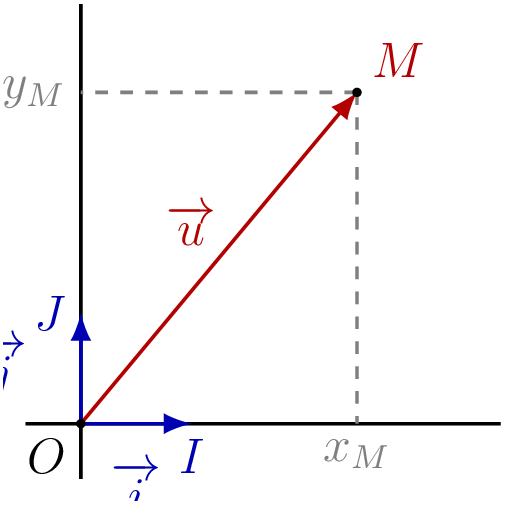
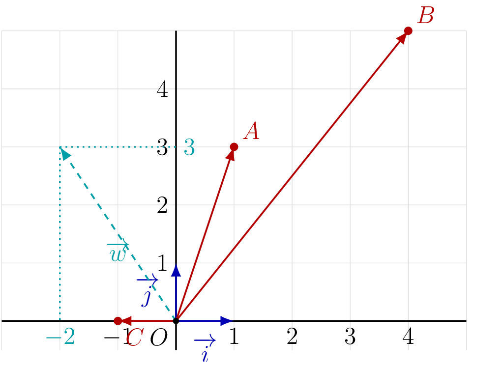

## Base orthonormée — rappel

::: {.bloc .def}
Définition : Base orthonormée

On dit que $(\ve{i}\,;\,\ve{j})$ est une **base orthonormée** du plan si :

- $\ve{i}$ et $\ve{j}$ sont **perpendiculaires** (orthogonaux) ;
- $\ve{i}$ et $\ve{j}$ sont de **norme** $1$ : $\|\ve{i}\| = \|\ve{j}\| = 1$.

On dit alors que $\Oij$ est un **repère orthonormé** du plan.
:::

::: {.bloc .rem}
Remarque : 

Dans un repère orthonormé, on a $\ve{i} = \ve{OI}$ et $\ve{j} = \ve{OJ}$,
où $OI = OJ = 1$ (unité) et $(OI) \perp (OJ)$.

Dans un repère orthonormé, les formules de distance et de norme proviennent
directement du théorème de Pythagore : c'est l'orthogonalité qui les rend possibles.
:::

## Coordonnées d'un vecteur

::: {.bloc .def}
Définition : Coordonnées d'un vecteur

Soit $\Oij$ un repère orthonormé du plan.
Tout vecteur $\ve{u}$ du plan s'écrit de manière **unique**
$$\ve{u} = x\,\ve{i} + y\,\ve{j},$$
où $x$ et $y$ sont des réels appelés **coordonnées** (ou composantes) de $\ve{u}$.

On note $\ve{u}\vecol{x}{y}$ ou $\ve{u}\,(x\,;\,y)$.

  

:::

::: {.bloc .thm}
Propriété : Égalité de deux vecteurs

Deux vecteurs $\ve{u}\,(x\,;\,y)$ et $\ve{v}\,(x'\,;\,y')$ sont égaux
si et seulement si ils ont les mêmes coordonnées :
$$\ve{u} = \ve{v} \ssi x = x' \et y = y'.$$
:::

::: {.bloc .info}
À retenir : Méthode — Lire et représenter les coordonnées d'un vecteur

La **première coordonnée** (abscisse) est le déplacement horizontal :
positif vers la droite, négatif vers la gauche.
La **deuxième coordonnée** (ordonnée) est le déplacement vertical :
positif vers le haut, négatif vers le bas.
:::

::: {.bloc .sfc}

Savoir - faire : Lire et représenter les coordonnées d'un vecteur — Représenter 

1. On donne $A(1\,;\,3)$, $B(4\,;\,5)$, $C(-1\,;\,0)$.
   Lire les coordonnées des vecteurs $\ve{OA}$, $\ve{OB}$, $\ve{OC}$.
2. Représenter le vecteur $\ve{w}\vecol{-2}{3}$ depuis l'origine $O$
   dans un repère orthonormé.

Afficher la correction :

Par définition, les coordonnées de $\ve{OM}$ sont celles du point $M$.
Donc $\ve{OA}\vecol{1}{3}$, $\ve{OB}\vecol{4}{5}$, $\ve{OC}\vecol{-1}{0}$.

*Point clef :* les coordonnées d'un vecteur donnent directement le déplacement à effectuer : première coordonnée horizontalement, deuxième verticalement.

  

:::
