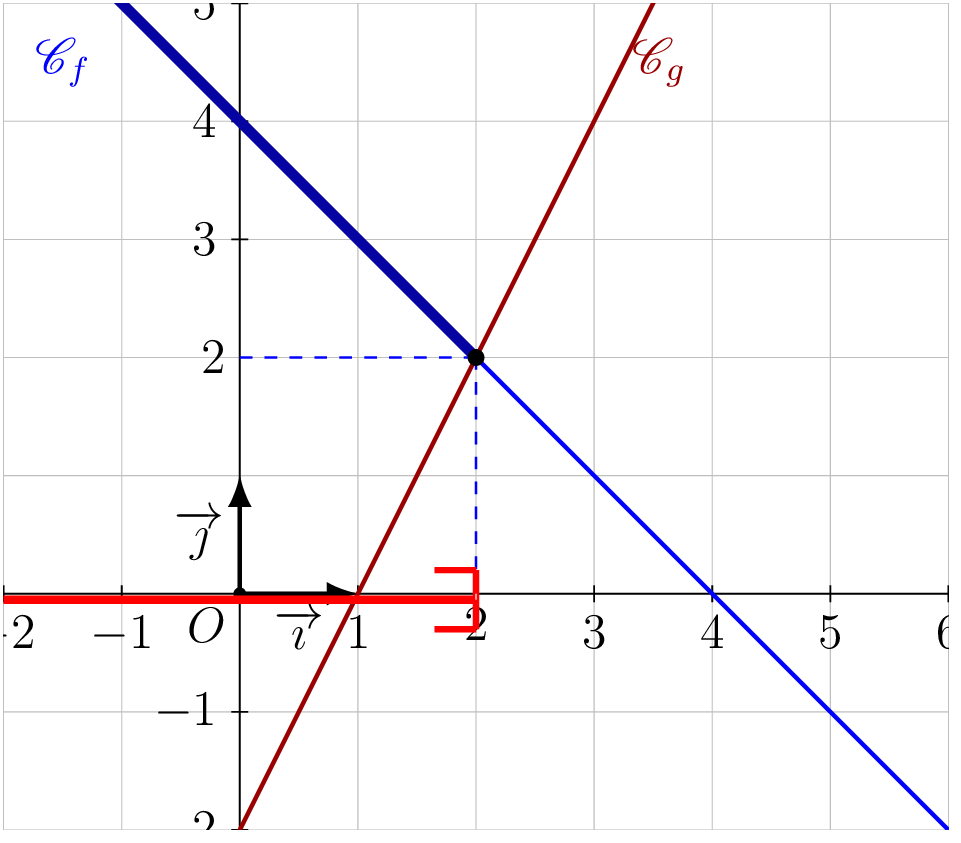
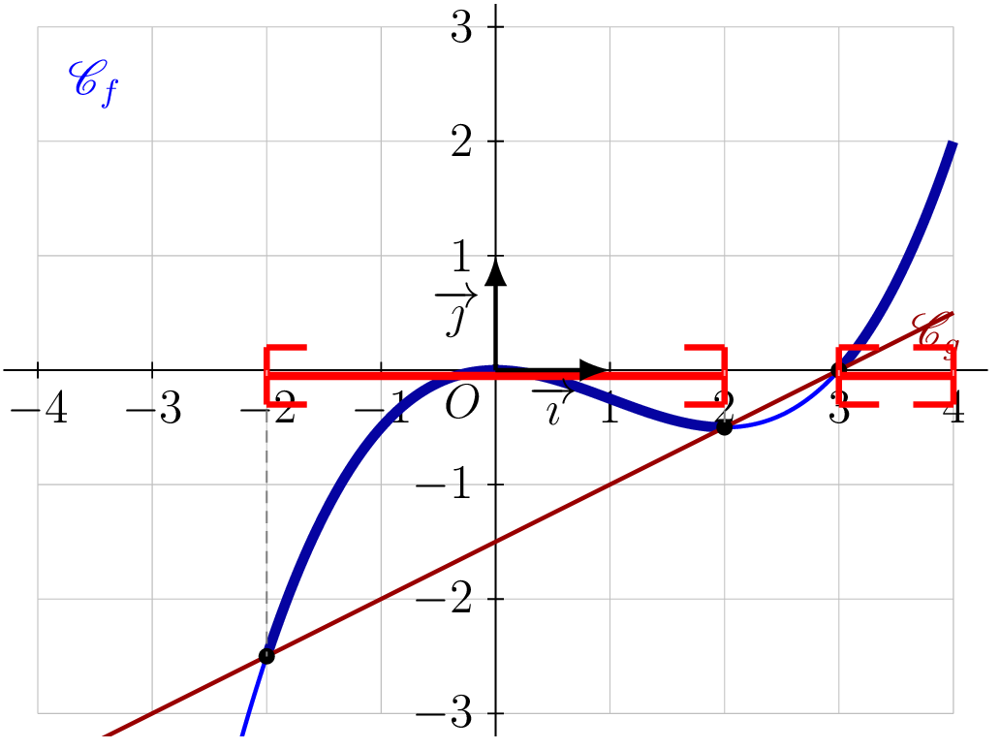

::: {.bloc .def}
Définition : Comparaison de deux fonctions

**Comparer deux fonctions** $f$ et $g$, c'est comparer la position
relative de leurs représentations graphiques $\mathscr{C}_f$ et $\mathscr{C}_g$,
c'est-à-dire dire laquelle est **au-dessus** de l'autre.
:::

::: {.bloc .info}
À retenir : Point méthode — Comparer deux courbes

- Si $\mathscr{C}_f$ est **au-dessus** de $\mathscr{C}_g$ en $x$, alors $f(x) \geqslant g(x)$.
- Si $\mathscr{C}_f$ est **en dessous** de $\mathscr{C}_g$ en $x$, alors $f(x) \leqslant g(x)$.
- Les **intersections** des deux courbes donnent les frontières des intervalles solution.
:::

::: {.bloc .thm}
Théorème : Résolution graphique d'une inéquation

Soient $f$ et $g$ deux fonctions définies sur $I$, de représentations
graphiques $\mathscr{C}_f$ et $\mathscr{C}_g$, et soit $k$ un réel.

1. Les solutions de $f(x) \geqslant k$ sont les abscisses des points
   de $\mathscr{C}_f$ d'ordonnée **supérieure ou égale** à $k$.
2. Les solutions de $f(x) \geqslant g(x)$ sont les abscisses des points
   de $\mathscr{C}_f$ situés **au-dessus ou sur** $\mathscr{C}_g$.
:::

Démonstration :

Si $f(x) \geqslant g(x)$, alors $M'(x\,;\,g(x))$ est en dessous de
$M(x\,;\,f(x))$, c'est-à-dire que $\mathscr{C}_f$ est au-dessus de
$\mathscr{C}_g$ en $x$.

::: {.bloc .info}
À retenir : Point méthode — Résoudre graphiquement une inéquation

- **Inéquation $f(x) \leqslant k$ :** on procède en deux étapes :
  1. On colorie en **bleu** la partie de
     $\mathscr{C}_f$ située **en dessous ou sur** la droite $y = k$.
  2. On colorie en **rouge** la partie de l'axe
     des abscisses correspondant aux abscisses solution.

- **Inéquation $f(x) \leqslant g(x)$ :** on procède en deux étapes :
  1. On colorie en **bleu** la partie de
     $\mathscr{C}_f$ située **en dessous ou sur** $\mathscr{C}_g$.
  2. On colorie en **rouge** la partie de l'axe
     des abscisses correspondant aux abscisses solution.
:::

::: {.bloc .sfc}

Savoir-Faire : Résoudre graphiquement $f(x) \geqslant g(x)$ — Représenter

Résoudre graphiquement $f(x) \geqslant g(x)$ où $f(x) = -x + 4$ et
$g(x) = 2x - 2$ sur $[-2\,;\,6]$.

Afficher la correction :

*Point clef :* $f(x) \geqslant g(x)$ graphiquement, ce sont les abscisses des points où la courbe $\mathscr{C}_f$ est **au-dessus ou confondue** avec $\mathscr{C}_g$.

Les solutions de l'inéquation $f(x) \geqslant g(x)$ sont les abscisses
des points de $\mathscr{C}_f$ situés au-dessus ou sur ceux de $\mathscr{C}_g$.

Graphiquement on obtient $\mathcal{S} = \left[-2\,;\,2\right]$.

  

:::

::: {.bloc .ex}

Exercice : Position relative d'une courbe et d'une droite — Représenter

On considère les fonctions $f$ et $g$ définies sur $[-4\,;\,4]$ par
$$f(x) = \dfrac{1}{8}x^3 - \dfrac{3}{8}x^2 \qquad \text{et} \qquad g(x) = \dfrac{1}{2}x - \dfrac{3}{2}.$$

Les représentations graphiques $\mathscr{C}_f$ et $\mathscr{C}_g$ sont
données ci-dessous.

  

Résoudre graphiquement $f(x) \geqslant g(x)$.

Afficher la correction :

Les solutions de l'inéquation $f(x) \geqslant g(x)$ sont les abscisses
des points de $\mathscr{C}_f$ situés au-dessus ou sur ceux de $\mathscr{C}_g$.

Graphiquement on obtient $\mathcal{S} = \left[-2\,;\,2\right] \cup \left[3\,;\,4\right]$.

:::

::: {.bloc .sfc}

Savoir-Faire : Choisir la bonne stratégie de résolution — Calculer, Raisonner

Pour chacune des inéquations suivantes, indiquer la méthode adaptée **sans résoudre**.

1. $(x-3)(2x+1) > 0$

Afficher la correction :

**Produit de deux facteurs** : tableau de signes des deux facteurs, puis règle des signes.

2. $\dfrac{3x-1}{x+4} \leqslant 2$

Afficher la correction :

**Quotient** : on ramène d'abord à $\dfrac{A(x)}{B(x)} \leqslant 0$, puis tableau de signes avec valeur interdite en $x = -4$.

3. $4x - 7 \leqslant 0$

Afficher la correction :

**Inéquation affine** : résolution directe — $4x \leqslant 7 \iff x \leqslant \dfrac{7}{4}$.

4. $f(x) \geqslant g(x)$ où les représentations graphiques de $f$ et $g$ sont connues.

Afficher la correction :

**Résolution graphique** : on cherche les abscisses des points où $\mathscr{C}_f$ est au-dessus ou sur $\mathscr{C}_g$.

:::

## Bilan

::: {.bloc .info}
À retenir : Méthodes de résolution d'inéquations

<table>
<thead>
<tr><th>Type</th><th>Méthode</th><th>Résultat</th><th>Attention</th></tr>
</thead>
<tbody>
<tr>
<td><strong>Affine</strong> $ax+b > 0$</td>
<td>Isoler $x$, attention au signe de $a$</td>
<td>Intervalle $]-\infty\,;\,\alpha[$ ou $]\alpha\,;\,+\infty[$</td>
<td>Si $a<0$ : signe inversé</td>
</tr>
<tr>
<td><strong>Produit</strong> $A \times B > 0$</td>
<td>Tableau de signes de $A$ et $B$, règle des signes</td>
<td>Union d'intervalles</td>
<td>Chercher les zéros de $A$ et $B$</td>
</tr>
<tr>
<td><strong>Quotient</strong> $\dfrac{A}{B} > 0$</td>
<td>Tableau de signes de $A$ et $B$, même règle</td>
<td>Union d'intervalles</td>
<td>$B \neq 0$ : valeur interdite</td>
</tr>
<tr>
<td><strong>Graphique</strong> $f(x) > g(x)$</td>
<td>Lire les abscisses où $\mathscr{C}_f$ est au-dessus de $\mathscr{C}_g$</td>
<td>Intervalle(s) lus sur l'axe des $x$</td>
<td>Borne : point d'intersection</td>
</tr>
<tr>
<td><strong>Valeur absolue</strong> $\abs{A} \leqslant k$</td>
<td>$-k \leqslant A \leqslant k$</td>
<td>Intervalle $[-k\,;\,k]$</td>
<td>$k \geqslant 0$</td>
</tr>
<tr>
<td><strong>Valeur absolue</strong> $\abs{A} > k$</td>
<td>$A < -k$ ou $A > k$</td>
<td>$]-\infty\,;\,-k[\,\cup\,]k\,;\,+\infty[$</td>
<td>$k > 0$</td>
</tr>
</tbody>
</table>

:::
