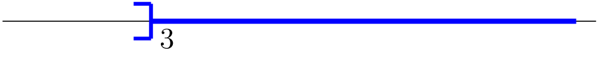

## Ensemble des réels, droite des réels

::: {.bloc .thm}
Théorème (admis) : 

À tout point de la droite graduée est associé un unique nombre réel
(son abscisse) et, réciproquement, à tout nombre réel correspond un
unique point de la droite graduée.
:::

::: {.bloc .info}
À retenir : Représentation graphique : droite des réels

On représente graphiquement l'ensemble des réels par une droite graduée,
orientée de gauche à droite.

  

L'idée essentielle est que la droite réelle est **continue** :
il n'existe pas de « trou ».
:::

::: {.bloc .def}
Définition : Ensemble des réels

On appelle **ensemble des réels**, noté $\R$, l'ensemble de tous
les nombres représentables sur la droite graduée.
:::

## Notion d'intervalle

::: {.bloc .info}
À retenir : 

La représentation de $\R$ étant une droite, on peut définir sur cette
droite des segments (ouverts ou fermés) et des demi-droites (ouvertes ou fermées).
:::

::: {.bloc .sfc}

Savoir - faire : Représenter un segment sur la droite graduée — Représenter 

Soit $A(-3)$ et $B(4)$ deux points d'une droite graduée.
Représenter $[AB[$ sur une droite graduée.

Afficher la correction :

  

:::
::: {.bloc .rem}
Remarque : 

Ce segment est un morceau de la droite des réels. Le point $A$ a pour
abscisse $-3$ et $B$ pour abscisse $4$. 

Pour tout point $M(x) \in [AB[$,
$M$ est compris entre $A$ et $B$, donc :

$$-3 \leqslant x < 4 $$

:::

::: {.bloc .def}
Définition : Intervalle

Un **intervalle** est une partie de $\R$ constituée de tous les
réels compris entre deux **bornes** (finies ou infinies),
éventuellement incluses.
:::

::: {.bloc .info}
À retenir : Tableau des intervalles — intervalles bornés

<table>
<thead>
<tr><th>Notation</th><th>Ensemble des réels $x$ tels que</th><th>Représentation</th></tr>
</thead>
<tbody>
<tr>
<td>$[a\,;\,b]$</td>
<td>$a \leqslant x \leqslant b$</td>
<td style="text-align:center;"></td>
</tr>
<tr>
<td>$[a\,;\,b[$</td>
<td>$a \leqslant x < b$</td>
<td style="text-align:center;"></td>
</tr>
<tr>
<td>$]a\,;\,b]$</td>
<td>$a < x \leqslant b$</td>
<td style="text-align:center;"></td>
</tr>
<tr>
<td>$]a\,;\,b[$</td>
<td>$a < x < b$</td>
<td style="text-align:center;"></td>
</tr>
</tbody>
</table>

:::

::: {.bloc .info}
À retenir : Tableau des intervalles — intervalles non bornés

<table>
<thead>
<tr><th>Notation</th><th>Ensemble des réels $x$ tels que</th><th>Représentation</th></tr>
</thead>
<tbody>
<tr>
<td>$[a\,;\,+\infty[$</td>
<td>$x \geqslant a$</td>
<td style="text-align:center;"></td>
</tr>
<tr>
<td>$]a\,;\,+\infty[$</td>
<td>$x > a$</td>
<td style="text-align:center;"></td>
</tr>
<tr>
<td>$]-\infty\,;\,b]$</td>
<td>$x \leqslant b$</td>
<td style="text-align:center;"></td>
</tr>
<tr>
<td>$]-\infty\,;\,b[$</td>
<td>$x < b$</td>
<td style="text-align:center;"></td>
</tr>
</tbody>
</table>

:::

::: {.bloc .hist}
Anecdote : 

Le symbole $\infty$ est dû au mathématicien John Wallis (1655,
*De sectionibus conicis*). Il désigne le caractère illimité
d'un ensemble de nombres ; ce n'est pas un nombre réel.
En $-\infty$ et $+\infty$, les crochets sont donc toujours **ouverts**.
:::

::: {.bloc .sfc}

Savoir - faire : Lire un intervalle sur une droite graduée — Représenter 

Donner l'ensemble des réels représentés, sous forme d'inégalité
puis d'intervalle.

  

Afficher la correction :

$-2 \leqslant x < 3$, soit $x \in [-2\,;\,3[$.

:::

::: {.bloc .sfc}

Savoir - faire : Lire et écrire un intervalle — Représenter 

Soit $x$ un réel. Écrire sous forme d'intervalle l'ensemble des
solutions des inégalités suivantes, puis représenter chacune sur
une droite graduée.

1. $-2 \leqslant x < 5$

Afficher la correction :

$-2 \leqslant x < 5 \Longleftrightarrow x \in [-2\,;\,5[$.

  

2. $x > 3$

Afficher la correction :

$x > 3 \Longleftrightarrow x \in ]3\,;\,+\infty[$.

  

3. $x \leqslant -1$

Afficher la correction :

$x \leqslant -1 \Longleftrightarrow x \in ]-\infty\,;\,-1]$.

  

:::