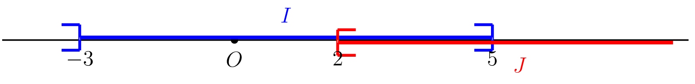

::: {.bloc .def}
Définition : Intersection et réunion

Soient $A$ et $B$ deux intervalles.

- L'**intersection** $A \cap B$ est l'ensemble des réels
  appartenant **à la fois** à $A$ et à $B$.
- La **réunion** $A \cup B$ est l'ensemble des réels
  appartenant **à au moins un** des deux intervalles.

Lorsque $A$ et $B$ n'ont aucun élément en commun,
leur intersection est l'**ensemble vide** $\emptyset$.
:::

::: {.bloc .sfc}

Savoir - faire : Intersection et réunion d'intervalles — Calculer 

Soient $A = [-1\,;\,4]$ et $B = ]2\,;\,7[$. Déterminer $A \cap B$ et $A \cup B$.

Afficher la correction :

- Un réel $x$ appartient à $A \cap B$ ssi
  $-1 \leqslant x \leqslant 4$ et $2 < x < 7$, soit $2 < x \leqslant 4$.
  Donc $A \cap B = ]2\,;\,4]$.

- Un réel $x$ appartient à $A \cup B$ ssi
  $-1 \leqslant x \leqslant 4$ ou $2 < x < 7$, soit $-1 \leqslant x < 7$.
  Donc $A \cup B = [-1\,;\,7[$.

  

:::

::: {.bloc .ex}

Exercice : Intersection et réunion — Calculer et Raisonner 

Soient $I = ]-3\,;\,5]$ et $J = [2\,;\,+\infty[$.

1. Le réel $5$ appartient-il à $I$ ? à $J$ ?

Afficher la correction :

$5 \in J$ car $5 \geqslant 2$.
Mais $5 \notin I$ car $I$ est ouvert à droite en $5$ (inégalité stricte).

2. Déterminer $I \cap J$ et $I \cup J$.

Afficher la correction :

  

$I \cap J = ]2\,;\,5]$ et $I \cup J = ]-3\,;\,+\infty[$.

3. Le réel $-3$ appartient-il à $I \cup J$ ?

Afficher la correction :

$-3 \notin I$ (borne exclue) et $-3 \notin J$, donc $-3 \notin I \cup J$.

:::
