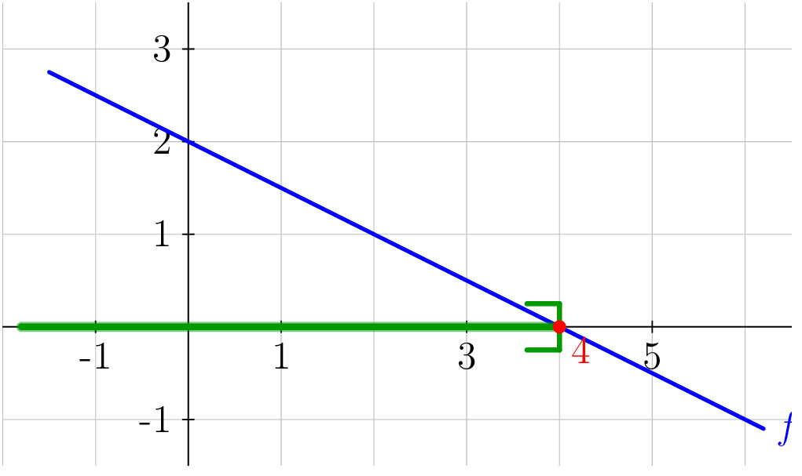
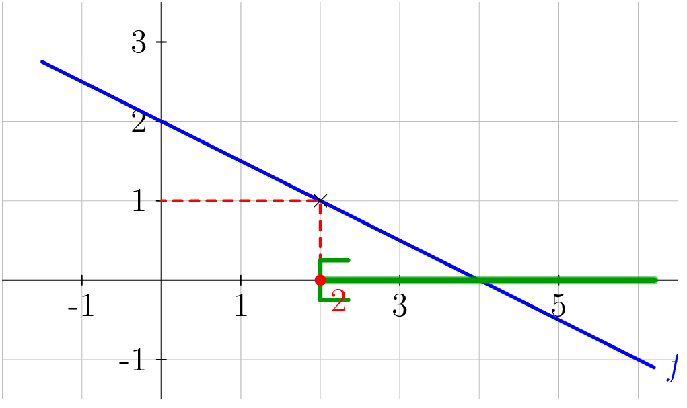

## Résolution d'inéquations du premier degré

::: {.bloc .def}
Définition : Inéquation du premier degré

On appelle **inéquation du premier degré** en $x$  toute inégalité pouvant se ramener à une inégalité de la forme
$$ax + b > 0 \quad ax + b \geqslant 0 \quad ax + b < 0 \quad \text{ou} \quad ax + b \leqslant 0$$
où $a$ et $b$ sont des réels avec $a \neq 0$.

**Résoudre** une inéquation, c'est déterminer l'ensemble des réels $x$
qui vérifient l'inégalité. Cet ensemble est appelé **ensemble des solutions**.
:::

::: {.bloc .sfc}

Savoir - faire : Résoudre une inéquation du premier degré — Calculer 

Résoudre $2x - 7 \leqslant 5x + 13$.

Afficher la correction :

*Point clef :* lorsqu'on multiplie ou divise les deux membres d'une inégalité par un réel **strictement négatif**, le sens de l'inégalité est inversé.

Pour tout réel $x$, $$
2x - 7 \leqslant 5x + 13
\ssi 2x - 5x \leqslant 13 + 7 
\ssi -3x \leqslant 20 
\underset{-3<0} {\ssi} x \geqslant -\frac{20}{3}$$

L'ensemble des solutions est $S = \left[-\dfrac{20}{3}\,;\,+\infty\right[$.

:::

::: {.bloc .sfc}

Savoir - faire : Résoudre une inéquation avec fractions — Calculer 

Résoudre $\dfrac{3x+1}{2} - \dfrac{x-4}{3} > 1$.

Afficher la correction :

Pour tout réel $x$, 
$$
\frac{3(3x+1) - 2(x-4)}{6} > 1
\ssi 9x + 3 - 2x + 8 > 6 
\ssi 7x + 11 > 6 
\ssi 7x > -5 
\ssi x > -\frac{5}{7}
$$
$S = \left]-\dfrac{5}{7}\,;\,+\infty\right[$.

:::

::: {.bloc .ex}

Exercice : Résolution d'inéquations — Calculer 

1. Résoudre $3(x-2) \leqslant 2x + 1$.

Afficher la correction :

Pour tout réel $x$, 
$$3x - 6 \leqslant 2x + 1 \ssi x \leqslant 7$$
$S = ]-\infty\,;\,7]$.

2. Résoudre $\dfrac{x+1}{4} > \dfrac{2x-3}{6}$.

Afficher la correction :

Pour tout réel $x$, 

$$3(x+1) > 2(2x-3) \ssi 3x+3 > 4x-6 \ssi -x > -9 \ssi x < 9$$
$S = ]-\infty\,;\,9[$.

:::

## Résolution graphique d'inéquations se ramenant au premier degré

::: {.bloc .info}
À retenir : Résolution graphique d'une inéquation $f(x) > k$

Pour résoudre graphiquement $f(x) > k$ (où $f$ est une fonction affine),
on trace la droite $\mathcal{C}_f$ et la droite horizontale $y = k$,
puis on lit les abscisses des points de $\mathcal{C}_f$ **au-dessus**
de la droite $y = k$.

De même, $f(x) < k$ correspond aux abscisses où $\mathcal{C}_f$ est
**en dessous** de $y = k$.
:::

::: {.bloc .sfc}

Savoir - faire : Résoudre graphiquement une inéquation — Représenter 

On considère $f(x) = -\dfrac{1}{2}x + 2$.  Résoudre graphiquement $f(x) > 0$
et $f(x) \leqslant 1$.

Afficher la correction :

  
  

$f(x) > 0 \ssi x \in ]-\infty\,;\,4[$

$f(x) \leqslant 1 \ssi x \in [2\,;\,+\infty[$

:::
