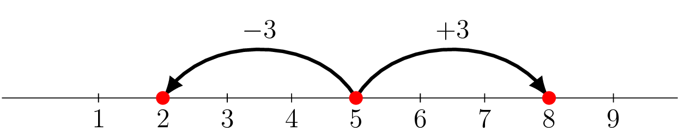

## Distance à $0$

::: {.bloc .def}
Définition : Valeur absolue

Soit $x \in \R$. On appelle **valeur absolue** de $x$ le réel noté $\abs{x}$ défini par :
$$\abs{x} = \begin{cases} x & \text{si } x \geqslant 0 \\ -x & \text{si } x < 0 \end{cases}$$
Ce nombre est aussi appelé **distance de $x$ à $0$**.
:::

::: {.bloc .sfc}

Savoir - faire : Calculer une valeur absolue — Calculer 

Calculer $\abs{-3}$, $\abs{0}$, $\abs{1}$ et $\abs{2{,}5}$.

Afficher la correction :

$\abs{-3} = 3$ ; $\abs{0} = 0$ ; $\abs{1} = 1$ ; $\abs{2{,}5} = 2{,}5$.

:::

::: {.bloc .rem}
Remarque : 

Ainsi, en considérant, sur la droite graduée $A(-3)$, $B(2{,}5)$, on a

$d(A,0) = \abs{-3} = 3$, $d(B,0) = \abs{2{,}5} = 2{,}5$.

  

:::

::: {.bloc .thm}
Propriété : Équation avec valeur absolue

Pour tous réels $x$, $y$, 
$$\abs{x} = \abs{y} \ssi x = y \ou x = -y$$
:::

Démonstration :

$d(x,0) = d(y,0)$ signifie que $x$ et $y$ sont à la même distance de $0$.
Il y a exactement deux points à distance $\abs{x}$ de $0$ : $\abs{x}$ et $-\abs{x}$,
d'où $x = y$ ou $x = -y$.

::: {.bloc .sfc}

Savoir - faire : Résoudre une équation avec valeur absolue — Calculer 

Résoudre dans $\R$.

1. $\abs{x - 3} = 5$

Afficher la correction :

Pour tout réel $x$, 
$$\abs{x-3} = 5 \ssi x-3 = 5 \ou x-3 = -5 \ssi x = 8 \ou x = -2$$
Donc $S = \left\{-2\,;\,8\right\}$.

2. $\abs{2 - 3x} = 4$

Afficher la correction :

Pour tout réel $x$, 
$$\abs{2-3x} = 4 \ssi 2-3x = 4 \ou 2-3x = -4 \ssi x = -\dfrac{2}{3} \ou x = 2$$
Donc $S = \left\{-\dfrac{2}{3}\,;\,2\right\}$.

:::

::: {.bloc .ex}

Exercice : Équation avec valeur absolue — Calculer 

Résoudre dans $\R$ : $\abs{3 - 5x} = \abs{x + 3}$.

Afficher la correction :

Pour tout réel $x$, 
$$\abs{3-5x} = \abs{x+3} \ssi 3-5x = x+3 \ou 3-5x = -(x+3)$$

- D'une part, $3-5x = x+3 \ssi -6x = 0 \ssi x = 0$
- D'autre part, 
  $3-5x = -x-3 \ssi -4x = -6 \ssi x = \dfrac{3}{2}$

Donc $S = \left\{0\,;\,\dfrac{3}{2}\right\}$.

:::

## Distance entre deux réels

::: {.bloc .thm}
Propriété : Distance entre deux réels

Soient $x, y \in \R$. Le nombre $d(x,y) = \abs{x-y} = \abs{y-x}$ est la
**distance entre $x$ et $y$**.
:::

Démonstration :

Si $x \leqslant y$, alors $x - y \leqslant 0$, donc
$\abs{x-y} = -(x-y) = y-x = \abs{y-x}$.
C'est bien la longueur du segment $[x\,;\,y]$ sur la droite réelle.

::: {.bloc .sfc}

Savoir - faire : Résoudre graphiquement une équation — Représenter 

Résoudre graphiquement $\abs{x-5} = 3$.

Afficher la correction :

$\abs{x-5} = 3$ : on cherche les réels à distance $3$ du point $5$.

$S = \{2\,;\,8\}$

  

:::

::: {.bloc .ex}

Exercice : Résolution graphique 2 — Représenter, Calculer 

Résoudre graphiquement $\abs{3-2x} = 2$.

Afficher la correction :

*Point clef :* On fait un changement de variable $X$ à la place de $2x$. Une fois que l'on a trouver les valeurs de $X$ on en déduit celles de $x$.

$\abs{3-2x} = \abs{2x-3} = 2$

Soit $\abs{X-3} = 2$, alors  obtient $X=1$ ou $X=5$,

Donc  $2x = 1$ ou $2x = 5$, soit $x = \dfrac{1}{2}$ ou $x = \dfrac{5}{2}$.

Donc $S = \left\{\dfrac{1}{2}\,;\,\dfrac{5}{2}\right\}$

  

:::
