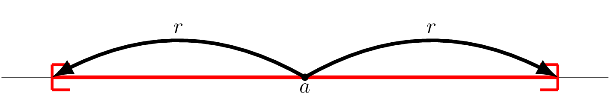
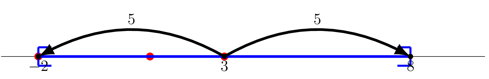
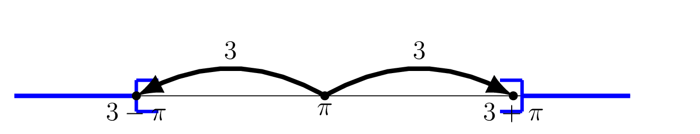
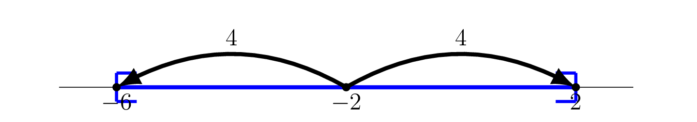
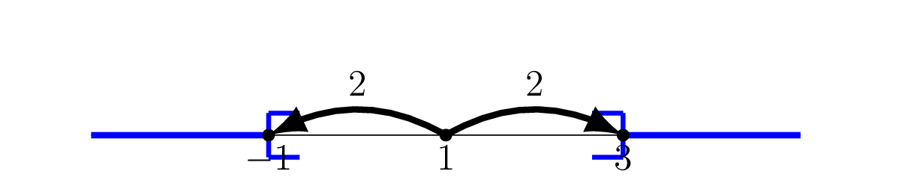

## Intervalles et valeur absolue

::: {.bloc .thm}
Propriété : Intervalle centré en $0$

Soit $r > 0$. Pour tout réel $x$ :
$$\abs{x} \leqslant r \iff x \in [-r\,;\,r]
\qquad\text{et}\qquad
\abs{x} < r \iff x \in ]-r\,;\,r[$$
:::

Démonstration :

$\abs{x} < r$ signifie que $x$ est à distance $< r$ de $0$, soit $-r < x < r$.

::: {.bloc .thm}
Propriété : Intervalle centré en $a$

Soient $a \in \R$ et $r > 0$. Pour tout réel $x$ :
$$\abs{x - a} \leqslant r \iff x \in [a-r\,;\,a+r]$$
:::

Démonstration :

Pour tout réel $x$ :
$x \in [a-r\,;\,a+r] \iff -r \leqslant x-a \leqslant r \iff \abs{x-a} \leqslant r$.

::: {.bloc .info}
À retenir : Illustration graphique

  

:::

::: {.bloc .sfc}

Savoir - faire : Résoudre une inéquation avec valeur absolue — Calculer et Représenter 

Résoudre dans $\R$.

1. $\abs{x - 3} \leqslant 5$
2. $\abs{\pi - x} > 3$

Afficher la correction :

*Point clef :* $\abs{A} \leqslant r$ (avec $r > 0$) équivaut à $-r \leqslant A \leqslant r$, c'est-à-dire $A \in [-r\,;\,r]$. De même, $\abs{A} > r$ équivaut à $A < -r$ ou $A > r$.

  
  

$\abs{x-3} \leqslant 5$ : $x \in [-2\,;\,8]$

$\abs{x-\pi} > 3$ : $x \in ]-\infty\,;\,\pi-3[\,\cup\,]\pi+3\,;\,+\infty[$

:::

::: {.bloc .ex}

Exercice : Inéquations avec valeur absolue 

Résoudre dans $\R$.

1. $\abs{x + 2} \leqslant 4$

Afficher la correction :

$\abs{x+2} = \abs{x-(-2)}$, donc $a = -2$ et $r = 4$ :
$x \in [-6\,;\,2]$.

  

2. $\abs{1 - x} > 2$

Afficher la correction :

$\abs{1-x} = \abs{x-1}$, donc $a = 1$ et $r = 2$ :
$\abs{x-1} > 2 \iff x \notin [-1\,;\,3]$,
soit $x \in ]-\infty\,;\,-1[\,\cup\,]3\,;\,+\infty[$.

  

:::
 

## Valeur approchée

::: {.bloc .def}
Définition : Valeur approchée

Soient $x$ un réel et $p > 0$. On dit que $a$ est une **valeur approchée**
de $x$ à $p$ près si :
$$\abs{x - a} \leqslant p$$

- Si de plus $a \leqslant x$, la valeur approchée est dite **par défaut**.
- Si de plus $x \leqslant a$, la valeur approchée est dite **par excès**.
:::

::: {.bloc .sfc}

Savoir - faire : Valeur approchée — Raisonner 

1. On sait que $\sqrt{2} \approx 1{,}41421\ldots$
   Justifier que $1{,}414$ est une valeur approchée de $\sqrt{2}$
   à $10^{-3}$ près. Est-elle par défaut ou par excès ?

Afficher la correction :

$1{,}414 \leqslant \sqrt{2} \leqslant 1{,}415$, donc
$\abs{\sqrt{2} - 1{,}414} \leqslant 10^{-3}$ :
$1{,}414$ est une valeur approchée de $\sqrt{2}$ à $10^{-3}$ près,
**par défaut** (car $1{,}414 \leqslant \sqrt{2}$).

2. Justifier que $0{,}142857033$ est une valeur approchée
   de $\dfrac{1}{7}$ à $10^{-6}$ près. Est-elle par défaut ou par excès ?

Afficher la correction :

$\dfrac{1}{7} = 0{,}142857142\ldots$, donc :
$$\abs{\dfrac{1}{7} - 0{,}142857033}
= 0{,}142857142\ldots - 0{,}142857033
= 0{,}000000109\ldots \leqslant 10^{-6}$$
Donc $0{,}142857033$ est une valeur approchée de $\dfrac{1}{7}$
à $10^{-6}$ près, **par défaut**
(car $0{,}142857033 \leqslant \dfrac{1}{7}$).

:::

::: {.bloc .sfc}

Savoir - faire : Arrondi par défaut et par excès — Calculer 

Donner l'arrondi de $\pi \approx 3{,}14159\ldots$ à $10^{-2}$ près, par excès.

Afficher la correction :

***Point clef :** Il suffit « d'augmenter » de 1, le dernier chiffre.*

L'arrondi de $\pi$ à $10^{-2}$ près par excès est  $3{,}15$.

En effet $\abs{\pi - 3{,}15} \leqslant 10^{-2}$ 

:::

::: {.bloc .rem}
Remarque : 

L'arrondi **usuel** (ou arrondi au plus près) est $3{,}14$ car le troisième
chiffre après la virgule est $1 < 5$ : on arrondit par défaut.
Si ce chiffre avait été $\geqslant 5$, on aurait arrondi par excès.
:::

::: {.bloc .sfc}

Savoir - faire : Inéquation avec valeur absolue et fraction — Calculer 

Résoudre $\abs{2x-1} < \dfrac{5}{2}$.

Afficher la correction :

Pour tout réel $x$, 
$$\abs{2x-1} < \frac{5}{2}
\iff -\frac{5}{2} < 2x-1 < \frac{5}{2}
\iff -\frac{3}{2} < 2x < \frac{7}{2}
\iff -\frac{3}{4} < x < \frac{7}{4}$$

$S = \left]-\dfrac{3}{4}\,;\,\dfrac{7}{4}\right[$.

:::

::: {.bloc .ex}

Exercice : Valeur approchée et intervalle — Raisonner 

On sait que $x \in [3{,}14\,;\,3{,}15]$.
Montrer que $3{,}141$ est une valeur approchée de $x$ à $10^{-2}$ près,
quelle que soit la valeur de $x$ dans cet intervalle.

Afficher la correction :

Soit $x \in [3{,}14\,;\,3{,}15]$.

$x$ et $3{,}141$ sont tous deux dans $[3{,}14\,;\,3{,}15]$, donc :
$$\abs{x - 3{,}141} \leqslant 3{,}15 - 3{,}14 = 0{,}01 = 10^{-2}$$

Donc $3{,}141$ est une valeur approchée de $x$ à $10^{-2}$ près,
pour toute valeur de $x$ dans $[3{,}14\,;\,3{,}15]$.

:::

## Bilan

::: {.bloc .info}
À retenir : Propriétés d'ordre et valeur absolue

<table>
<thead><tr><th colspan="2" style="text-align:center;">Propriétés d'ordre</th></tr></thead>
<tbody>
<tr><td><strong>Addition</strong></td><td>$a \leqslant b \iff a + c \leqslant b + c$</td></tr>
<tr><td><strong>Multiplication ($c>0$)</strong></td><td>$a \leqslant b \iff ac \leqslant bc$</td></tr>
<tr><td><strong>Multiplication ($c<0$)</strong></td><td>$a \leqslant b \iff ac \geqslant bc$ (sens inversé !)</td></tr>
</tbody>
<thead><tr><th colspan="2" style="text-align:center;">Valeur absolue</th></tr></thead>
<tbody>
<tr><td><strong>Définition</strong></td><td>$\abs{x} = x$ si $x \geqslant 0$, $\abs{x} = -x$ si $x < 0$</td></tr>
<tr><td><strong>Distance</strong></td><td>$\abs{x-a}$ = distance de $x$ à $a$ sur la droite réelle</td></tr>
<tr><td><strong>Équation</strong></td><td>$\abs{A} = k$ ($k \geqslant 0$) $\iff A = k$ ou $A = -k$</td></tr>
<tr><td><strong>Inéquation ($k>0$)</strong></td><td>$\abs{A} \leqslant k \iff -k \leqslant A \leqslant k \iff A \in [-k\,;\,k]$</td></tr>
<tr><td><strong>Inéquation stricte ($k>0$)</strong></td><td>$\abs{A} > k \iff A < -k$ ou $A > k$</td></tr>
<tr><td><strong>Intervalle centré</strong></td><td>$\abs{x-a} \leqslant r \iff x \in [a-r\,;\,a+r]$</td></tr>
</tbody>
</table>

:::
