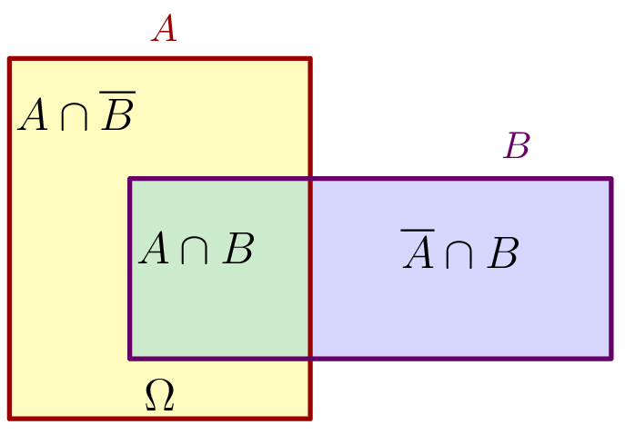

::: {.bloc .def}
Définition : Expérience aléatoire

Une **expérience aléatoire** est une expérience dont on connaît les résultats possibles mais dont on ne peut pas prévoir le résultat avec certitude.

- Chaque résultat possible est appelé une **issue** (ou événement élémentaire).
- L'ensemble de toutes les issues est appelé **univers** de l'expérience, noté $\Omega$.
- Toute partie de $\Omega$ est appelée un **événement**.
:::

::: {.bloc .rem}
Remarque : 

L'univers dépend de la question posée, pas seulement de l'expérience. Lancer un dé à 6 faces peut conduire à $\Omega = \{1\,;\,2\,;\,3\,;\,4\,;\,5\,;\,6\}$ si on s'intéresse au chiffre, ou à $\Omega = \{\text{pair}\,;\,\text{impair}\}$ si on s'intéresse à la parité.
:::

::: {.bloc .sfc}

Savoir-Faire : Identifier univers et événements — Calculer

On lance un dé équilibré à 6 faces et on note le résultat.
Soit $A$ : « le résultat est pair » et $B$ : « le résultat est supérieur ou égal à 5 ».

1. Décrire $\Omega$, $A$ et $B$.

Afficher la correction :

$\Omega = \{1\,;\,2\,;\,3\,;\,4\,;\,5\,;\,6\}$, $A = \{2\,;\,4\,;\,6\}$, $B = \{5\,;\,6\}$.

2. Décrire en extension l'événement $A \cap B$ puis $A \cup B$.

Afficher la correction :

$A \cap B = \{6\}$ (pair *et* $\geqslant 5$) ; $A \cup B = \{2\,;\,4\,;\,5\,;\,6\}$ (pair *ou* $\geqslant 5$).

3. $A$ et $B$ sont-ils incompatibles ?

Afficher la correction :

$A \cap B = \{6\} \neq \varnothing$, donc $A$ et $B$ ne sont **pas** incompatibles.

:::

::: {.bloc .def}
Définition : Opérations sur les événements

Soient $A$ et $B$ deux événements d'un même univers $\Omega$.

- L'événement **« $A$ ou $B$ »**, noté $A \cup B$, est réalisé lorsque $A$ est réalisé **ou** $B$ est réalisé (ou les deux).
- L'événement **« $A$ et $B$ »**, noté $A \cap B$, est réalisé lorsque $A$ **et** $B$ sont tous deux réalisés.
- L'**événement contraire** de $A$, noté $\overline{A}$, est réalisé lorsque $A$ ne l'est pas.
- $A$ et $B$ sont dits **incompatibles** si $A \cap B = \varnothing$ (ils ne peuvent pas se réaliser simultanément).
:::

  

::: {.bloc .rem}
Remarque : 

Les mots clefs sont importants : « ou » correspond à $\cup$, « et » correspond à $\cap$, « ne pas » correspond à $\overline{\phantom{A}}$.
:::
