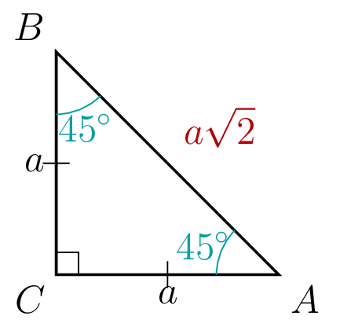
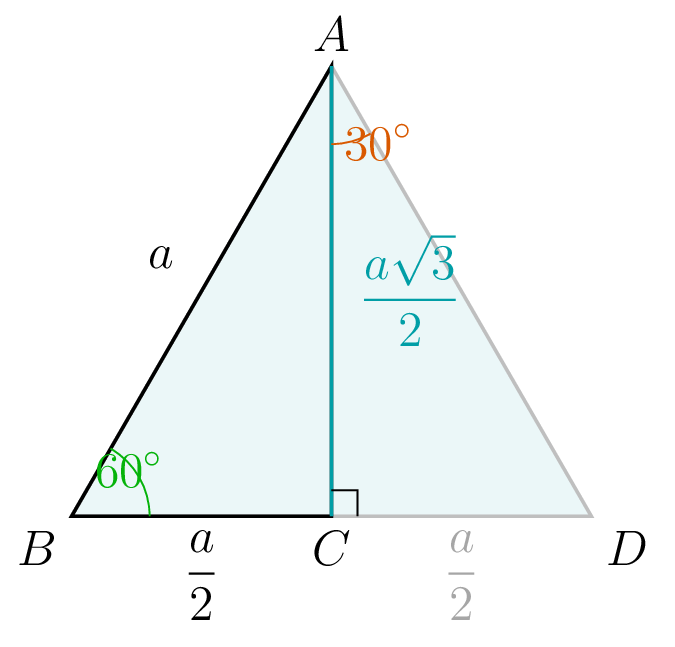

::: {.bloc .info}
À retenir : Cas de $45^\circ$ — triangle isocèle rectangle de côté $a$.

Soit $ABC$ un triangle rectangle isocèle en $C$,
avec $AC = BC = a > 0$.

Les deux angles aigus valent chacun $45^\circ$.

Par le **théorème de Pythagore** dans le triangle $ABC$
rectangle en $C$ :
$$AB^2 = AC^2 + BC^2 = a^2 + a^2 = 2a^2$$
donc $AB = \sqrt{2a^2} = a\sqrt{2}$.

  

On en déduit, dans le triangle $ABC$ rectangle en $C$,
en considérant l'angle $\widehat{BAC} = 45^\circ$ :
$$\cos 45^\circ = \dfrac{AC}{AB} = \dfrac{a}{a\sqrt{2}}
= \dfrac{1}{\sqrt{2}} = \dfrac{\sqrt{2}}{2}\; ; \; \sin 45^\circ = \dfrac{BC}{AB} = \dfrac{a}{a\sqrt{2}}
= \dfrac{\sqrt{2}}{2} \; ;\; \tan 45^\circ = \dfrac{BC}{AC} = \dfrac{a}{a} = 1$$
:::

::: {.bloc .info}
À retenir : Cas de $30^\circ$ et $60^\circ$ — demi-triangle équilatéral de côté $a$.

Soit $ABD$ un triangle équilatéral de côté $a > 0$ et
$C$ le milieu de $[BD]$.

La droite $(AC)$ est la médiatrice de $[BD]$ et
la hauteur issue de $A$ dans le triangle $ABD$.

Puisque le triangle $ABD$ est équilatéral, $C$ est le milieu
de $[BD]$, donc $BC = \dfrac{a}{2}$.

Le triangle $ABC$ est rectangle en $C$.

Par le **théorème de Pythagore** dans le triangle $ABC$
rectangle en $C$ :
$$AB^2 = AC^2 + BC^2
\Longrightarrow AC^2 = AB^2 - BC^2
= a^2 - \dfrac{a^2}{4} = \dfrac{3a^2}{4}$$

donc $AC = \sqrt{\dfrac{3a^2}{4}} = \dfrac{a\sqrt{3}}{2}$.

  

On en déduit, dans le triangle $ABC$ rectangle en $C$,
en considérant l'angle $\widehat{ABC} = 60^\circ$ :
$$\cos 60^\circ = \dfrac{BC}{AB} = \dfrac{a/2}{a} = \dfrac{1}{2}
\; ;\;
\sin 60^\circ = \dfrac{AC}{AB}
= \dfrac{a\sqrt{3}/2}{a} = \dfrac{\sqrt{3}}{2}
\; ;\;
\tan 60^\circ = \dfrac{AC}{BC}
= \dfrac{a\sqrt{3}/2}{a/2} = \sqrt{3}$$

Et en considérant l'angle $\widehat{BAC} = 30^\circ$
(les rôles du côté adjacent et du côté opposé sont échangés) :
$$\cos 30^\circ = \dfrac{AC}{AB}
= \dfrac{\sqrt{3}}{2}
 \; ;\;
\sin 30^\circ = \dfrac{BC}{AB} = \dfrac{1}{2}
\; ;\;
\tan 30^\circ = \dfrac{BC}{AC}
= \dfrac{a/2}{a\sqrt{3}/2} = \dfrac{1}{\sqrt{3}}
= \dfrac{\sqrt{3}}{3}$$
:::

::: {.bloc .thm}
Propriété : Valeurs remarquables

<table>
<thead>
<tr><th>$\alpha$</th><th>$30^\circ$</th><th>$45^\circ$</th><th>$60^\circ$</th></tr>
</thead>
<tbody>
<tr><td>$\cos\alpha$</td><td>$\dfrac{\sqrt{3}}{2}$</td><td>$\dfrac{\sqrt{2}}{2}$</td><td>$\dfrac{1}{2}$</td></tr>
<tr><td>$\sin\alpha$</td><td>$\dfrac{1}{2}$</td><td>$\dfrac{\sqrt{2}}{2}$</td><td>$\dfrac{\sqrt{3}}{2}$</td></tr>
<tr><td>$\tan\alpha$</td><td>$\dfrac{\sqrt{3}}{3}$</td><td>$1$</td><td>$\sqrt{3}$</td></tr>
</tbody>
</table>

:::

::: {.bloc .rem}
Remarque : 

- Les valeurs de $\cos$ et $\sin$ sont
  **symétriques** : $\cos 30^\circ = \sin 60^\circ$
  et $\sin 30^\circ = \cos 60^\circ$.
  Cela s'explique par le fait que $30^\circ + 60^\circ
  = 90^\circ$ : les deux angles sont complémentaires,
  et les rôles du côté adjacent et du côté opposé
  sont échangés.
- Pour $45^\circ$, le triangle étant isocèle rectangle,
  $\cos 45^\circ = \sin 45^\circ$.
:::

::: {.bloc .sfc}

Savoir - faire : Utiliser les valeurs remarquables — Calculer 

Dans un triangle rectangle $ABC$ rectangle en $C$,
on donne $\widehat{ABC} = 30^\circ$ et $AB = 8$.
Calculer $BC$ et $AC$ en valeur exacte.

Afficher la correction :

$$\cos 30^\circ = \dfrac{BC}{AB}
\Longrightarrow BC = AB \cos 30^\circ
= 8 \times \dfrac{\sqrt{3}}{2} = 4\sqrt{3}$$
$$\sin 30^\circ = \dfrac{AC}{AB}
\Longrightarrow AC = AB \sin 30^\circ
= 8 \times \dfrac{1}{2} = 4$$

**Vérification par Pythagore :**
$BC^2 + AC^2 = (4\sqrt{3})^2 + 4^2 = 48 + 16 = 64 = 8^2 = AB^2$. ✓

:::

::: {.bloc .sfc}

Savoir - faire : Calculer avec les valeurs remarquables — Calculer 

Calculer en valeur exacte :
$$4\cos 60^\circ + 3\sin 30^\circ$$

Afficher la correction :

$$4\cos 60^\circ + 3\sin 30^\circ
= 4 \times \dfrac{1}{2} + 3 \times \dfrac{1}{2}
= 2 + \dfrac{3}{2}
= \dfrac{7}{2}$$

:::

::: {.bloc .ex}

Exercice : Calcul numérique — valeurs remarquables — Calculer 

Calculer en valeur exacte :
$$3\cos 60^\circ - 2\sin 30^\circ + \sqrt{3}\,\tan 60^\circ$$

Afficher la correction :

$$3\cos 60^\circ - 2\sin 30^\circ + \sqrt{3}\,\tan 60^\circ
= 3 \times \dfrac{1}{2} - 2 \times \dfrac{1}{2}
  + \sqrt{3} \times \sqrt{3}
= \dfrac{3}{2} - 1 + 3
= \dfrac{3}{2} + 2
= \dfrac{7}{2}$$

:::

::: {.bloc .ex}

Exercice : Valeurs exactes en trigonométrie — Calculer 

1. Dans un triangle rectangle $DEF$ rectangle en $F$,
   on donne $\widehat{DEF} = 45^\circ$ et $DE = 5$.
   Calculer $EF$ et $DF$ en valeur exacte.

Afficher la correction :

$$EF = DE \cos 45^\circ = 5 \times \dfrac{\sqrt{2}}{2}
= \dfrac{5\sqrt{2}}{2}$$
$$DF = DE \sin 45^\circ = 5 \times \dfrac{\sqrt{2}}{2}
= \dfrac{5\sqrt{2}}{2}$$
Le triangle est isocèle rectangle en $F$,
ce qui est cohérent avec l'angle de $45^\circ$.

2. Dans un triangle rectangle $PQR$ rectangle en $R$,
   on donne $\widehat{QPR} = 60^\circ$ et $PR = 3$.
   Calculer $PQ$ et $QR$ en valeur exacte.

Afficher la correction :

$$\cos 60^\circ = \dfrac{PR}{PQ}
\Longrightarrow PQ = \dfrac{PR}{\cos 60^\circ}
= \dfrac{3}{\dfrac{1}{2}} = 6$$
$$QR = PQ \sin 60^\circ = 6 \times \dfrac{\sqrt{3}}{2}
= 3\sqrt{3}$$

3. La diagonale d'un losange mesure $\sqrt{6}$ cm.
   Le demi-angle au sommet vaut $30^\circ$.
   Calculer le côté du losange en valeur exacte.

Afficher la correction :

*Point clef :* les diagonales
d'un losange sont perpendiculaires et se coupent en leur
milieu. On obtient ainsi quatre triangles rectangles
identiques.

Notons $O$ le centre du losange et $c$ son côté.
Dans le triangle rectangle formé, l'angle en $O$
est $90^\circ$, l'angle au sommet est $30^\circ$,
et le demi-côté de la diagonale considérée est
$\dfrac{\sqrt{6}}{2}$.

$$\cos 30^\circ = \dfrac{\sqrt{6}/2}{c}
\Longrightarrow c = \dfrac{\sqrt{6}/2}{\cos 30^\circ}
= \dfrac{\sqrt{6}/2}{\sqrt{3}/2}
= \dfrac{\sqrt{6}}{\sqrt{3}}
= \sqrt{\dfrac{6}{3}} = \sqrt{2}$$

Le côté du losange mesure $\sqrt{2}$ cm.

:::
