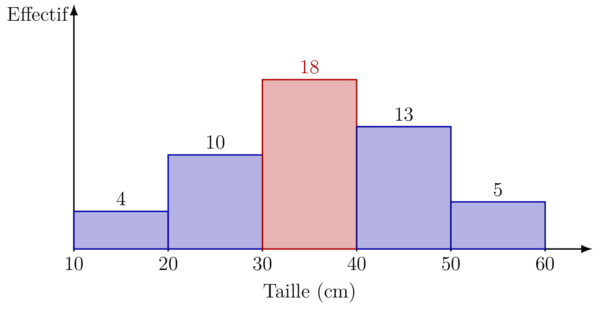
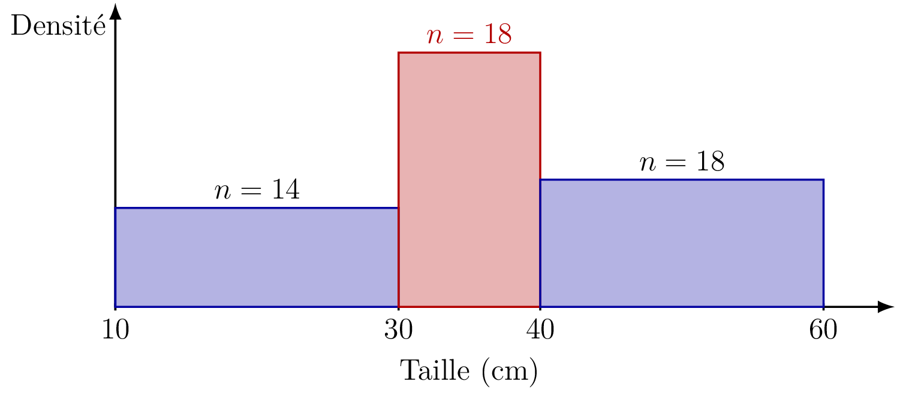

::: {.bloc .info}
À retenir : Pourquoi regrouper en classes

Lorsqu'une série statistique porte sur une grandeur **continue** (taille, durée, revenu…) mesurée sur un grand nombre d'individus, il est rarement pertinent de lister chaque valeur individuellement. On regroupe alors les valeurs en **classes** de même amplitude, ce qui facilite la lecture et la représentation graphique, au prix d'une perte d'information sur la répartition exacte à l'intérieur de chaque classe.
:::

## Classes, effectifs, centres

::: {.bloc .def}
Définition : Classe, amplitude, centre de classe

Une **classe** est un intervalle $[e_{k}\,;\,e_{k+1}[$. Son **amplitude** est $e_{k+1} - e_k$. L'**effectif** $n_k$ de la classe est le nombre de valeurs de la série appartenant à cet intervalle. Le **centre** de la classe est
$$c_k = \frac{e_k + e_{k+1}}{2}$$
:::

::: {.bloc .rem}
Remarque : 

On choisit le plus souvent des classes de **même amplitude** : c'est ce que l'on fera dans tout ce chapitre, sauf mention contraire. Rien n'y oblige cependant : deux classes d'une même série peuvent très bien avoir des amplitudes différentes, par exemple lorsqu'on regroupe entre elles des classes déjà existantes.
:::

::: {.bloc .sfc}

Savoir-Faire : Compléter un tableau de classes — Calculer

On mesure la taille (en cm) de $50$ plants après trois semaines de culture. Un premier regroupement, en classes de même amplitude, donne le tableau suivant (incomplet). On y ajoute une ligne **effectif cumulé croissant (ECC)**, qui s'obtient en additionnant progressivement les effectifs des classes (cette notion sera précisée plus loin) :

<table>
<tbody>
<tr><td>Classe</td><td>$[10\,;\,20[$</td><td>$[20\,;\,30[$</td><td>$[30\,;\,40[$</td><td>$[40\,;\,50[$</td><td>$[50\,;\,60[$</td></tr>
<tr><td>Effectif $n_k$</td><td>$4$</td><td>$10$</td><td>$18$</td><td>$13$</td><td>$5$</td></tr>
<tr><td>Amplitude</td><td></td><td></td><td></td><td></td><td></td></tr>
<tr><td>Centre</td><td></td><td></td><td></td><td></td><td></td></tr>
<tr><td>Effectif cumulé croissant</td><td></td><td></td><td></td><td></td><td></td></tr>
</tbody>
</table>

On peut regrouper ces mêmes $50$ plants autrement, en fusionnant certaines des classes précédentes, ce qui donne un second tableau (incomplet lui aussi) :

<table>
<tbody>
<tr><td>Classe</td><td>$[10\,;\,30[$</td><td>$[30\,;\,40[$</td><td>$[40\,;\,60[$</td></tr>
<tr><td>Effectif $n_k$</td><td>$14$</td><td>$18$</td><td>$18$</td></tr>
<tr><td>Amplitude</td><td></td><td></td><td></td></tr>
<tr><td>Effectif cumulé croissant</td><td></td><td></td><td></td></tr>
</tbody>
</table>

Compléter les deux tableaux (amplitude, centre pour le premier ; amplitude pour le second ; effectif cumulé croissant pour les deux).

Afficher la correction :

Pour le premier regroupement, chaque amplitude vaut $e_{k+1}-e_k=10$, chaque centre $c_k=\dfrac{e_k+e_{k+1}}{2}$, et l'effectif cumulé croissant s'obtient en additionnant progressivement les effectifs :

<table>
<tbody>
<tr><td>Classe</td><td>$[10\,;\,20[$</td><td>$[20\,;\,30[$</td><td>$[30\,;\,40[$</td><td>$[40\,;\,50[$</td><td>$[50\,;\,60[$</td></tr>
<tr><td>Effectif $n_k$</td><td>$4$</td><td>$10$</td><td>$18$</td><td>$13$</td><td>$5$</td></tr>
<tr><td>Amplitude</td><td>$10$</td><td>$10$</td><td>$10$</td><td>$10$</td><td>$10$</td></tr>
<tr><td>Centre</td><td>$15$</td><td>$25$</td><td>$35$</td><td>$45$</td><td>$55$</td></tr>
<tr><td>ECC</td><td>$4$</td><td>$14$</td><td>$32$</td><td>$45$</td><td>$50$</td></tr>
</tbody>
</table>

Pour le second regroupement, les mêmes $50$ plants sont regroupés autrement : les amplitudes valent $20\,;\,10\,;\,20$, et l'effectif cumulé croissant (aux mêmes bornes $30\,;\,40\,;\,60$) reste inchangé, car il ne dépend que des valeurs de la série, pas du découpage en classes choisi :

<table>
<tbody>
<tr><td>Classe</td><td>$[10\,;\,30[$</td><td>$[30\,;\,40[$</td><td>$[40\,;\,60[$</td></tr>
<tr><td>Effectif $n_k$</td><td>$14$</td><td>$18$</td><td>$18$</td></tr>
<tr><td>Amplitude</td><td>$20$</td><td>$10$</td><td>$20$</td></tr>
<tr><td>ECC</td><td>$14$</td><td>$32$</td><td>$50$</td></tr>
</tbody>
</table>

Les deux regroupements décrivent la **même** série de $50$ plants : $14 = 4+10$, $18=18$ et $18=13+5$.

:::

## Représentations graphiques

::: {.bloc .info}
À retenir : Histogramme — principe général

Un **histogramme** représente une série statistique regroupée en classes par des rectangles juxtaposés, un par classe.

**C'est l'aire de chaque rectangle qui est proportionnelle à l'effectif de la classe qu'il représente — et non sa hauteur.**

En hauteur, on porte donc la **densité d'effectif** de la classe :
$$\text{hauteur} = \frac{\text{effectif de la classe}}{\text{amplitude de la classe}}$$
:::

::: {.bloc .rem}
Remarque : 

Lorsque toutes les classes ont la **même amplitude** (cas le plus fréquent), la densité de chaque classe est proportionnelle à son effectif : porter directement l'effectif en hauteur revient alors bien à représenter une aire proportionnelle à l'effectif. Mais dès que les classes ont des amplitudes **différentes**, il devient indispensable de revenir à la densité, sous peine de fausser la lecture visuelle de la répartition.
:::

::: {.bloc .sfc}

Savoir-Faire : Construire un histogramme — premier regroupement — Calculer, Représenter

On reprend le premier regroupement des $50$ plants, en classes de même amplitude $10$ cm (effectifs $4\,;\,10\,;\,18\,;\,13\,;\,5$).

1. Justifier que, pour ce regroupement, la hauteur de chaque rectangle de l'histogramme peut être prise directement égale à l'effectif de la classe.

Afficher la correction :

Toutes les classes ayant la même amplitude ($10$), la densité $\dfrac{n_k}{10}$ de chaque classe est proportionnelle à l'effectif $n_k$. Porter l'effectif en hauteur revient donc bien, ici, à représenter une aire proportionnelle à l'effectif.

2. Construire l'histogramme correspondant.

Afficher la correction :

  

:::

::: {.bloc .sfc}

Savoir-Faire : Construire un histogramme — second regroupement — Calculer, Représenter

On reprend le second regroupement des mêmes $50$ plants, en classes $[10\,;\,30[$, $[30\,;\,40[$, $[40\,;\,60[$ (effectifs $14\,;\,18\,;\,18$).

1. Calculer la densité (hauteur à porter sur l'histogramme) de chacune des trois classes.

Afficher la correction :

Les amplitudes valent respectivement $20\,;\,10\,;\,20$, donc
$$\frac{14}{20} = 0{,}7 \qquad \frac{18}{10} = 1{,}8 \qquad \frac{18}{20} = 0{,}9$$

2. Construire l'histogramme correspondant.

Afficher la correction :

  

3. La classe $[30\,;\,40[$ et la classe $[40\,;\,60[$ ont le même effectif ($18$). Ont-elles la même hauteur sur l'histogramme ? Pourquoi ?

Afficher la correction :

Non : bien qu'elles aient le **même effectif**, ces deux classes n'ont pas la même **amplitude** ($10$ contre $20$). La classe $[30\,;\,40[$, deux fois plus étroite, doit donc être représentée par un rectangle deux fois plus **haut** pour que son **aire** — et non sa hauteur — reste proportionnelle à son effectif. C'est précisément ce que montre l'exemple : si l'on avait porté l'effectif directement en hauteur pour les deux classes, on aurait obtenu deux rectangles de même hauteur alors qu'ils ne représentent pas la même densité de plants.

:::
