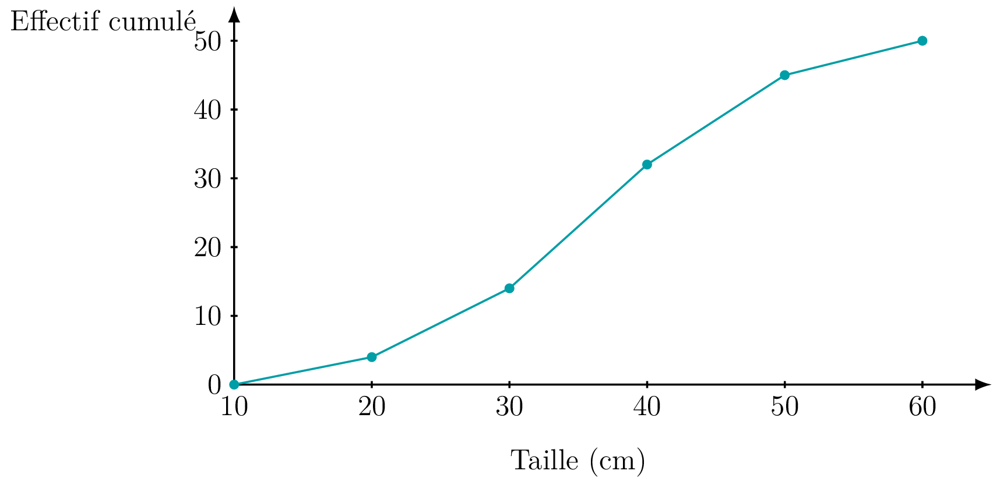
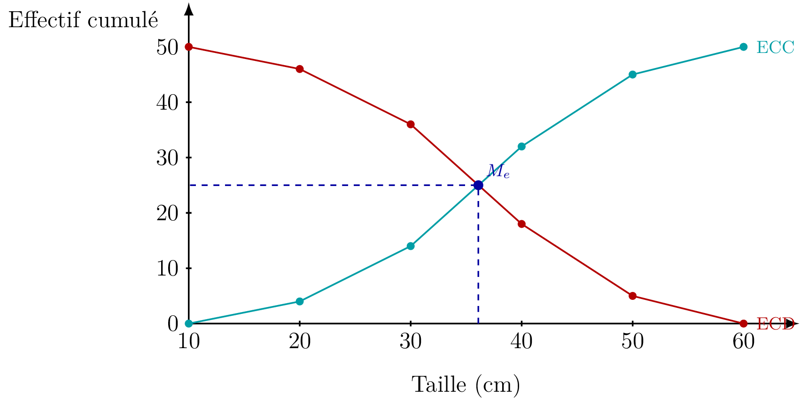

## Effectifs cumulés

::: {.bloc .def}
Définition : Effectif cumulé croissant, effectif cumulé décroissant

Soit une série statistique regroupée en classes, d'effectif total $N$.
L'**effectif cumulé croissant** (ECC) associé à une valeur $e$ est le nombre de valeurs de la série **strictement inférieures à** $e$.
L'**effectif cumulé décroissant** (ECD) associé à une valeur $e$ est le nombre de valeurs de la série **supérieures ou égales à** $e$.
Pour toute valeur $e$,
$$\text{ECC}(e) + \text{ECD}(e) = N$$
:::

## Représentation graphique : polygone des effectifs cumulés

::: {.bloc .info}
À retenir : Polygone des effectifs cumulés croissants

Le **polygone des effectifs cumulés croissants** relie, par des segments, les points de coordonnées (borne supérieure de la classe ; effectif cumulé croissant jusqu'à cette borne), en partant du point (borne inférieure de la première classe ; $0$).

  

:::

## Moyenne d'une série regroupée en classes

::: {.bloc .thm}
Théorème : Moyenne pondérée par les centres de classe

Soit une série regroupée en $p$ classes de centres $c_1, \ldots, c_p$ et d'effectifs $n_1, \ldots, n_p$ (d'effectif total $N$). On **estime** la moyenne de la série par la **moyenne pondérée**
$$\overline{x} \approx \frac{n_1 c_1 + n_2 c_2 + \cdots + n_p c_p}{N}$$
:::

::: {.bloc .rem}
Remarque : 

Cette formule remplace chaque individu d'une classe par le **centre** de cette classe, ce qui revient à supposer que les valeurs sont réparties de façon **uniforme** dans chaque classe. Le résultat est donc une **estimation**, exacte uniquement si cette hypothèse d'uniformité est vérifiée.
:::

::: {.bloc .sfc}

Savoir-Faire : Calculer une moyenne pondérée — Calculer

Calculer la taille moyenne estimée des $50$ plants de l'exemple précédent.

Afficher la correction :

$$\overline{x} \approx \frac{15\times 4 + 25\times 10 + 35\times 18 + 45\times 13 + 55\times 5}{50}$$
$$\overline{x} \approx \frac{60 + 250 + 630 + 585 + 275}{50} = \frac{1\,800}{50} = 36$$
La taille moyenne estimée est **36 cm**.

:::

## Classe médiane et estimation de la médiane

::: {.bloc .def}
Définition : Classe médiane

La **classe médiane** d'une série regroupée en classes est la première classe pour laquelle l'effectif cumulé croissant atteint ou dépasse $\dfrac{N}{2}$.
:::

::: {.bloc .sfc}

Savoir-Faire : Déterminer la classe médiane — Raisonner

Déterminer la classe médiane de la série des $50$ plants.

Afficher la correction :

On a $\dfrac{N}{2} = 25$. D'après le tableau des effectifs cumulés croissants ($4\,;\,14\,;\,32\,;\,45\,;\,50$), l'effectif cumulé dépasse $25$ pour la première fois dans la classe $[30\,;\,40[$ (effectif cumulé $32$).

La classe médiane est **$[30\,;\,40[$**.

:::

::: {.bloc .thm}
Théorème : Estimation de la médiane par interpolation linéaire

Si la répartition est supposée uniforme dans la classe médiane $[e_k\,;\,e_{k+1}[$, d'effectif $n_k$, précédée d'un effectif cumulé $N_{k-1}$, on estime la médiane par
$$M_e \approx e_k + \frac{\dfrac{N}{2} - N_{k-1}}{n_k} \times (e_{k+1} - e_k)$$
:::

Démonstration :

On suppose que les $n_k$ valeurs de la classe médiane sont réparties uniformément sur $[e_k\,;\,e_{k+1}[$ : sur le polygone des effectifs cumulés, le segment reliant $(e_k\,;\,N_{k-1})$ à $(e_{k+1}\,;\,N_{k-1}+n_k)$ est donc une droite. On cherche l'abscisse $M_e$ du point de ce segment d'ordonnée $\dfrac{N}{2}$.

Par proportionnalité des accroissements le long de ce segment,
$$\frac{M_e - e_k}{e_{k+1}-e_k} = \frac{\dfrac{N}{2} - N_{k-1}}{n_k}$$
d'où le résultat en multipliant par $(e_{k+1}-e_k)$.

::: {.bloc .sfc}

Savoir-Faire : Estimer la médiane par lecture graphique — Représenter, Raisonner

On reprend la série des $50$ plants (effectifs $4\,;\,10\,;\,18\,;\,13\,;\,5$).

1. Construire le tableau des effectifs cumulés décroissants (ECD) associés aux bornes inférieures des classes.

Afficher la correction :

En utilisant $\text{ECD}(e) = N - \text{ECC}(e)$ :

<table>
<tbody>
<tr><td>Borne</td><td>$10$</td><td>$20$</td><td>$30$</td><td>$40$</td><td>$50$</td><td>$60$</td></tr>
<tr><td>ECC</td><td>$0$</td><td>$4$</td><td>$14$</td><td>$32$</td><td>$45$</td><td>$50$</td></tr>
<tr><td>ECD</td><td>$50$</td><td>$46$</td><td>$36$</td><td>$18$</td><td>$5$</td><td>$0$</td></tr>
</tbody>
</table>

2. Tracer, sur un même graphique, le polygone des effectifs cumulés croissants (ECC) et celui des effectifs cumulés décroissants (ECD).

Afficher la correction :

  

3. Quelle est l'abscisse du point d'intersection des deux polygones ? Que représente son ordonnée ? En déduire ce que représente ce point.

Afficher la correction :

Les deux polygones se croisent en un point d'ordonnée $25 = \dfrac{N}{2}$. En effet $\text{ECC}(e) = \text{ECD}(e)$ signifie qu'il y a autant de valeurs inférieures à $e$ que de valeurs supérieures ou égales à $e$ : c'est exactement la définition de la **médiane**. L'abscisse de ce point d'intersection est donc une estimation graphique de la médiane.

4. Par lecture graphique, donner une valeur approchée de la médiane.

Afficher la correction :

Graphiquement, on lit $M_e \approx 36$ cm, ce qui est cohérent avec l'estimation par interpolation ($M_e \approx 36{,}1$).

:::

::: {.bloc .ex}

Exercice : Retrouver la médiane par équation de droite — Calculer, Modéliser

On reprend la série des $50$ plants. Sur la classe médiane $[30\,;\,40[$, on admet que la **fréquence cumulée croissante** (proportion de valeurs inférieures à $e$) peut être modélisée par une fonction affine.

1. Calculer les fréquences cumulées croissantes aux bornes $30$ et $40$.

Afficher la correction :

$$f(30) = \frac{14}{50} = 0{,}28 \qquad\quad f(40) = \frac{32}{50} = 0{,}64$$

2. Soit $f$ la fonction affine dont la courbe passe par $A(30\,;\,0{,}28)$ et $B(40\,;\,0{,}64)$. Déterminer $f$.

Afficher la correction :

Soit $f$ une fonction affine, alors il existe deux réels $m$ et $p$ tels que $f(x) = mx + p$.
$$m = \frac{0{,}64-0{,}28}{40-30} = \frac{0{,}36}{10} = 0{,}036$$
Donc $f(x) = 0{,}036x + p$.
De plus $f(30) = 0{,}28$,
donc $$0{,}28 = 0{,}036 \times 30 + p$$
d'où $p = 0{,}28 - 1{,}08 = -0{,}8$.
Ainsi $f(x) = 0{,}036x - 0{,}8$.

3. La médiane $M_e$ vérifie $f(M_e) = 0{,}5$ (la moitié des valeurs lui sont inférieures). Résoudre cette équation pour en déduire $M_e$.

Afficher la correction :

$$f(M_e) = 0{,}5 \Longrightarrow 0{,}036\,M_e - 0{,}8 = 0{,}5 \Longrightarrow 0{,}036\,M_e = 1{,}3 \Longrightarrow M_e = \frac{1{,}3}{0{,}036} \approx 36{,}1$$
On retrouve $M_e \approx$ **36,1 cm**, conforme à l'estimation par interpolation et à la lecture graphique.

:::

::: {.bloc .def}
Définition : Premier et troisième quartiles

Le **premier quartile** $Q_1$ est la plus petite valeur telle que l'effectif cumulé croissant atteigne $\dfrac{N}{4}$. Le **troisième quartile** $Q_3$ est la plus petite valeur telle que l'effectif cumulé croissant atteigne $\dfrac{3N}{4}$.
:::

::: {.bloc .rem}
Remarque : 

Pour une série regroupée en classes, on estime $Q_1$ et $Q_3$ par interpolation linéaire, exactement comme pour la médiane, en remplaçant $\dfrac{N}{2}$ par $\dfrac{N}{4}$ (pour $Q_1$) ou par $\dfrac{3N}{4}$ (pour $Q_3$) :
$$Q_1 \approx e_k + \frac{\dfrac{N}{4} - N_{k-1}}{n_k} \times (e_{k+1} - e_k) \qquad\quad Q_3 \approx e_k + \frac{\dfrac{3N}{4} - N_{k-1}}{n_k} \times (e_{k+1} - e_k)$$
où, dans chaque cas, $[e_k\,;\,e_{k+1}[$ désigne la classe où l'effectif cumulé croissant atteint le seuil considéré.
:::

::: {.bloc .ex}

Exercice : Lire la médiane et les quartiles sur le polygone des effectifs cumulés — Calculer, Représenter

On reprend la série des $50$ plants et son tableau des effectifs cumulés croissants :
$$\text{ECC} : 0\,;\,4\,;\,14\,;\,32\,;\,45\,;\,50 \quad\text{aux bornes } 10\,;\,20\,;\,30\,;\,40\,;\,50\,;\,60$$

1. Sur le polygone des effectifs cumulés croissants, quelle ordonnée correspond à $Q_1$ ? à la médiane ? à $Q_3$ ?

Afficher la correction :

On a $N=50$, donc
$$\frac{N}{4} = 12{,}5 \qquad \frac{N}{2} = 25 \qquad \frac{3N}{4} = 37{,}5$$
Ce sont les ordonnées à repérer sur le polygone des effectifs cumulés croissants pour lire respectivement $Q_1$, la médiane et $Q_3$.

2. En déduire, par lecture graphique puis par interpolation linéaire, une estimation de $Q_1$.

Afficher la correction :

L'effectif cumulé croissant atteint $12{,}5$ dans la classe $[20\,;\,30[$ (car $\text{ECC}(20)=4 < 12{,}5 \leqslant 14=\text{ECC}(30)$), donc
$$Q_1 \approx 20 + \frac{12{,}5-4}{10}\times(30-20) = 20 + \frac{8{,}5}{10}\times 10 = 20+8{,}5 = 28{,}5$$
Ainsi $Q_1 \approx$ **28,5 cm**.

3. De même, estimer $Q_3$.

Afficher la correction :

L'effectif cumulé croissant atteint $37{,}5$ dans la classe $[40\,;\,50[$ (car $\text{ECC}(40)=32 < 37{,}5 \leqslant 45=\text{ECC}(50)$), donc
$$Q_3 \approx 40 + \frac{37{,}5-32}{13}\times(50-40) = 40 + \frac{5{,}5}{13}\times 10 \approx 40+4{,}2 = 44{,}2$$
Ainsi $Q_3 \approx$ **44,2 cm**.

4. Comparer $M_e$, $Q_1$ et $Q_3$ à la moyenne estimée $\overline{x} = 36$ trouvée précédemment. Cette série vous paraît-elle symétrique ?

Afficher la correction :

On a $Q_1 \approx 28{,}5 < M_e \approx 36{,}1 < Q_3 \approx 44{,}2$, avec $M_e$ très proche de $\overline{x}=36$. De plus, $M_e - Q_1 \approx 7{,}6$ et $Q_3 - M_e \approx 8{,}1$ : les deux moitiés de l'intervalle interquartile sont d'amplitudes voisines, ce qui suggère une répartition assez peu éloignée d'une répartition symétrique autour de la médiane.

:::

::: {.bloc .ex}

Exercice : Regroupement en classes — Calculer, Modéliser

On a relevé la durée (en minutes) du trajet domicile-travail de $80$ salariés d'une entreprise :

<table>
<tbody>
<tr><td>Classe</td><td>$[0\,;\,15[$</td><td>$[15\,;\,30[$</td><td>$[30\,;\,45[$</td><td>$[45\,;\,60[$</td></tr>
<tr><td>Effectif</td><td>$12$</td><td>$30$</td><td>$26$</td><td>$12$</td></tr>
</tbody>
</table>

1. Calculer la durée moyenne estimée du trajet.

Afficher la correction :

Les centres de classe sont $7{,}5\,;\,22{,}5\,;\,37{,}5\,;\,52{,}5$.
$$\overline{x} \approx \frac{7{,}5\times 12 + 22{,}5\times 30 + 37{,}5\times 26 + 52{,}5\times 12}{80} = \frac{90+675+975+630}{80} = \frac{2\,370}{80} \approx 29{,}6$$
La durée moyenne estimée est d'environ **29,6 minutes**.

2. Déterminer la classe médiane, puis estimer la médiane.

Afficher la correction :

Les effectifs cumulés croissants sont $12\,;\,42\,;\,68\,;\,80$. On a $\dfrac{N}{2} = 40$, dépassé pour la première fois dans la classe $[15\,;\,30[$ (effectif cumulé $42$) : c'est la classe médiane.
$$M_e \approx 15 + \frac{40-12}{30}\times(30-15) = 15 + \frac{28}{30}\times 15 = 15+14 = 29$$
La médiane estimée est **29 minutes**.

:::
