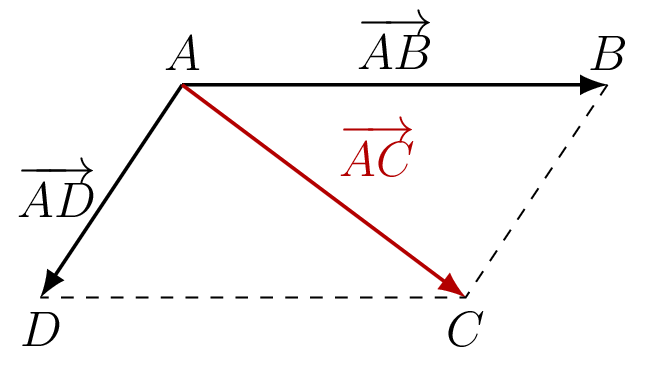

::: {.bloc .thm}
Propriété : Identité du parallélogramme

Soient $A$, $B$, $D$ trois points non alignés. Le point $C$ est défini par $\ve{AC} = \ve{AB} + \ve{AD}$.

Alors $ABCD$ est un **parallélogramme**.

  

:::

Démonstration : 

Soit $ABCD$ un parallélogramme, alors $\ve{AB} = \ve{DC}$.

Ainsi $\ve{DC} = \ve{DA}+\ve{AC}$, donc $\ve{AB} = \ve{DA}+\ve{AC}$,

Donc $\ve{AC} = \ve{AB}-\ve{DA} = \ve{AB}+\ve{AD}$.

Réciproquement, soit $\ve{AC} = \ve{AB}+\ve{AD}$, ainsi, puisque $\ve{DA}+\ve{AD} = \ve{0}$,
$$\ve{DC} = \ve{DA}+\ve{AC} = \ve{DA}+\ve{AB}+\ve{AD} = \ve{AB}$$

Donc $ABCD$ est un parallélogramme.

::: {.bloc .sfc}

Savoir-Faire : Reconnaître un parallélogramme — Raisonner

Les points $O$, $A$, $B$, $C$, $E$, $F$ vérifient $\ve{OE} = \ve{OA}+\ve{OB}$ et $\ve{OF} = \ve{OB}+\ve{OC}$.

Montrer que $AEFC$ est un parallélogramme.

Afficher la correction :

$\ve{OE} = \ve{OA}+\ve{OB}$ signifie que $OAEB$ est un parallélogramme (identité du parallélogramme), donc $\ve{AE} = \ve{OB}$.

$\ve{OF} = \ve{OB}+\ve{OC}$ signifie que $OBFC$ est un parallélogramme, donc $\ve{CF} = \ve{OB}$.

Ainsi $\ve{AE} = \ve{CF}$, d'où $AEFC$ est un **parallélogramme**.

:::
