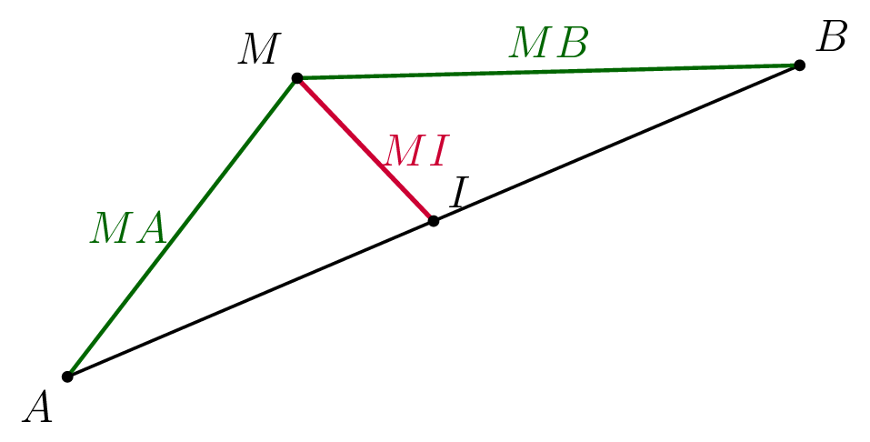

::: {.bloc .thm}
Propriété : Caractérisation vectorielle du milieu

$I$ est le milieu de $[AB]$ si et seulement si $\ve{AI} = \ve{IB}$, ou encore $\ve{AB} = 2\,\ve{AI}$.
:::

Démonstration : 

Par Chasles, $\ve{AB} = \ve{AI}+\ve{IB}$. Si $I$ est le milieu, $\ve{AI} = \ve{IB}$, donc $\ve{AB} = 2\,\ve{AI}$.

Réciproquement, si $\ve{AB} = 2\,\ve{AI}$, alors $\ve{AI}+\ve{IB} = 2\,\ve{AI}$, d'où $\ve{IB} = \ve{AI}$, soit $I$ milieu de $[AB]$.

::: {.bloc .thm}
Propriété : Propriété vectorielle du milieu

$I$ est le milieu de $[AB]$ si et seulement si, pour tout point $M$ du plan :
$$\ve{MI} = \frac{1}{2}(\ve{MA}+\ve{MB})$$

  

:::

Démonstration : 

$$\ve{MA}+\ve{MB} = (\ve{MI}+\ve{IA})+(\ve{MI}+\ve{IB}) = 2\,\ve{MI}+\ve{IA}+\ve{IB}$$

Or $I$ milieu de $[AB]$ implique $\ve{IA}+\ve{IB} = \ve{0}$.

Donc $\ve{MA}+\ve{MB} = 2\,\ve{MI}$, soit
$$\ve{MI} = \frac{1}{2}(\ve{MA}+\ve{MB})$$

::: {.bloc .sfc}

Savoir-Faire : Milieu et relation de Chasles — Calculer, Raisonner

Soient $A$, $B$, $C$ trois points, et $I$, $J$ les milieux respectifs de $[AB]$ et $[BC]$.

Exprimer $\ve{IJ}$ en fonction de $\ve{AC}$, puis en déduire que $(IJ)\parallel(AC)$ et que $IJ = \dfrac{1}{2}AC$.

Afficher la correction :

*Point clef : $I$ est le milieu de $[AB]$ donc on fait apparaître le vecteur $\ve{BI}$ pour utiliser la relation vectorielle sur le milieu.*

$$\ve{IJ} = \ve{IB}+\ve{BJ} = \frac{1}{2}\ve{AB}+\frac{1}{2}\ve{BC} = \frac{1}{2}(\ve{AB}+\ve{BC}) = \frac{1}{2}\ve{AC}$$

Ainsi $\ve{IJ} = \dfrac{1}{2}\ve{AC}$ : on en déduit que $(IJ)\parallel(AC)$ et $IJ = \dfrac{1}{2}AC$.

C'est le **théorème des milieux**.

:::
