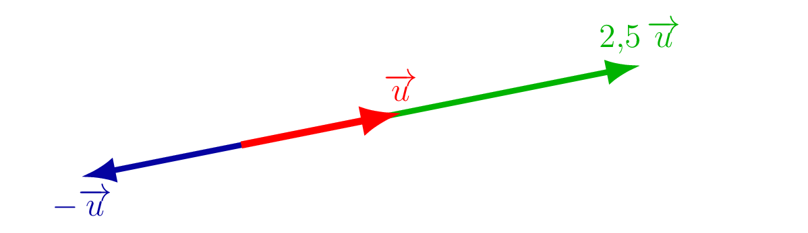

## Produit d'un vecteur par un réel 
::: {.bloc .def}
Définition : Produit par un réel

Soit $\lambda \in \R$ et $\ve{u}$ un vecteur non nul. Le **produit** $\lambda\ve{u}$ est le vecteur qui a :

- la même **direction** que $\ve{u}$ ;
- le même **sens** que $\ve{u}$ si $\lambda > 0$, le sens contraire si $\lambda < 0$ ;
- pour **norme** $|\lambda|\cdot\norm{\ve{u}}$.

Par convention, $0\cdot\ve{u} = \ve{0}$.
:::

::: {.bloc .rem}
Récapitulatif selon le signe de $\lambda$ : 

| Condition | Sens | Norme |
|---|---|---|
| $\lambda > 0$ | même sens que $\ve{u}$ | $\lambda\norm{\ve{u}}$ |
| $\lambda < 0$ | sens contraire à $\ve{u}$ | $\vert\lambda\vert\norm{\ve{u}}$ |
| $\lambda = 0$ | vecteur nul | $0$ |

  

:::

::: {.bloc .thm}
Propriété : Distributivité (admis)

Pour tous vecteurs $\ve{u}$, $\ve{v}$ et tous réels $k$, $m$ :
$$k(\ve{u}+\ve{v}) = k\ve{u}+k\ve{v} \qquad \text{et} \qquad (k+m)\ve{u} = k\ve{u}+m\ve{u}$$
:::

::: {.bloc .sfc}

Savoir-Faire : Simplifier des expressions vectorielles — Calculer

Soient $\ve{u}$ et $\ve{v}$ deux vecteurs.

1. On donne $2\ve{u}+3\ve{v}-5\ve{u} = \ve{0}$. Montrer que $\ve{u} = \ve{v}$.

Afficher la correction :

$(2-5)\ve{u}+3\ve{v} = -3\ve{u}+3\ve{v} = \ve{0}$, donc $3\ve{v} = 3\ve{u}$, soit $\ve{u} = \ve{v}$.

2. On donne $-3(\ve{u}+2\ve{v}) = 2\ve{v}+\ve{u}$. Que peut-on dire des vecteurs $\ve{u}$ et $\ve{v}$ ?

Afficher la correction :

$-3\ve{u}-6\ve{v} = 2\ve{v}+\ve{u}$, donc $-4\ve{u} = 8\ve{v}$, soit $\ve{u} = -2\ve{v}$.

Les vecteurs $\ve{u}$ et $\ve{v}$ ont **même direction et de sens contraires**, et $\norm{\ve{u}} = 2\norm{\ve{v}}$.

:::

::: {.bloc .ex}

Exercice : Écriture contrainte — Calculer, Raisonner

Soient $A$, $B$, $C$ trois points non alignés, et $M$ un point du plan.

On suppose que
$$\ve{MA} = 3\ve{MB} - \ve{MC}$$

Exprimer $\ve{AM}$ en fonction de $\ve{AB}$ et $\ve{AC}$.

Afficher la correction :

On a :
$$\ve{MA} = 3\ve{MB} - \ve{MC}$$

D'après la relation de Chasles :
$$\ve{MA} = 3(\ve{MA}+\ve{AB}) - (\ve{MA}+\ve{AC})$$

Donc,
$$\ve{MA} = 3\ve{MA} + 3\ve{AB} - \ve{MA} - \ve{AC} = 2\ve{MA} + 3\ve{AB} - \ve{AC}$$

Ainsi $2\ve{MA} = 2\ve{AB} - \ve{AC}$, d'où :
$$\ve{AM} = -\ve{AB} + \frac{1}{2}\ve{AC}$$

:::

::: {.bloc .rem}
Point méthode — écrire un vecteur dans une base : 

On cherche souvent à exprimer un vecteur $\ve{AM}$ en fonction de $\ve{AB}$ et $\ve{AC}$ sous la forme :
$$\ve{AM} = \alpha\ve{AB} + \beta\ve{AC}$$
afin de montrer des relations.

On dit que l'on **décompose** le vecteur $\ve{AM}$ dans la **base $\left(\ve{AB}\,;\,\ve{AC}\right)$**.

En pratique, on cherche à écrire les deux vecteurs dans la même base, puis à montrer que l'un est multiple de l'autre ou à exhiber les coordonnées d'un point.
:::

## Milieu d'un segment

::: {.bloc .thm}
Propriété : Caractérisation vectorielle du milieu

$I$ est le milieu de $[AB]$ si et seulement si $\ve{AI} = \ve{IB}$, ou encore $\ve{AB} = 2\,\ve{AI}$.
:::

Démonstration : 

Par Chasles, $\ve{AB} = \ve{AI}+\ve{IB}$. Si $I$ est le milieu, $\ve{AI} = \ve{IB}$, donc $\ve{AB} = 2\,\ve{AI}$.

Réciproquement, si $\ve{AB} = 2\,\ve{AI}$, alors $\ve{AI}+\ve{IB} = 2\,\ve{AI}$, d'où $\ve{IB} = \ve{AI}$, soit $I$ milieu de $[AB]$.

::: {.bloc .thm}
Propriété : Propriété vectorielle du milieu

$I$ est le milieu de $[AB]$ si et seulement si, pour tout point $M$ du plan :
$$\ve{MI} = \frac{1}{2}(\ve{MA}+\ve{MB})$$

  

:::

Démonstration : 

$$\ve{MA}+\ve{MB} = (\ve{MI}+\ve{IA})+(\ve{MI}+\ve{IB}) = 2\,\ve{MI}+\ve{IA}+\ve{IB}$$

Or $I$ milieu de $[AB]$ implique $\ve{IA}+\ve{IB} = \ve{0}$.

Donc $\ve{MA}+\ve{MB} = 2\,\ve{MI}$, soit
$$\ve{MI} = \frac{1}{2}(\ve{MA}+\ve{MB})$$

::: {.bloc .sfc}

Savoir-Faire : Milieu et relation de Chasles — Calculer, Raisonner

Soient $A$, $B$, $C$ trois points, et $I$, $J$ les milieux respectifs de $[AB]$ et $[BC]$.

Exprimer $\ve{IJ}$ en fonction de $\ve{AC}$, puis en déduire que $(IJ)\parallel(AC)$ et que $IJ = \dfrac{1}{2}AC$.

Afficher la correction :

*Point clef : $I$ est le milieu de $[AB]$ donc on fait apparaître le vecteur $\ve{BI}$ pour utiliser la relation vectorielle sur le milieu.*

$$\ve{IJ} = \ve{IB}+\ve{BJ} = \frac{1}{2}\ve{AB}+\frac{1}{2}\ve{BC} = \frac{1}{2}(\ve{AB}+\ve{BC}) = \frac{1}{2}\ve{AC}$$

Ainsi $\ve{IJ} = \dfrac{1}{2}\ve{AC}$ : on en déduit que $(IJ)\parallel(AC)$ et $IJ = \dfrac{1}{2}AC$.

C'est le **théorème des milieux**.

:::
