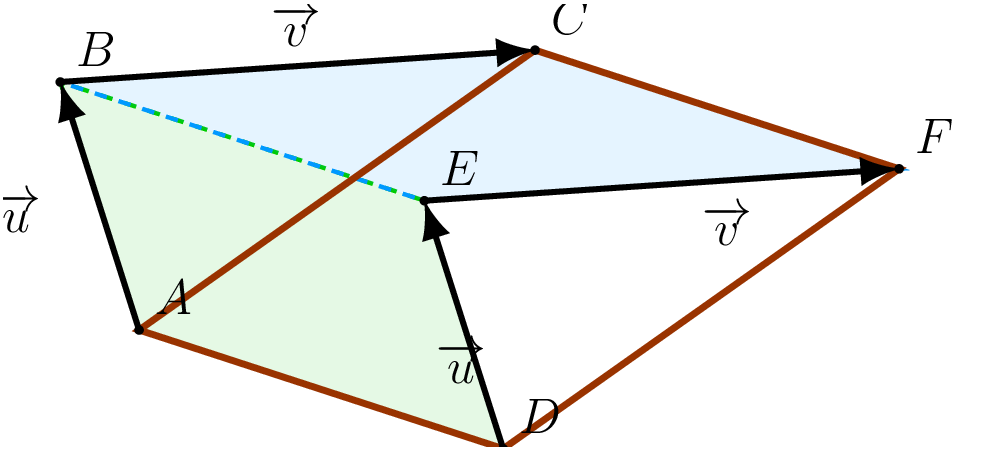
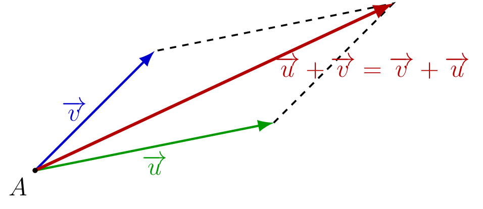

## Existence et propriétés

::: {.bloc .thm}
Propriété : Existence et unicité de la somme

Soient $\ve{u}$ et $\ve{v}$ deux vecteurs du plan. Il existe un unique vecteur $\ve{w}$ tel que $\ve{w} = \ve{u} + \ve{v}$.

  

:::

Démonstration : 

Soient $A$, $B$, $D$, $E$, $C$, $F$ des points tels que $t_{\ve{u}}(A) = B$, $t_{\ve{u}}(D) = E$, $t_{\ve{v}}(B) = C$ et $t_{\ve{v}}(E) = F$.

$ABED$ et $BCFE$ sont des parallélogrammes.

  

On en déduit que $ACFD$ est aussi un parallélogramme. Il existe donc une unique translation de vecteur $\ve{w}$ telle que $t_{\ve{w}}(A) = C$ et $t_{\ve{w}}(D) = F$.

Elle correspond à l'application successive de $t_{\ve{u}}$ puis $t_{\ve{v}}$, ce que l'on note $\ve{w} = \ve{u} + \ve{v}$.

::: {.bloc .thm}
Propriété : Commutativité et associativité

Pour tous vecteurs $\ve{u}$, $\ve{v}$, $\ve{w}$ :

1. **Commutativité :** $\ve{u} + \ve{v} = \ve{v} + \ve{u}$.
2. **Associativité :** $(\ve{u} + \ve{v}) + \ve{w} = \ve{u} + (\ve{v} + \ve{w})$.
:::

Démonstration : 

**Commutativité.**

En plaçant $\ve{u}$ et $\ve{v}$ à partir d'un même point, ils définissent un parallélogramme dont la diagonale représente à la fois $\ve{u}+\ve{v}$ et $\ve{v}+\ve{u}$.

  

**Associativité.**

Tracer successivement $\ve{u}$, $\ve{v}$ puis $\ve{w}$ bout à bout aboutit au même point final, que l'on regroupe $(\ve{u}+\ve{v})+\ve{w}$ ou $\ve{u}+(\ve{v}+\ve{w})$.

::: {.bloc .rem}
Remarque : 

Ces deux propriétés signifient que l'ordre et le groupement des vecteurs à additionner n'ont pas d'importance.
:::
